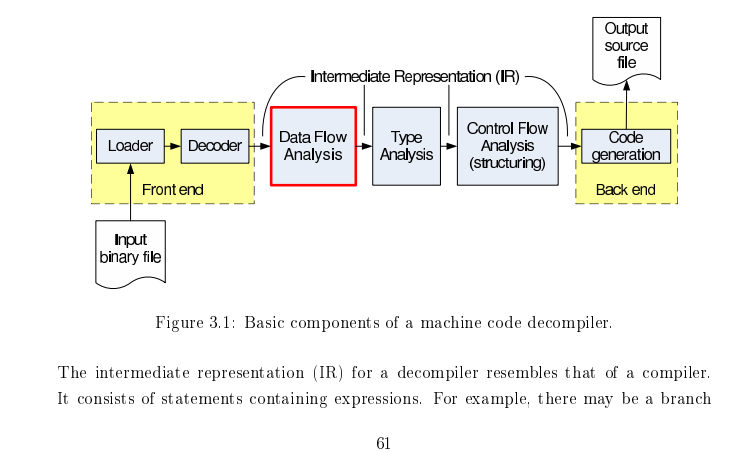

All rights reserved (currently). You cannot use this in any public published paper without our consent. We plan to set a MIT license after our work is published.

目标：a webassembly and ethereum VM bytecode decompiler. 

侧重于前中端（转IR与IR的优化。）

### 从“零”实现反编译器

为什么要从零开始？为了更好地学习反编译器的原理。即使最后改为对接现有的反编译器。

怎么样的从零？可以使用现有的disassembler，IR，compiler等，但是不能直接去对接现有的反编译器。前期可以使用一些LLVM的Pass，后期最好都替换为自己写的Pass。

计划产出：

1. 反编译器自身：能够对“内存”中的变量也构建SSA进行优化。
2. 最终的结果能够很好地重编译。
3. 反编译器实现过程尽量记录完善的文档，未来考虑整理扩写为系列教程。

### 不知道接下来怎么办？（资料收集）

学习阶段：

1. LLVM IR基础：只要达到能手写LLVM IR的程度就行。即主要理解各种语言特性对应的是什么样的LLVM IR代码。同时理解带alloca的半SSA形式，即alloca里的变量是非SSA，外面的是SSA。
   - llvm-tutor 
   - ollvm源码
2. SSA与编译优化基础
   - [《Engineering a compiler》](https://book.douban.com/subject/20436488/) 上来先看9.3章，深入研读。其他的章节没那么重要
   - 再找找其他讲过SSA的中文书？
   
   下面有两个实验，动手做了印象才会深
   - [mem2reg 实验指导 · GitBook (buaa-se-compiling.github.io)](https://buaa-se-compiling.github.io/miniSysY-tutorial/challenge/mem2reg/help.html)
   - [Lv9+.4. SSA 形式 - 北京大学编译实践课程在线文档 | 北大编译实践在线文档 (pku-minic.github.io)](https://pku-minic.github.io/online-doc/#/lv9p-reincarnation/ssa-form)
   
   其他不错的资料：
   - [《SSA book》](https://pfalcon.github.io/ssabook/latest/book-v1.pdf)
   - [《simple and efficient ssa construction》](https://pp.info.uni-karlsruhe.de/uploads/publikationen/braun13cc.pdf)

3. 反编译

#### 直接相关的资料

多看看现有的资料：

1. Static Single Assignment for Decompilation vanEmmerik_ssa https://yurichev.com/mirrors/vanEmmerik_ssa.pdf
2. [retdec/publications at master · avast/retdec (github.com)](https://github.com/avast/retdec/tree/master/publications) 
   1. 综述是[Retargetable Analysis of Machine Code](http://www.fit.vutbr.cz/study/DP/PD.php?id=482&file=t) 

参考现有的反编译器：

1. Ghidra [ghidra/docmain.hh at master · NationalSecurityAgency/ghidra (github.com)](https://github.com/NationalSecurityAgency/ghidra/blob/master/Ghidra/Features/Decompiler/src/decompile/cpp/docmain.hh) 看代码前构建doxygen看文档。
2. [avast/retdec: RetDec is a retargetable machine-code decompiler based on LLVM. (github.com)](https://github.com/avast/retdec)
3. [Boomerang Decompiler (sourceforge.net)](https://boomerang.sourceforge.net/)     [BoomerangDecompiler/boomerang: Boomerang Decompiler - Fighting the code-rot :) (github.com)](https://github.com/BoomerangDecompiler/boomerang) 
4. [yegord/snowman: Snowman decompiler (github.com)](https://github.com/yegord/snowman) 
5. angr好像也有了

也要学习程序分析的内容。

[SVF-tools/SVF: Static Value-Flow Analysis Framework for Source Code (github.com)](https://github.com/SVF-tools/SVF) 

控制流恢复算法：

1. [No More Gotos: Decompilation Using Pattern-Independent Control-Flow Structuring and Semantics-Preserving Transformations – NDSS Symposium (ndss-symposium.org)](https://www.ndss-symposium.org/ndss2015/ndss-2015-programme/no-more-gotos-decompilation-using-pattern-independent-control-flow-structuring-and-semantics/) 
2. Phoenix: [Schwartz et al._2013_Native x86 Decompilation using Semantics-Preserving Structural Analysis and Iterative Control-Flow Structuring.pdf (cmu.edu)](https://users.ece.cmu.edu/~dbrumley/pdf/Schwartz et al._2013_Native x86 Decompilation using Semantics-Preserving Structural Analysis and Iterative Control-Flow Structuring.pdf) 

### 规划：基于LLVM IR的反编译

为什么要使用LLVM IR？

1. 之后可以直接对接SVF，得到较好的指针分析结果。

优先实现wasm的反编译。

1. Wasm转LLVM IR
   1. WAVM是一个基于LLVM的wasm的JIT，有部分逻辑是WASM转 LLVM IR
      1. 生成的IR不够简洁，有很多为了编译到汇编的冗余的内容
2. 

### 规划：反编译阶段

图片来自[Static Single Assignment for Decompilation](https://yurichev.com/mirrors/vanEmmerik_ssa.pdf)

反编译中的关键算法： Type Recovery（通过指令约束推导类型） Structual Analysis(恢复控制流)

1. 前端：将字节码转为LLVM IR
2. 中端：优化与分析
   1. 分析函数参数、分析callee saved register (wasm可以跳过这个阶段)
   2. SSA构建：使得前端可以有些冗余的alloca，由SSA构建来将相关alloca消除。 （编译原理相关）
   3. GVNGCM：Global Value Numbering and Global Code Motion 优化算法，有强大的优化能力，有助于反混淆等。（编译原理相关）
   4. 内存分析：将各种通过内存访问的变量显式地恢复出来。可能要用到指针分析算法，类型恢复等。关键词：Memory SSA。
3. 后端：高层控制流恢复，将字节码转为AST，打印为高级语言的形式。

### 项目架构与工具

Markdown编辑器（建议）使用Typora，或VSCode

由于基于LLVM IR，因此语言采用C++。

开发环境：VSCode + CMake。将Wabt，LLVM等作为CMake的外部依赖。

#### 开发环境搭建

采用VSCode DevContainer。出于[性能考虑](https://code.visualstudio.com/remote/advancedcontainers/improve-performance)，在clone时可以直接clone到wsl的ext4文件系统里。

1. 安装Docker Desktop on Windows： https://docs.docker.com/desktop/install/windows-install/ （无论是家庭版还是专业版均可）
   1. 其他系统直接安装docker
1. 用vscode打开代码，安装Dev Containers插件，按Ctrl-Shift-P 然后输入查找 `Remote-Containers: Rebuild and Reopen in container`.
1. 等待构建，构建完成后会直接进入开发环境中。
1. 安装CMake相关插件，toolkit选clang。

如果出现了无法使用windows侧的ssh-agent提供的ssh key的forward功能：
https://stackoverflow.com/questions/72293035/error-communication-with-agent-failed-when-ssh-auth-sock-is-set-but-ssh-agent 

#### 代码调试

直接使用自带的C/C++调试，不知道为什么会非常慢，gdb执行backtrace要卡3秒，各种step命令要卡5-6秒。因此安装使用CodeLLDB插件。

代码补全使用clangd插件。根据提示禁用Intellisense，然后确认下载一个clangd。

### 提交代码前

1. 写好commit message，简要概况所有的修改。
2. 检查添加的代码的注释和文档是否充足。

### 其他

各种杂七杂八的事情随意地列在这里

1. 反编译优化后重新编译，和原有代码对比测试。效果好甚至可以作为字节码的优化器。
2. 未来实现得够好之后，可以重写README，该文档可以改名为`plan.md`放到docs文件夹里。

