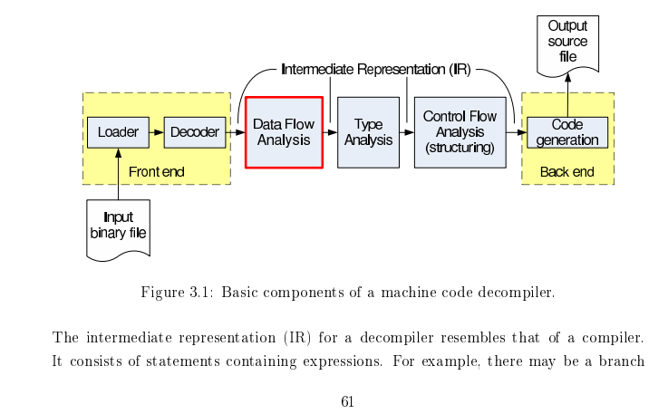

# NotDec: WebAssembly Decompiler and Static Analysis Framework

[Doc Website](https://notdec.github.io/NotDec/)

[中文](#中文)

NotDec is
1. A project that aims to demystify the internal of decompiler.
1. A webassembly decompiler that can experiment with new decompiler techniques.
   - Variable Recovery
   - Structual Analysis

We are still actively experimenting with and improving the type recovery algorithms (on another branch).

Keywords: Reverse LLVM, LLVM C Backend / llvm-cbe.

#### Development - Linux

Based on Ubuntu 22.04

1. Install dependencies
   - Use `apt`
      ```
      sudo apt install wabt python-is-python3 clang-14 cmake zlib1g-dev g++ ninja-build libboost-all-dev
      ```
   - Install `wasi-sdk` to `/opt`
      ```
      wget https://github.com/WebAssembly/wasi-sdk/releases/download/wasi-sdk-20/wasi-sdk-20.0-linux.tar.gz -P /tmp
      sudo tar xf /tmp/wasi-sdk-20.0-linux.tar.gz -C /opt
      ```
1. clone this repo
1. Install LLVM 14
   - Execute `scripts/build-debug-llvm.sh` to download and build LLVM. You may encounter errors about no memory during linking, just decrease the parallel number to 1.
1. cmake build, but use clang as the compiler.
    ```
    cmake -DCMAKE_EXPORT_COMPILE_COMMANDS:BOOL=TRUE -DCMAKE_C_COMPILER:FILEPATH=/usr/bin/clang-14 -DCMAKE_CXX_COMPILER:FILEPATH=/usr/bin/clang++-14 -DCMAKE_EXE_LINKER_FLAGS=-fuse-ld=lld --no-warn-unused-cli -S . -B ./build -G Ninja
    ```

### Notice

- It is recommended to set `--tr-level=3` and provide environment variables `NOTDEC_DISABLE_INTERPROC=1` (disable inter-procedural type recovery) and `NOTDEC_SAT_DISABLE=1` (disable complex type propagation) to reduce the time spent on type analysis.
- Setting the environment variables `NOTDEC_DEBUG_DIR=debug_dir` and `NOTDEC_TYPE_RECOVERY_DEBUG_DIR=debug_dir` will print detailed intermediate results of type recovery to `debug_dir/`, facilitating debugging of the type recovery algorithm.
- The robustness of the backend in generating C code may be insufficient; encountering complex statements may still cause errors or generate syntax errors.

# 中文

[文档站](https://notdec.github.io/NotDec/)

## NotDec: 反编译器原理分析

本项目旨在：
1. 学习现有反编译器的原理，系统地总结现有反编译器的工作，算法
1. 选择合适的算法，尝试实现自己的反编译器

#### 开发环境 - Linux

基于Ubuntu 22.04系统

1. 安装依赖项
   - 使用 `apt` 包管理器
      ```
      sudo apt install wabt python-is-python3 clang-14 cmake zlib1g-dev g++ ninja-build libboost-all-dev
      ```
   - 将 `wasi-sdk` 安装至 `/opt` 目录
      ```
      wget https://github.com/WebAssembly/wasi-sdk/releases/download/wasi-sdk-20/wasi-sdk-20.0-linux.tar.gz -P /tmp
      sudo tar xf /tmp/wasi-sdk-20.0-linux.tar.gz -C /opt
      ```
2. 克隆此代码仓库
3. 安装 LLVM 14
   - 执行 `scripts/build-debug-llvm.sh` 以下载并构建 LLVM。链接过程中可能出现内存不足的错误，只需将并行编译数降至 1 即可。
4. 使用 CMake 进行构建（需指定 clang 作为编译器）
    ```
    cmake -DCMAKE_EXPORT_COMPILE_COMMANDS:BOOL=TRUE -DCMAKE_C_COMPILER:FILEPATH=/usr/bin/clang-14 -DCMAKE_CXX_COMPILER:FILEPATH=/usr/bin/clang++-14 -DCMAKE_EXE_LINKER_FLAGS=-fuse-ld=lld --no-warn-unused-cli -S . -B ./build -G Ninja
    ```

### Notice

- 推荐设置`--tr-level=3`，并提供环境变量`NOTDEC_DISABLE_INTERPROC=1`（禁用跨函数的类型恢复）和`NOTDEC_SAT_DISABLE=1`（禁用复杂的类型传播），减少类型分析耗时。
- 设置环境变量`NOTDEC_DEBUG_DIR=debug_dir`和`NOTDEC_TYPE_RECOVERY_DEBUG_DIR=debug_dir`会将类型恢复的详细中间结果打印到`debug_dir/`里，方便debug类型恢复算法。
- 后端生成C代码的鲁棒性可能不足，遇到复杂的语句可能依然会报错或产生语法错误。

### 资料收集

1. LLVM IR基础：主要理解各种语言特性对应的是什么样的LLVM IR代码。同时理解带alloca的半SSA形式，即alloca里的变量是非SSA，外面的是SSA。
   - llvm-tutor 
   - ollvm源码
2. SSA与编译优化基础
   - [《Engineering a compiler》](https://book.douban.com/subject/20436488/) 上来先看9.3章
   关于SSA的实验
   - [mem2reg 实验指导 · GitBook (buaa-se-compiling.github.io)](https://buaa-se-compiling.github.io/miniSysY-tutorial/challenge/mem2reg/help.html)
   - [Lv9+.4. SSA 形式 - 北京大学编译实践课程在线文档 | 北大编译实践在线文档 (pku-minic.github.io)](https://pku-minic.github.io/online-doc/#/lv9p-reincarnation/ssa-form)

   其他不错的资料：
   - [《SSA book》](https://pfalcon.github.io/ssabook/latest/book-v1.pdf)
   - [《simple and efficient ssa construction》](https://pp.info.uni-karlsruhe.de/uploads/publikationen/braun13cc.pdf)

3. 反编译
   - 详见[文档站](https://notdec.github.io/NotDec/)

#### 资料

[现有的反编译器和资料](https://notdec.github.io/NotDec/papers.html)

## 反编译阶段



图片来自[Static Single Assignment for Decompilation](https://yurichev.com/mirrors/vanEmmerik_ssa.pdf)

反编译中的关键算法： Type Recovery（通过指令约束推导类型） Structual Analysis(恢复控制流)

1. 前端：将字节码转为LLVM IR
2. 中端：优化与分析
   1. 分析函数参数、分析callee saved register (wasm可以跳过这个阶段)
   2. SSA构建：使得前端可以有些冗余的alloca，由SSA构建来将相关alloca消除。 （编译原理相关）
   3. GVNGCM：Global Value Numbering and Global Code Motion 优化算法，有强大的优化能力，有助于反混淆等。（编译原理相关）
   4. 内存分析：将各种通过内存访问的变量显式地恢复出来。可能要用到指针分析算法，类型恢复等。关键词：Memory SSA。
3. 后端：高层控制流恢复，将字节码转为AST，打印为高级语言的形式。

### 项目架构与工具

由于基于LLVM IR，因此语言采用C++。

开发环境：VSCode + CMake。将Wabt，LLVM等作为CMake的外部依赖。

由于对LLVM的调试需求越来越多，项目转为使用本地源码编译的LLVM（RelWithDebInfo或Debug build）

#### 代码调试

使用vscode的CodeLLDB插件。代码补全使用clangd插件。根据提示禁用Intellisense，然后根据插件提示确认下载clangd。

### 提交代码前

1. 写好commit message，简要概况所有的修改。
2. 检查添加的代码的注释和文档是否充足。

## TODO

1. 反编译器自身：能够对“内存”中的变量也构建SSA进行优化。
2. 最终的结果能够很好地重编译。
3. 反编译器实现过程尽量记录完善的文档，未来考虑整理扩写为系列教程。

1. 将wasm lift到LLVM IR
   - 支持将wasm内存直接映射到某个基地址，从而直接支持运行，以及memory grow相关指令。
   - 支持DWARF调试信息，从而映射回原wat，wasm
1. 设计一个映射，将lift之后的IR反向转回wasm
