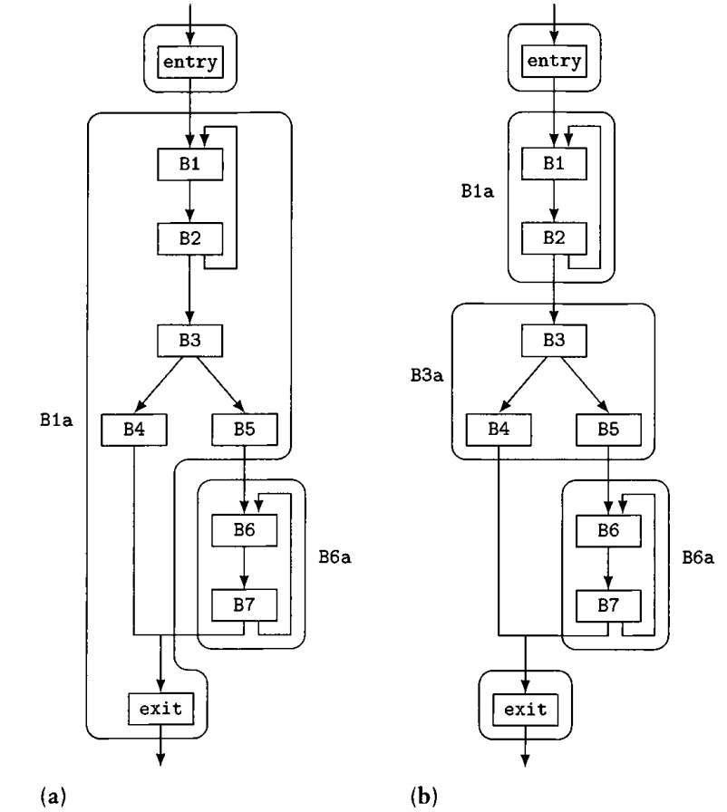
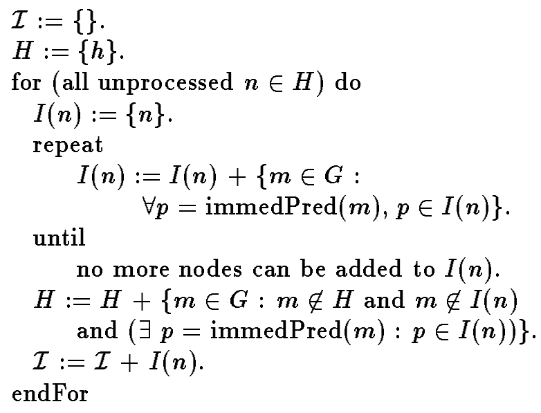
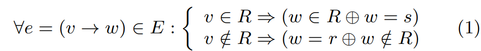
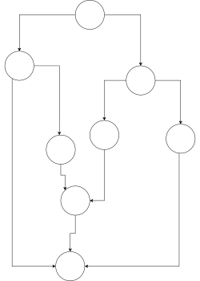

# 反编译器后端 - 结构分析

结构分析负责将IR转换为伪C代码。

## (最简单的)fallback实现

<!-- - 判断每个IR语句是否有副作用。如果不存在副作用，且仅有一个user，则作为表达式折叠到其他语句。否则生成局部变量储存它的值。 -->
- 给所有的基本块前添加标号，对于任意控制流跳转，使用goto实现。最后删除无用的标号。

Fallback实现可以考虑作为现有算法的辅助，将其他算法无法处理的边转换为Goto语句。

## Structural Analysis 和 Reducible Control Flow

- [PPT(结尾介绍了Reducibility)](http://baishakhir.github.io/class/2020_Fall/5_control_flow_analysis.pdf)
- [PPT(介绍了Reducibility编译原理相关的内容)](https://www.cs.cmu.edu/afs/cs/academic/class/15745-s08/www/lectures/lect5-loops.pdf)
- [PPT:介绍了structural analysis](http://www.cs.cmu.edu/afs/cs/academic/class/15745-s05/www/lectures/t1t2.pdf) 特别说明了
- [PPT:更详细地介绍了structural analysis](https://www.cs.princeton.edu/courses/archive/spr04/cos598C/lectures/10-Structural.pdf)
- [介绍了T1 T2转换](http://misailo.web.engr.illinois.edu/courses/526-sp17/lec1.pdf)

一个CFG如果是Reducible的，则我们可以将图上所有边分割为两部分，前向边，和反向边
- 前向边构成有向无环图，每个节点可以从entry到达。
- 反向边的目标节点都支配源节点。

定义2：T1 T2转换
一个CFG如果是reducible的，可以通过规则将图中的节点递归缩减为单个节点。
- T1 自环可以被缩减
- T2 如果某个节点仅有一个前驱，则可以将该节点缩入这个前驱节点

然而，有个PPT里面说，这种T1 T2转换，对控制流的缩减，从而对控制流划分的层次结构，不一定规范地符合真实源码里面的划分。T1 T2转换是最早的，最简单的一种interval analysis.

## Structural Analysis For Dataflow Analysis

- [《A Structural Algorithm for Decompilation》反编译的结构分析](https://www.cs.tufts.edu/comp/150FP/archive/cristina-cifuentes/structuring-algorithm.pdf)
    - 在CMU的lecture notes里面提到了这个paper
- [《Advanced Compiler Design and Implementation》](https://github.com/rambhawan/Computer-Compiler-Lang/blob/master/Advanced%20Compiler%20Design%20and%20Implementation.pdf) 
    - Phoenix论文里，提到结构分析的时候就让读者看这里。因此非常值得读一读。
    - 在203页更详细地介绍了structural analysis。建议从196页的Reducibility开始阅读。（书里面的页码，不是pdf的页码）这些结构分析都比较老了，而且有的不太是为反编译设计的。

**概述**：在编译优化方面，有研究人员发现，要是在IR（CFG）层面能够用上AST层面的信息（IF，While，For控制流结构），能够加速现有的数据流分析。然而在IR（CFG）层面，高级语言的结构信息已经丢失了。因此，有部分研究人员提出了通过模式匹配的方式，从CFG中识别出控制流结构。由此诞生了interval analysis算法，后续发展出了Structural Analysis。

结构分析一般可以分为一下几个步骤：
1. 类似interval analysis的嵌套区域划分。
1. 将划分好的子区域进行模式匹配，匹配为高级语言的控制结构。

**定义：(Maximal Interval)**：最大的，单入口子图，（假设入口节点为I）且子图中所有闭合的路径都包含I。

**定义：Minimal Interval**：是指：(1) 一个natural loop，(2)一个最大的有向无环子图，(3)一个最小的不可规约区域。和maximal interval主要区别大概在于，maximal interval划分loop的时候会把连带的有向无环分支带上，而minimal interval会单独分出来。

一个minimal interval和maximal interval的区别如下：左边是maximal interval的划分，右边是minimal interval的划分。

**定义：Natural Loop**：[Natural Loop](https://web.cs.wpi.edu/~kal/PLT/PLT8.6.4.html) 背景：在编译原理里面的loop，也是希望仅有单个节点支配整个loop。我们使用支配关系寻找loop的时候，由于它是一个loop，因此必然至少有个“反向边”，不然构不成一个环。  Natural Loop的关键在于那个反向边，即头节点支配尾节点的边。

一个反向边的Natural Loop，是指，最小的，包括反向边的节点集合，整个集合的前驱仅有entry节点，没有其他节点。（即，natural loop严格说并不是一个单独的概念，反而是对一条反向边而言的。）

当你移除那个entry节点的时候，因为entry节点支配其他节点，图就被分裂成了两部分。此时寻找所有有路径到达t的节点（t这里指反向边的源节点），这些节点和entry节点构成了natural loop。

在《A Structural Algorithm for Decompilation》里直接使用了类似T1-T2规约的方式划分interval。

**Interval Analysis (maximal interval)**：该算法就是《A Structural Algorithm for Decompilation》里面用的，算法如下：

- 迭代性：该算法是一个迭代的算法，每一次迭代找出节点集合后，即使可以看作一个新的单个抽象节点，也不会产生新的节点集合包含这些本轮生成的抽象节点了，这些嵌套的情况是下一轮迭代负责的。（图片里的算法不包含这个迭代，迭代在另外一个没截图的算法里）
- 从entry节点开始，依次类似T1 T2规约的方法（即，“看是否某节点仅有一个前驱”的拓展版，看某节点的前驱是否都在集合里）把节点加入集合中。如果结束了，就从当前集合的后继节点里抓节点出来再进行这个过程。直到所有节点都被归入了某个集合。
- 更新H的那一行代码的意思是：加入H的新节点，(1)不属于当前规约好的集合，(2)直接前驱在当前规约好的集合里。 （即，按顺序弄。）

在《Advanced Compiler Design and Implementation》里提到这种方式划分的是Maximal Interval。书中还提出了改进版的算法，划分的是Minimal Interval，划分效果更好，更小的区域便于后续划分高级语言的控制结构。

**Interval Analysis (minimal interval)**：该算法是《Advanced Compiler Design and Implementation》提出的改进版：
1. 使用一个后序遍历找到loop header，和improper region的header。
1. 对每个loop header构建natural loop区域。(使用支配图，判断是否有前驱节点指过来的边是反向边，即head dom tail)
1. 对improper region的header构建minimal SCC
    1. 构建区域之后，对（区域的）所有的直接后继节点构建最大的有向无环子图，如果成功弄出节点数量大于1的子图，就构建一个有向无环区域。
1. 递归整个过程直到终止。

可以感受到，其实是基于前一个算法，融合了把有向无环的子区域分离的想法。同时还顺便分离了有环区域中的natural loop。（但是，有一些具体的实现也还是不清楚。。）

**背景1 深度优先遍历与逆后序遍历：** Depth First Spanning Tree 是在DFS遍历过程中生成的一个树。基本思想是，DFS遍历过程中，会出现一种情况：判断当前节点指向其他节点的一条边的时候，发现这个边指向的目标节点已经被访问过了，所以就不需要沿着这条边过去了。因此可以将边划分为遍历使用了的边，和遍历过程中没有使用的边。

在深度优先遍历时，怎么才算是反向边？当然是这条边指向了已经被访问的节点。即遍历时发现指向的地方已经访问过了。也有可能出现，根据选择的子节点不同导致反向边不同的情况。比如两个子树交叉指向隔壁更高的节点。深度优先遍历的时候，走过的边属于前向边。如果某条边反过来就属于前向边，则它是反向边（和某个前向边形成2节点的小环）。剩下的边属于交叉边。

**一个如何确定反向边的问题**：在《A Structural Algorithm for Decompilation》里直接使用了类似T1-T2规约的方式划分interval。后面判断是否是loop的时候提到，只需要检查interval的header的前驱指过来的边是不是反向边。而且只需要看后序遍历的顺序上的关系即可。我们这里探讨的问题是：**（检查interval header的predecessor）真的只需要看后续遍历的顺序就可以确定是否是反向边吗？**反向边的定义是，head节点支配tail节点。假如我们有个interval，有个back edge，如果想破坏这个支配关系的同时，保留后序遍历的顺序。假如根节点在DFS优先遍历左子树，我们的interval也在左子树，我们从右子树引一条边过来，这样不会影响左子树节点在后序遍历的顺序。同时我们把边指向header到tail节点的路径上，这样head就不再支配tail了。这样不就破坏了这个关系了吗？除非，这样引入的边会破坏interval的划分。确实，我们考虑那个被指向的节点，这个节点之前之所以会被归到这个interval，是因为它的所有前驱都在interval里了。这样增加的边会影响interval的划分，因此我们没能找到反例。

**结构分析算法(《Advanced Compiler Design and Implementation》)**
这边书中的算法是基于最早的结构分析《Structural Analysis: A New Approach to Flow Analysis in Optimizing Compilers》的改进。
书中205页介绍的算法的大体结构如下：
1. 使用一个DFS_Postorder算法，给每个节点标上序号。
1. 在一系列的节点遍历中，不断辨识出新的区域，把这些区域规约成单个抽象节点（因此可能需要修复图结构，并且可能需要重新做后序遍历）。
    1. 规约时，把进入区域的边，离开区域的边作为这个抽象节点和其他节点的边。
1. 直到最后规约为仅一个节点。

## Structural Analysis For Decompilation

**概述**：

然而，上面介绍的，为数据流分析加速设计的结构分析，用于反编译有着根本性的缺点。
1. 仅识别了一些简单的图模式。虽然通过递归，能够识别这些模式的组合，但当出现了复杂的图的时候，会完全放弃识别。无环图被识别为Proper Region，有环图被识别为Improper Region。
    1. 这对数据流分析算法没有影响，因为没识别出来可以按照旧的方式分析，只不过无法加速了。然而，这一点对我们反编译非常致命，直接放弃了划分。
        1. Phoenix在usenix 2013提出了，可以将部分边转成goto，从而能够继续识别出更多的控制流结构。
1. 本质上，稍微复杂一点的CFG，确实就不能识别控制流结构了。

### SESS

**Single entry single successor (SESS)**分析

来自《Enhanced Structural Analysis for C Code Reconstruction from IR Code》论文中的3.3节。（论文中3.1、3.2回顾了一下什么是结构分析）。

背景：结构分析其实没有考虑break，continue等跳转指令。带有这些跳出语句的，也可能被归类为proper/improper region。

定义：假设有一个CFG，内部划分了SESS区域R，唯一的entry节点是r，successor节点是s，则有以下性质：

SESS区域：entry r属于region，successor s不属于区域内（看作区域的线性后继块）。
- 对于（整个图的）任意边，如果source属于区域内
  - 要么target属于区域内，区域内部边
  - 要么target等于successor节点
- 如果source不属于区域内
  - 要么target是entry节点（进入）
  - 要么target不属于区域内（区域外部边）

有哪些边被否认了？区域内部到区域外部的，不经过entry和exit的边。

**Tail Region**：文中提出了Tail Region的概念。一个break语句的基本块，原本是跳走的，但是识别成tail region之后，就假装没有那个边。

一些其他点：
- 论文中提到有这些性质的区域可以直接输出为C语言代码。因此SESS算法的目的是让SESS区域覆盖尽可能多的边。
- 在原有匹配cyclic region，acyclic region之后，如果匹配失败，就尝试匹配tail region。这里在Phoenix里面提到，这篇论文里没有写清楚具体的匹配算法。而且他们发现，经常确实也匹配不到这种tail region，如果图太复杂还是会失败。
- 关于论文没有说清楚的其他点，首先是怎么识别SESS region吧，可能是在原有的划分region基础上再做些判断。其次是怎么识别tail region的跳走的边。可能是识别region的基础上，看边是不是跳到head和tail的吧。

###  Phoenix

- [\[Phoenix\]](https://kapravelos.com/teaching/csc591-s20/readings/decompilation.pdf) 《Native x86 Decompilation Using Semantics-Preserving Structural Analysis and Iterative Control-Flow Structuring》 [slides](https://edmcman.github.io/pres/usenix13.pptx)

paper的3.1节介绍了算法框架，和结构分析很相似。
- 使用后序遍历，遍历每个节点。直观上子节点被处理合并后再处理父节点。遍历每个节点时，判断是acyclic还是cyclic的。
    - 如果是acyclic的区域，算法尝试匹配几种简单的模式，以及潜在的switch语句。匹配不了还是会跳过
    - 如果是cyclic的区域，算法尝试找natural loop，匹配常见的循环模式，或者就是普通的loop。匹配不了还是跳过
        - 
    - 如果一轮下来都匹配失败了，则使用“最后手段”将一个跳转归类为goto，并忽视它，再重新进行一轮。
        - 优先选择：源节点没有支配目标节点。源节点支配了目标节点的边，大概率是比较重要的边。
        - 优先选择：目标节点支配了源节点。这种不就是natural loop的边吗？

具体应该选择哪些边移除？当前的选择到底好不好？确实是一个值得思考的问题。

**算法的输入输出：**：输入当然是CFG。如何规划输出的格式？结构分析的本质是把CFG组织成了带有标签的树的结构。树的节点里蕴含额外的控制流跳转信息。

结构化算法尝试将现有的基本块CFG的IR架构，重新组织为类似AST的形式
- 原有的基本块划分能否和AST共存？即，能否将结构分析的结果表示为原有IR上的标记？不太行。映射可以做到，但是如果强行想要做标记，可能会不方便打印。
    - 结构分析有点像是，把结构嵌套折叠到了一个条件跳转里。但是这种折叠，在IR上不一定看得出来。比如，菱形的IF-Else结构，就没有明显的从if开头，到整个if结构的successor的边。如果仅把结构分析的结果看作是对边的标记，这里肯定是丢了信息的。
- SSA能否和AST共存？稍微搜了一下，不太能。确实和我想的一样，最多就是基本块参数。还是直接把SSA解构了吧。
    - SSA保留比较麻烦，可以考虑写成basic block argument的形式，在if while这种结构的末尾加上（带基本块参数的）goto？或者直接留下基本块参数。

- Region：算法的主体数据结构，对`List<Statement>`的封装，但是内部不止可以放指令，还可以放statement。当折叠If, While等结构的时候，它们作为单个statement。
    - 最开始的时候根据基本块的后继块数量情况，每个块创建region，同时将线性的指令都转换为statement。([reko - RegionGraphBuilder](https://github.com/uxmal/reko/blob/a7c5e21c17a43479d487d44922471c57417d50c6/src/Decompiler/Structure/RegionGraphBuilder.cs))，在算法的迭代下不断折叠。
    - 最后的效果就是整个函数体变成单个linear region。
- Statement：已经结构化的基本块/statement的集合。
    - 不使用Expression，而是结合LLVM的指令。
- LLVM语句序列化写出来就已经可以看作全是goto的高级语言了。因此不额外增加goto statement。

**Interval Analysis as a pre step?**：上面介绍时，似乎说Interval分析是结构分析的预处理步骤。Interval分析可以划分子图，然后子图再去模式匹配。然而观察到，论文里给出的算法居然看不出来有做Interval Analysis。也没有写清楚如何判断一个节点后面的区域是cyclic的，还是acyclic的。这是为什么？

- Acyclic Region：识别是否是IF的三角形，IF-ELSE的菱形。如果不是，就返回匹配失败（归类为proper region）。
- Cyclic Region：识别natural loop。如果无法识别，还是返回失败(归类为improper region)。

可以发现，如果匹配失败，总要用fallback去删边，所以详尽地划分cyclic，acyclic interval也没有意义了，反而是给自己增加了限制，限制必须在这个interval区域内匹配。我们只需要直接匹配过去便是，不必太在于具体是什么region。

natural loop，如果才能

**子问题：有向无环图的规约**
- 必然存在“叶子节点”，即不指向其他节点的节点。根据这种节点的被指向情况分类
    - 仅有一个节点指向它：类似叶子节点，可以规约成block。
    - 有多个节点指向它：后续寻找菱形，三角形，多分叉合并继续规约。
然而，对于任意子图，并不是都一定能规约成IF-ELSE结构，比如下面的图：

### Dream

- [Dream](https://net.cs.uni-bonn.de/fileadmin/ag/martini/Staff/yakdan/dream_ndss2015.pdf):《No More Gotos: Decompilation Using Pattern-Independent Control-Flow Structuring and Semantics-Preserving Transformations》 [slides](https://www.ndss-symposium.org/wp-content/uploads/2017/09/11NoMoreGotos.slide_.pdf)
- [fcd decompiler](https://github.com/fay59/fcd) and its blog posts (404 now, find content in web archive)
    - [http://zneak.github.io/fcd/2016/02/24/seseloop.html](http://web.archive.org/web/20210924232738/http://zneak.github.io/fcd/2016/02/24/seseloop.html)
    - http://zneak.github.io/fcd/2016/02/17/structuring.html
    - http://zneak.github.io/fcd/2016/02/21/csaw-wyvern.html

