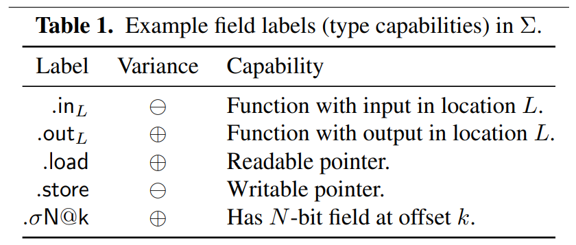

# retypd

[retypd](https://github.com/GrammaTech/retypd) 是一个高级的反编译算法，有一篇[论文](https://github.com/GrammaTech/retypd/blob/master/reference/paper.pdf)

资源：
- 优先看[这个介绍](https://github.com/GrammaTech/retypd/blob/master/reference/type-recovery.rst)。
- 这个[PPT](https://github.com/GrammaTech/retypd/blob/master/reference/presentation_slides.pdf)比论文容易懂很多


## 背景

#### monoid

读《Haskell趣学指南》的Monoids一节，理解一下。

### unification-based type inference algorithms

https://www.cs.cornell.edu/courses/cs3110/2011sp/Lectures/lec26-type-inference/type-inference.htm

## 约束语法



**sketches** 约束的求解结果被表示为sketches。每个value关联上一个sketch，包含该value的所有能力，即能否被store，能否访问指定的偏移。同时sketch还包含一个可自定义的lattice，用来传播类似于typedef这种类型。

**规则** 规则都表示为“X ⊑ Y”的形式，意思是“X is a subtype of Y ”。

**S-Pointer and S-Field⊕/⊖** 通过搜索代码，可以得知，至少在[retypd-ghidra-plugin](https://github.com/GrammaTech/retypd-ghidra-plugin)和[gtirb-ddisasm-retypd](https://github.com/GrammaTech/gtirb-ddisasm-retypd)中是没有和这个相关的规则的生成的。

**covariant/contravariant**

**规则生成**
- 复制操作：x := y，此时保守地认为，有可能是子类型赋值给了父类型变量：Y ⊑ X。
    - 由复制操作带来的数据流，类型方向是父类型。子类型赋值给了父类型。
- 指针加载：x := *p，生成：P.load.σ32@0 ⊑ X 。
- 指针赋值：*q := y，生成 Y ⊑ Q.store.σ32@0 。
- 函数调用：如果有调用y := f(x)，生成 X ⊑ F.in 和 F.out ⊑ Y 。
- icmp：两值进行比较的时候：1 bool类型是结果的子类型。2 两个被比较的值直接，随便生成一个子类型关系？

## 开发与使用

如何使用当前开源的代码呢？代码是一个python模块。当前开源的两个相关的使用代码有：[retypd-ghidra-plugin](https://github.com/GrammaTech/retypd-ghidra-plugin)和[gtirb-ddisasm-retypd](https://github.com/GrammaTech/gtirb-ddisasm-retypd)。

首先分析[retypd-ghidra-plugin](https://github.com/GrammaTech/retypd-ghidra-plugin)是如何使用retypd的。内部代码主要分为ghidra插件的java代码，和封装模块，[ghidra_retypd_provider](https://github.com/GrammaTech/retypd-ghidra-plugin/tree/master/ghidra_retypd_provider)。Java代码部分通过Ghidra提供的API，从Ghidra的反编译器的IR中提取出相关的类型约束，提取为json文件。然后调用python封装模块读取并求解，结果也表示为json文件。然后Ghidra插件部分的java代码读取结果，并设置相应的类型。（注，无论是上次分析lua虚拟机，还是这次分析`/bin/ls`，花的时间特别久，半小时往上）

输入ghidra_retypd_provider的样例json约束文件如下。可以观察到，每个函数的约束单独分开，同时还包含一个call graph部分。

```json
{
  "language": "x86/little/64/default",
  "constraints": {
    "FUN_00109d00": [
        "v_7456 ⊑ v_7780",
        "v_997 ⊑ int64",
        "v_1441 ⊑ FUN_00109b50.in_13",
        "v_4504 ⊑ v_1242.store.σ8@0",
        "v_6777 ⊑ FUN_00109b50.in_5",
        "bool ⊑ v_542",
        "v_2301 ⊑ null",
        "v_7379.load.σ8@0*[nobound] ⊑ v_1441",
        "v_4396 ⊑ v_1671.store.σ8@0*[nobound]",
        "v_1188.load.σ8@0 ⊑ v_1191",
        "v_1671.load.σ8@0*[nobound] ⊑ v_1720",
    ],
    "FUN_00110e10": [
        ...
    ]
  }
  "callgraph": {
    "FUN_00109d00": [
      "FUN_001158c0",
      "FUN_00115920",
      "FUN_00109b50",
      "FUN_00115b30"
    ],
    "FUN_00110e10": [
      "strcmp",
      "strlen",
      "FUN_001158c0",
      "getgrnam",
      "strcpy"
    ],
    ...
  }
}
```

输出ghidra_retypd_provider的样例json结果文件如下。可以观察到，包含两种类型的结果，分别是结构体和函数。结构体包含内部的成员及类型。函数块描述了函数的各个参数的类型。在[这里](https://github.com/am009/retypd-ghidra-plugin/blob/e4f587a2560148f0d0ebbdb2f26fc9977587661f/ghidra_retypd_provider/type_serialization.py#L51)的自定义encoder中定义了转json的函数。

这一点其实很奇怪，似乎该插件关注的核心是函数参数类型。这里[后续解析和类型设置](https://github.com/am009/retypd-ghidra-plugin/blob/7c2547574cd86100e02793ae2c8c0cc8f88c3990/GhidraRetypd/src/main/java/ghidraretypd/RetypdTypes.java#L272)也说明了这一点。

```json
[
  {
    "type": "struct",
    "name": "struct_545",
    "fields": [
      {
        "name": "field_0",
        "type": "char1_t*",
        "offset": 0
      },
      {
        "name": "field_1",
        "type": "char1_t[4]",
        "offset": 168
      }
    ]
  },
  {
    "type": "function",
    "name": "function_260",
    "params": [
      {
        "index": 0,
        "type": "char1_t[4]"
      }
    ],
    "ret": "char1_t[0]"
  },
  ...
]
```

接着我们看ghidra_retypd_provider内部是如何调用retypd的。

- 使用`SchemaParser.parse_constraint`解析每个约束项，放到一个集合里，再按函数名字放到map里，然后构建`Program`：
    ```python
    program = Program(
        CLattice(),
        {},
        parsed_constraints,
        callgraph,
    )
    ```
    这里`parsed_constraints`就是准备好的那个map。callgraph都不用动，就是`Dict[str, List[str]]`。前两个参数分别是`types: Lattice[DerivedTypeVariable]`和`global_vars: Iterable[MaybeVar]`。
- 使用Solver去求解约束：
    ```python
    config = SolverConfig(top_down_propagation=True)
    solver = Solver(program, config, verbose=LogLevel.DEBUG)
    _, sketches = solver()
    ```
    查看solver的`__call__`方法，可以发现返回类型是`Dict[DerivedTypeVariable, ConstraintSet]`和`Dict[DerivedTypeVariable, Sketch]`。
- 传入`CTypeGenerator`，得到最终的类型结果。
    ```python
    gen = CTypeGenerator(
        sketches,
        CLattice(),
        CLatticeCTypes(),
        int_size,
        pointer_size,
    )
    return list(gen().values())
    ```
    `CTypeGenerator`的`__call__`方法的返回类型是`Dict[DerivedTypeVariable, CType]`。

根据[这里](https://github.com/GrammaTech/retypd/blob/e2c2adac5b123aa68b573192519f0d01e365527d/src/parser.py#L111)，每个规则大致就是`var1 ⊑ var2`或者`var1 <= var2`，然后两边的变量就是DerivedTypeVariable类型的。因此，上面结果里返回的map其实就能够用来查每个变量的类型。

#### retypd ghidra 插件

在我的[fork](https://github.com/am009/retypd-ghidra-plugin)仓库里可以直接下载到构建好的插件，修改版Ghidra，以及docker镜像。同时提供了给retypd的样例输入和输出。

通过修改 GhidraRetypd.zip中的extension.properties，可以绕过ghidra插件安装时的版本检查

```Python
version=10.2.3
```

安装Ghidra插件：

    1. 打开 Ghidra 软件，点击 "File" 菜单，选择 "Install Extensions" 选项。
    2. 在弹出的 "Install Extensions" 窗口中，点击 "Browse" 按钮选择你要安装的扩展程序。
    3. 选中你要安装的扩展程序文件（通常是一个 zip 压缩文件），然后点击 "Open" 按钮。
    4. 点击 "OK" 按钮开始安装扩展程序。在安装过程中，Ghidra 软件会自动解压缩扩展程序文件，并将它们安装到正确的目录中。
    5. 安装完成后，重启 Ghidra。

