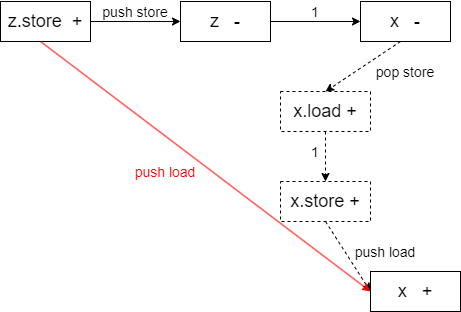
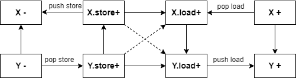

# retypd

**Intro**

钻研了半年多《[Polymorphic Type Inference for Machine Code](https://arxiv.org/abs/1603.05495)》论文。看完本文后还有任何相关的问题可以问我。

跨函数的类型传播算法，可以将库函数的类型传递到代码内部。即使没有库函数识别时，也可以识别处函数内的结构体信息。

**资源**

[retypd](https://github.com/GrammaTech/retypd) 是一个非常高级的反编译类型恢复算法，技术领先程度足以超出其他论文好几年。有一篇[论文](https://github.com/GrammaTech/retypd/blob/master/reference/paper.pdf): 《[Polymorphic Type Inference for Machine Code](https://arxiv.org/abs/1603.05495)》

资源：

- 优先看[这个介绍](https://github.com/GrammaTech/retypd/blob/master/reference/type-recovery.rst)。
- 这个[PPT](https://github.com/GrammaTech/retypd/blob/master/reference/presentation_slides.pdf)比论文容易懂很多

## 背景

**规则生成**

- 复制操作：x := y，此时保守地认为，有可能是子类型赋值给了父类型变量：Y ⊑ X。
  - 由复制操作带来的数据流，类型方向是父类型。子类型赋值给了父类型。
- 指针加载：x := *p，生成：P.load.σ32@0 ⊑ X 。
- 指针赋值：*q := y，生成 Y ⊑ Q.store.σ32@0 。
- 函数调用：如果有调用y := f(x)，生成 X ⊑ F.in 和 F.out ⊑ Y 。
- icmp：两值进行比较的时候：1 bool类型是结果的子类型。2 两个被比较的值直接，随便生成一个子类型关系？

## 开发与使用

如何使用当前开源的代码呢？代码是一个python模块。当前开源的两个相关的使用代码有：[retypd-ghidra-plugin](https://github.com/GrammaTech/retypd-ghidra-plugin)和[gtirb-ddisasm-retypd](https://github.com/GrammaTech/gtirb-ddisasm-retypd)。

首先分析[retypd-ghidra-plugin](https://github.com/GrammaTech/retypd-ghidra-plugin)是如何使用retypd的。内部代码主要分为ghidra插件的java代码，和封装模块，[ghidra_retypd_provider](https://github.com/GrammaTech/retypd-ghidra-plugin/tree/master/ghidra_retypd_provider)。Java代码部分通过Ghidra提供的API，从Ghidra的反编译器的IR中提取出相关的类型约束，提取为json文件。然后调用python封装模块读取并求解，结果也表示为json文件。然后Ghidra插件部分的java代码读取结果，并设置相应的类型。（注，无论是上次分析lua虚拟机，还是这次分析`/bin/ls`，花的时间特别久，半小时往上）

输入ghidra_retypd_provider的样例json约束文件如下。可以观察到，每个函数的约束单独分开，同时还包含一个call graph部分。

```json
{
  "language": "x86/little/64/default",
  "constraints": {
    "FUN_00109d00": [
        "v_7456 ⊑ v_7780",
        "v_997 ⊑ int64",
        "v_1441 ⊑ FUN_00109b50.in_13",
        "v_4504 ⊑ v_1242.store.σ8@0",
        "v_6777 ⊑ FUN_00109b50.in_5",
        "bool ⊑ v_542",
        "v_2301 ⊑ null",
        "v_7379.load.σ8@0*[nobound] ⊑ v_1441",
        "v_4396 ⊑ v_1671.store.σ8@0*[nobound]",
        "v_1188.load.σ8@0 ⊑ v_1191",
        "v_1671.load.σ8@0*[nobound] ⊑ v_1720",
    ],
    "FUN_00110e10": [
        ...
    ]
  }
  "callgraph": {
    "FUN_00109d00": [
      "FUN_001158c0",
      "FUN_00115920",
      "FUN_00109b50",
      "FUN_00115b30"
    ],
    "FUN_00110e10": [
      "strcmp",
      "strlen",
      "FUN_001158c0",
      "getgrnam",
      "strcpy"
    ],
    ...
  }
}
```

输出ghidra_retypd_provider的样例json结果文件如下。可以观察到，包含两种类型的结果，分别是结构体和函数。结构体包含内部的成员及类型。函数块描述了函数的各个参数的类型。在[这里](https://github.com/am009/retypd-ghidra-plugin/blob/e4f587a2560148f0d0ebbdb2f26fc9977587661f/ghidra_retypd_provider/type_serialization.py#L51)的自定义encoder中定义了转json的函数。

这一点其实很奇怪，似乎该插件关注的核心是函数参数类型。这里[后续解析和类型设置](https://github.com/am009/retypd-ghidra-plugin/blob/7c2547574cd86100e02793ae2c8c0cc8f88c3990/GhidraRetypd/src/main/java/ghidraretypd/RetypdTypes.java#L272)也说明了这一点。

```json
[
  {
    "type": "struct",
    "name": "struct_545",
    "fields": [
      {
        "name": "field_0",
        "type": "char1_t*",
        "offset": 0
      },
      {
        "name": "field_1",
        "type": "char1_t[4]",
        "offset": 168
      }
    ]
  },
  {
    "type": "function",
    "name": "function_260",
    "params": [
      {
        "index": 0,
        "type": "char1_t[4]"
      }
    ],
    "ret": "char1_t[0]"
  },
  ...
]
```

接着我们看ghidra_retypd_provider内部是如何调用retypd的。

- 使用`SchemaParser.parse_constraint`解析每个约束项（`SubtypeConstraint`），它保存子类型关系左右两边的变量（`DerivedTypeVariable`）。每个函数的约束项放到一个集合里，再按函数名字放到map里，然后构建`Program`：
  ```python
  program = Program(
      CLattice(),
      {},
      parsed_constraints,
      callgraph,
  )
  ```

  这里`parsed_constraints`就是准备好的那个map。callgraph都不用动，就是`Dict[str, List[str]]`。前两个参数分别是`types: Lattice[DerivedTypeVariable]`和`global_vars: Iterable[MaybeVar]`。
- 使用Solver去求解约束：
  ```python
  config = SolverConfig(top_down_propagation=True)
  solver = Solver(program, config, verbose=LogLevel.DEBUG)
  _, sketches = solver()
  ```

  查看solver的`__call__`方法，可以发现返回类型是`Dict[DerivedTypeVariable, ConstraintSet]`和`Dict[DerivedTypeVariable, Sketch]`。
- 传入`CTypeGenerator`，得到最终的类型结果。
  ```python
  gen = CTypeGenerator(
      sketches,
      CLattice(),
      CLatticeCTypes(),
      int_size,
      pointer_size,
  )
  return list(gen().values())
  ```

  `CTypeGenerator`的`__call__`方法的返回类型是`Dict[DerivedTypeVariable, CType]`。

根据[这里](https://github.com/GrammaTech/retypd/blob/e2c2adac5b123aa68b573192519f0d01e365527d/src/parser.py#L111)，每个规则大致就是`var1 ⊑ var2`或者`var1 <= var2`，然后两边的变量就是DerivedTypeVariable类型的。因此，上面结果里返回的map其实就能够用来查每个变量的类型。

**S-Pointer and S-Field⊕/⊖** 通过搜索代码，可以得知，至少在[retypd-ghidra-plugin](https://github.com/GrammaTech/retypd-ghidra-plugin)和[gtirb-ddisasm-retypd](https://github.com/GrammaTech/gtirb-ddisasm-retypd)中是没有和这个相关的规则的生成的。

#### retypd ghidra 插件

在我的[fork](https://github.com/am009/retypd-ghidra-plugin)仓库里可以直接下载到构建好的插件，修改版Ghidra，以及docker镜像。同时提供了给retypd的样例输入和输出。

通过修改 GhidraRetypd.zip中的extension.properties，可以绕过ghidra插件安装时的版本检查

```Python
version=10.2.3
```

安装Ghidra插件：

1. 打开 Ghidra 软件，点击 "File" 菜单，选择 "Install Extensions" 选项。
2. 在弹出的 "Install Extensions" 窗口中，点击 "Browse" 按钮选择你要安装的扩展程序。
3. 选中你要安装的扩展程序文件（通常是一个 zip 压缩文件），然后点击 "Open" 按钮。
4. 点击 "OK" 按钮开始安装扩展程序。在安装过程中，Ghidra 软件会自动解压缩扩展程序文件，并将它们安装到正确的目录中。
5. 安装完成后，重启 Ghidra。
## 算法详解

- 首先阅读[这个PPT](http://www.lsv.fr/~schwoon/enseignement/verification/ws1112/c3.pdf)和这个论文《[Saturation algorithms for model-checking pushdown systems](https://arxiv.org/pdf/1405.5593)》，学会B¨uchi发现， Caucal提出的这个saturation算法。
- 然后阅读论文，学习其中基于saturation算法改进的部分。

### 自动机基础 Saturation algorithms

资料：

- 《[Pushdown systems](http://www.lsv.fr/~schwoon/enseignement/verification/ws1112/c3.pdf)》了解下推自动机
- 《[Saturation algorithms for model-checking pushdown systems](https://arxiv.org/abs/1405.5593)》了解Saturation algorithms相关的背景概念。

有两个重要结论：

- 下推系统可达的栈内容形成了一个正则语言，因此可以表示为有限状态自动机。但是最初提出的算法是指数级的。后面有人提出了多项式级的算法，核心思想就是引入一个saturation process，转换被逐渐地加入有限自动机。（这个结论没有被retypd使用）
- 下推系统定义了配置（状态加栈字符串）之间的转换关系，可以多项式时间内构建一个带输出的有限状态自动机（transducer）识别这些转换关系。（retypd使用的结论）

**有限自动机**

- $\Sigma$ 是自动机的字符集。$\Sigma^{*}$ 是字符串的集合。 $\Gamma^{\leq n}$ 是长度最多为n的字符串集合。
- 一个在字符集 $\Sigma$ 上的自动机 $\mathcal{A}$ 是一个元组： $(\mathbb{S},\mathcal{I},\mathcal{F},\delta)$ 分别代表有限的状态集合，初始状态集合，最终状态集合，转换规则集合 $\delta \subseteq \mathbb{S} \times \Sigma \times \mathbb{S}$ 表示从一个状态遇到一个字符，转换到另外一个状态。
  - 有时会把字符集写进来 $(\mathbb{S},\Sigma,\mathcal{I},\mathcal{F},\delta)$ 变成五元组
- $s \overset{a}{\underset{\mathcal{A}}{\longrightarrow}} t$ 表示自动机 $\mathcal{A}$ 有这样一个转换 $(s,a,t)$
- $s \overset{w}{\underset{\mathcal{A}}{\Longrightarrow}} t$ 表示自动机读入字符串w之后可以转换到t。

#### 下推系统 pushdown system 与 P-自动机

**和下推自动机的区别**：pushdown system是自动机的简化版本。当我们用PDS建模程序的时候，有时不太关注读入和识别字符，而是关注栈状态的转移。

和自动机的区别在于没有识别字符串这种概念。自动机一般只能用来识别字符串，有初始态，终止态，遇到某个字符的时候触发转换规则。这里的下推系统则不是识别字符串的，即转换规则里不需要读入字符，直接改变状态和栈内容。这里下推系统直接主要关注栈上的内容字符串。

一个下推系统是四元组 $(Q,\Gamma,\bot,\Delta)$

- $Q$ 是有限的控制状态的集合
- $\Gamma$ 是有限的栈字符集
- $\bot \in \Gamma$ 是一个特殊的底部栈字符
- $\Delta \subseteq (Q \times \Gamma) \times (Q \times \Gamma^{\leq 2})$ 是转换的集合。表示在一个状态从栈上弹出一个字符，转换到另外一个状态并压入一个字符串。
- Configuration表示系统状态，是 当前状态 $\in Q$ 和 当前栈字符串 $\in \Gamma^{*}$ 的二元组。
- 不考虑弹出超过栈底的情况。所以有时会引入特殊底部栈字符，然后要求规则不会把这个符号弹出来。

**Pushdown system （PDS）可以用来分析程序**

- 程序表示
  - 状态Q保存程序的全局变量
  - 栈反映程序执行的调用栈
  - 栈上字符编码程序局部变量：比如编码为 当前program counter 和 局部变量的二元组。
- 一些例子
  - 状态 $pAw$, 这里 $p$ 表示状态，代表全局变量， $Aw$ 表示栈。其中 $A$ 表示当前的PC和局部变量，w表示调用栈中，被“暂停”执行的程序状态，包括返回地址和局部变量情况。
  - 状态转换 $pA \rightarrow qB$ 表示执行一个普通语句。
    - 全局变量可能发生修改，从 $p$ 变成 $q$ ，
    - 栈深度不变，但是从A变成B，表示当前PC和局部变量发生了变化。
  - 状态转换 $pA \rightarrow qBC$ 表示函数调用
    - 栈深度增加了，B里面包含了返回地址以及调用者的局部变量状态。现在压入了被调用者的栈。
  - $pA \rightarrow q\epsilon$ 表示函数返回
    - 栈上弹出了一个字符，表示弹出了一个调用栈。

**PDS的可达性问题**

给定一个PDS和两个configuration $c,c'$，是否能从 $c$ 走到 $c'$ 状态？

$$
\{ w \in \Gamma^{*} \mid  \exists q \in Q, (q_{0},\bot) \Rightarrow (q,w) \}
$$

即求出这样一个集合，从起始状态 $(q_{0},\bot)$ 出发能推导到的所有状态 $(q,w)$ (这里状态 $q \in Q$ 任意)，其中字符串w组成的集合。

**一个非常重要的结论是，这里可达的字符串集合形成了正则语言。** 这意味着函数调用时的状态转换可以用一个有限状态自动机表示。

**PDS的configuration的正则性：**

- **背景**：众所周知，能被确定有限状态自动机识别的语言是正则（regular）语言。而说到语言，我们会想到根据语法生成的规则，最后推导出很多可以被接受的字符串，但是语言本质也就是一种无限的字符串的集合。
  - 如果是有限的话，直接对每个字符串用or连接就完全匹配了。所以一般讨论的都是无限的字符串集合。
- **定义1**：如果某个配置集合 $C$ 是正则的，那么对任意的状态 $p \in Q$ （即不管状态），在这个配置集合里面的所有字符串w构成的集合， $\{ w \in \Gamma^{*} \mid (p,w) \in C\}$ 是正则的。即栈状态构成正则语言。
  - 简单来说，不管state，如果栈上字符的集合构成正则的语言，则这个configuration集合是正则的。
- **定理1，初始状态可达的配置集合的正则性**：
  - 定义：初始配置：任意状态，但是栈为空（仅有 $\bot$ 符号）的配置
  - 任意pushdown system，从初始配置出发，可达的配置是正则的。
- **定理2：后推闭包的正则性**：给定一个正则配置集合C，基于自动机规则任意后推形成的闭包集合也是正则的。
  - 写作：$Post^*_{P}(C) = \{ c'  \mid \exists c \in C, c \underset{P}{\Longrightarrow} c' \}$ 从任意的C中配置开始，在自动机P下能推导出c'，则c'属于集合。
  - 这一定理能从定理1推出：构建一个新自动机P'，增加很多新的state，使得当前配置集合都是初始配置。这里定理里的后推可得到的配置集合其实就是可达的配置集合。
- **倒推闭包的正则性**：正则集合的倒推集合，即另外一个配置集合Pre*(C)，能够推理得到当前集合C。当前集合是正则的，则Pre*(C)也是正则的。
  - **原因**：有时候想要基于程序的错误状态，倒退前面的可达状态。
  - **证明**：思想是，构建新的自动机P'，规则和P是反着来的。
    - 如果P有个规则是 $qA \rightarrow p$ 即弹出了字符A。我们P'增加反着来，压入字符A的规则 $pX \rightarrow qAX$。即对于任意字符X，都允许压入AX。
    - 如果P有个规则是 $qA \rightarrow pBC$ 弹出A压入BC。则我们需要增加两个规则。
      - $pB \rightarrow r_{(C,q,A)}$
      - $r_{(C,q,A)} C  \rightarrow  q A$
      - 直接插入规则的问题在于，下推自动机左边一般只能匹配一个栈顶字符，右边则可以为空，也可以压入两个字符。这里我们需要考虑同时按顺序存在BC字符的情况。
      - 借助中间状态 $r_{(C,q,A)}$ 我们
    - **一致性**：如果在P中有两个状态可以互推，当且仅当我们P'中这两个状态可以反着互推。而且P'满足上面定理的要求，然后应用上面正推的定理，成功证明反推定理。

**和retypd的PDS对应**：我们构建的PDS表达的是子类型之间的转换关系。但是实际构建出来可能存在很多初始状态不可达的序列。例如如果有规则 $A.load \sqsubseteq B$ 我们增加初始状态的转换，使得初始状态可达 (A/B, $\bot$) 的配置。但是规则并不允许 $(A, \bot) \rightarrow (A, .load)$ ，否则存在子类型关系 $A \sqsubseteq A.load$。也因此，这里构建的自动机没有用在retypd中。

**PDS对应的自动机**

有一个PDS $\mathcal{P}=(P, \Gamma, \Delta)$，我们对应有一个有限自动机 $\mathcal{A}=(Q, \Gamma, P, T, F)$

- PDS的栈字符集 $\Gamma$ 被用作有限自动机的字符集。PDS栈字符原本用来表示局部变量和PC。
- PDS的控制状态（表示全局变量），被用作有限自动机的初始状态。
- 我们称，有限自动机接受配置 $pw$ ，如果自动机从状态p开始，接受字符串w之后能停止在终结态。而且对应每个PDS都能构造出这样的自动机。
  - 直观上理解：对任意的state（代表了程序的全局变量状态），此时可能的栈情况是什么样的？这些所有可能的栈情况可以用一个有限自动机来表达。
  - 上面提到，不考虑状态，单把栈上字符串拿出来，形成的也是正则语言。这里其实表达的是一个意思。每个configuration的状态作为初始状态，然后存在一个P-有限自动机匹配栈上的内容，其实就是说明了栈上形成的是正则语言。

**Pre(S)的Saturation Algorithm**

- 相关符号总结
  - $\Delta$: pushdown system的下推规则
  - $\delta$: P-自动机的状态推理规则。后面会不断增加规则，构成一个递增的规则序列。
  - $Q$: pushdown system的状态集合，也是P-自动机的初始状态
  - $\mathcal{F}$: P-自动机的终止状态集合
  - $\mathcal{A}$: P-自动机。包括状态集合 $\mathbb{S}$, 初始状态 $Q$, 推理规则 $\delta$ 和终止状态 $\mathcal{F}$。
  - $\mathcal{L}(\mathcal{A})$: 表示A接受的语言。
  - $\mathcal{B}$: 需要构建的新自动机，接受 $Pre^{*}_P (\mathcal{L}(\mathcal{A}))$
- Saturation Algorithm算法
  - 前提：已知一个下推系统 $P=(Q,\Gamma,\bot,\Delta)$ ,和对应的P-自动机 $\mathcal{A}=(\mathbb{S},Q,\delta,\mathcal{F})$
  - 目标：构建出一个新的自动机 $\mathcal{B}$ 接受语言 $Pre^{*}_P (\mathcal{L}(\mathcal{A}))$
  - 过程：构建一个自动机的序列 $(\mathcal{A}_{i})_{i \in [0,N]}$

    - 其中其他部分都是相同的，状态数量是相同的，只有转换规则 $\delta_i$ 不同。
    - 保证转换规则只会增加新的规则： $i \in [0,N-1]$, $\delta_{i} \subseteq \delta_{i+1}$
    - 最后转换规则会收敛，达到不动点： $\delta_{i+1}=\delta_{i}$
    - 每次至少增加一个规则，因此程序最多走 $|Q|^{2} |\Gamma|$ 步
      - 作为一个有限状态自动机，这里只对Q状态增加边，每两个状态之间最多 $|\Gamma|$ 个规则。
  - 算法：如果有一个规则 $pA \rightarrow qw$ ，同时现在的P-自动机存在一个路径 $q \overset{w}{\underset{\mathcal{A}_{i}}{\Longrightarrow}} s$ 我们给P-自动机增加一个新的转换规则 $p \xrightarrow[]{A} s$

    

    `p Au -> q wu`。原有自动机为黑色部分，u代表未知任意字符串，即代表的是路径，内部省略了具体的其他节点。意味着从状态为q栈为空的状态，能够接受一个字符串wu。

    然后我们新增了这样一条规则，使得状态为p，字符串为Au也被接受了。

    规则的构建使得，某个下推系统的前驱规则的节点被覆盖到了。而最后目的自动机 $\mathcal{B}$ 由于达到了不动点，因此关于下推系统P的前驱规则封闭。
  - 证明过程的不变量：在这个自动机转换规则的序列中，存在一些始终为真的条件。如果自动机存在转换规则 $p \xrightarrow[]{A} s$ ，那么以下两个性质始终满足满足。

    - 如果状态s属于下推系统P的状态：在下推系统P中存在规则 $pA \overset{}{\underset{P}{\Longrightarrow}} s$。这是一个弹出栈字符的规则。
    - 如果状态s属于其他状态，即不属于下推系统P的状态：对于任何从状态s出发能被接受的字符串u，配置 $(p,Au)$ 属于 $Pre^{*}_P (\mathcal{L}(\mathcal{A}))$
    - 从这个不变关系，可以推出， $\mathcal{L}(\mathcal{A}_i) \subseteq Pre^{*}_P (\mathcal{L}(\mathcal{A}))$ ，即每个A的语言都是我们目标的子集。 特别地， $\mathcal{L}(\mathcal{B}) \subseteq Pre^{*}_P (\mathcal{L}(\mathcal{A}))$ 最终迭代的不动点也是这样。
  - 最小关系：我们如果只关注状态在Q中（下推系统的状态）的部分，那么关系只在 $(Q \times \{\varepsilon\}) \times (Q \times \Gamma)$ 上被添加 1. 左边都是初始状态; 2. 转换规则都是接受了一个字符。 这里增加的关系可以被看作是一个最小关系 $\mathcal{R}$

    - $pA \; \mathcal{R} \; q$ 如果存在规则 $pA \rightarrow q$
    - $pA \; \mathcal{R} \; q$ 如果 $rB \; \mathcal{R} \; q$ 并且 $pA \rightarrow rB$ 在规则中。
      - 这里关系 $\mathcal{R}$ 似乎会对每个带栈字符的状态创建一个无字符的对应状态？比如这里为 $rB$ 引入中间状态
    - $pA \; \mathcal{R} \; q$ 如果存在规则 $pA \rightarrow rBC$，并且存在状态 $s\in Q$，关系 $rB \; \mathcal{R} \; s$ 和 $sC \; \mathcal{R} \; q$
      - 这里 $q$ 仿佛直接代表了 $rBC$

#### 描述派生（可达）关系的 Transducer

基础概念：

- Finite State Transducer 其实就是带有输出的有限状态自动机（finite state automaton）。
- 派生关系 $Deriv_{P}$：描述任意两个字符串之间的关系： $Deriv_{P} =\{ (u,v) \in \Gamma^{*} \mid (q_{0},u) \overset{}{\underset{P}{\Longrightarrow}} (q_{f},v) \}.$

  - $Deriv_{P} \subseteq \Gamma^{*} \times \Gamma^{*}$ 。是字符串之间的关系。
- 操作：$A_{+}$ 表示压入单个符号的操作 push A（$A \in \Gamma$ 是字符）。 $A_{-}$ 同理。

  - 操作集合 $\Gamma_{+}=\{ A_{+} \mid A \in \Gamma\}$ push操作的集合，  $\Gamma_{-}$ 同理。 $\overline{\Gamma}=\Gamma_{+} \cup \Gamma_{-}$ 表示两个的并集。
  - 操作序列： $\alpha=\alpha_{1} \ldots \alpha_{n} \in \overline{\Gamma}^{*}$ 表示一系列操作。
    - 例如， $pA \rightarrow qBC$ 的操作序列是 $A_{-}C_{+}B_{+}$
  - 操作转换关系： $u \overset{\alpha}{\underset{}{\leadsto}} v$ 表示栈状态 $u \in \Gamma^{*}$ 在操作 $\alpha$ 下变成了栈状态 $v$。
  - non-productive序列：无法被应用的栈序列，常常是这种 $B_{+} C_{-}$ 先push再pop一个不同符号的序列，刚压入B，怎么可能栈顶弹出C呢？
    - 就像下面对比图先走橙色边再走蓝色边一样。
- 对比自动机和transducer

  

  这里可以看到，transducer的状态和PDS是完全对应的，前面的自动机则仅是初始状态和PDS相同，只有栈为空的时候才对应PDS对应的状态。

  Transducer 每条边上也只能push或pop一个字符，这里是简略写法，隐藏了中间的状态。但是是否打破了Transducer和PDS状态的对应关系？并没有，如果要求PDS每次也只能增加或者减少一个栈字符，则两边还是对应的。
- 行为集合 $Behaviour_{P}$ 表示下推系统P，不管是否non-productive，可能走出的所有栈操作序列的集合。

  - 即我现在只需要管状态转换，不需要管栈操作的应用。
  - 即画出上面的转换图，然后随便沿着边走
- $Behaviour_{P}$ 和 $Deriv_{P}$ 的关系：对于任何在行为集合的操作序列， $\alpha \in Behaviour_{P}$ ， 两个字符串属于派生关系集合 $(u,v) \in Deriv_{P}$ 当且仅当 这两个字符串存在操作关系 $u \overset{\alpha}{\underset{}{\leadsto}} v$ 。

  - 然而这个定义不太行，因为 (1) $Behaviour_{P}$ 有很多不合法的序列。(2) 存在刚push就pop的冗余序列，如 $A_{-} B_{+} A_{+} A_{-} C_{+} C_{-}=A_{-} B_{+}$ 。
- 简化关系 $\mapsto$ ：表示一个栈操作序列被简化为另外一个栈操作序列。消除了上面的这种刚push就pop的冗余行为

  - 例如 $B_{-}A_{+}A_{-}C_{+} \mapsto B_{-}C_{+}$
- 操作序列集合在简化操作下维持正则性：如果一个操作序列集合R内的每个操作都被 $\mapsto$ 简化，那么新的集合 $Red(R) = \{ Red(\alpha)  \mid \alpha \in R \}$ 也是正则的
- 操作序列自动机的简化算法： $Red(R)$ 能在 $\mathcal{O}(|\mathcal{A}|^{3})$ 的复杂度构建出来。
- 简化并移除non-productive序列的操作集合 $RP_{P}$

  - 移除non-productive序列：简化后很容易识别，直接扫描找先push再pop的序列。因为如果push的字符和pop的字符不同则不合法，相同则说明化简没有结束。
  - 性质：可以推出里面的序列必然只会先pop再push。
- 最终的结论：

  - $Deriv_{P}$ 的关系 $(w_{1},w_{2})$ 对应到transducer 必然是，找出两个串的公共后缀，然后先pop w1的前缀，然后push w2的前缀。
  - $Deriv_{P}$ 对应的 Transducer 可以在多项式时间内被构建出来。

核心在于，将状态转换改为了一个push pop栈的序列。即，如果有一个 $pA \rightarrow rw$ 规则，那么我们这里构建一个序列：pop A，push ...(构成w的几个字符)。表示栈上的变化关系。

然后使用饱和（Saturation）算法。这里需要每条边上的操作只能压入或者弹出单个字符。即找到两个路径上能化简的状态，然后直接连过去，标上化简后的操作序列。

这里的饱和（Saturation）算法才是后面retypd使用的。

### retypd 基础符号

**使用的符号**

- $\mathcal{V}$: 类型变量的集合
  - 在这个集合里包含一系列类型常量，作为一种符号描述。这些类型常量可能形成一个lattice，但是我们不解释它们。
- $\Sigma$: 字段标签 field label。不一定是有限的。主要的符号如下：
  - $\mathsf{.in}_L$ 函数在位置L的输入
  - $\mathsf{.out}_L$ 函数在L位置的输出
  - $\mathsf{.load}$ 可读的指针
  - $\mathsf{.store}$ 可写的指针
  - $.\sigma\mathsf{N@k}$ 在偏移k处有一个N bit的成员。
- 函数 $\langle \cdot \rangle : \Sigma \to \{ \oplus, \ominus \}$: 从结构体label映射到 $\{ \oplus, \ominus \}$ 表示variance，协变和逆变属性
- 派生的类型变量 derived type variable (定义3.1)：形为 $\alpha w$ ，其中类型变量 $\alpha \in \mathcal{V}$ and 字段标签 $w \in \Sigma^*$.
- 标签 $\ell$ 的variance (定义3.2)，指的是前面的类型变量的类型如果发生变化时，带标签的派生类型变量的variance的变化方向。 $\alpha.\ell$ 和 $\beta.\ell$ 中，如果 $\alpha$ 是 $\beta$ 的子类型。
- 约束 $c$ (定义3.3)有两种形式。约束的集合用 $\mathcal{C}$ 表示
  - 存在形式: (派生)类型变量X存在
  - 子类型形式：(派生)类型变量X是Y的子类型。
  - 约束的推导 $\mathcal{C} \vdash c$ 表示约束能从原约束集合中，由那些规则派生出来。
  - 约束中的自由变量定义 $\exists \tau . \mathcal{C}$ 表示，存在变量 $\tau$ 满足了约束集合。
- Type Scheme类型方案，表示一个泛型的函数。 $\forall{\overline{\alpha}}.{\mathcal{C}}\Rightarrow{\beta}$ 表示在约束C的条件下，带有模板变量集合 $\overline{\alpha}$ 的泛型类型 $\beta$
  - 仅增加约束： $\forall \tau . C \Rightarrow \tau$ 表示仅对类型 $\tau$ 增加约束。
    - 例如 $\forall \tau . (\tau.\mathsf{in}.\mathsf{load}.\sigma\mathsf{32@4} \sqsubseteq \tau.\mathsf{out}) \Rightarrow \tau$ 表示函数返回了参数在4字节offset位置的成员。
  - 和约束的关系：基本是对应的。可以想象为我们主要关注约束，任何类型方案都可以理解为，声明一些通配符变量，然后定义一些约束。例如 $\forall \alpha . (\exists \tau . \mathcal{C}) \Rightarrow \alpha$ 。通过引入新的类型变量，可以让最右侧总是等于单个变量。如果能把约束里每个类型变量解出来，那么这个泛型也很容易得到。
  - 和sketch的关系。通过inferShapes算法将约束求解为变量映射到sketch的树/自动机结构。

**常见术语**

- pushdown system: 在基本的自动机的基础上，额外增加了一个栈结构。
- non-structural subtyping: 即子类型关系不一定非要结构完全相同（在structural subtyping中只能叶子节点不同）。尤其是在有结构体和对象这种情况。见["Type Inference with Non-structural Subtyping"](https://web.cs.ucla.edu/~palsberg/paper/fac97.pdf)

**规约规则**

- **T-Left**/**T-Right**/**T-Prefix**: 如果存在约束 $\alpha \sqsubseteq \beta$ ，则 $\alpha$ 和 $\beta$ 存在。如果存在一个带field label的派生变量，则原始变量存在。
  - 这意味着在算法中我们在访问约束时会创建对应变量节点。
- **T-InheritL** / **T-InheritR**: 子类型能安全代换父类型。父类型如果能带一个field label，则子类型带有相同的field label的派生变量也存在。
- **S-Refl**: 反射性，自己是自己的子类型。
- **S-Field$_\oplus$** / **S-Field$_\ominus$**: 如果field label的variance是协变 $\oplus$，则原变量子类型关系在带上标签后保持。否则反过来。
- **S-Pointer**: 指针存入的类型是取出的子类型。

**sketches** 约束的求解结果被表示为sketches。每个value关联上一个sketch，包含该value的所有能力，即能否被store，能否访问指定的偏移。同时sketch还包含一个可自定义的lattice，用来传播类似于typedef这种类型。

我们分析的不是具体的程序中的变量，而是他们的类型和类型之间的关系。因为复杂的约束关系，我们会把类型再设为一个类型变量，称为DataTypeVariable，DTV。

**什么是Sketches**：一个派生类型变量DTV，可能有各种各样的能力，比如可以在offset为4的地方load出一个四字节的值 （`.load.σ32@4`）。首先可以遍历所有的约束关系，比如`v_4504 ⊑ v_1242.store.σ8@0`，对每个关系单独看两边的变量，然后看比如`v_1242`是否被直接这样取过offset，然后把这些操作收集起来。但是这样还不够，因为可能因为约束的存在，其他变量能做的操作，它因为约束，应该也能做。这些都求解出来，得到的数据结构就是一个Sketch。

一个Sketch才是真正直接代表一个具体的类型。是一个树状的类型结构。这个树的边上标记了field label，节点上标记了类型lattice上的元素。

**基于程序操作的约束生成**

- 变量复制/赋值：要么两边类型相同，要么根据安全代换原则，子类型被赋值为父类型。
- 指针读取：增加field label。
  - 指针的读和写能力分开考虑。子类型方面特殊处理。
- 函数调用：参数父类型，返回值子类型。
  - 单独的类型变量规则是structural的，即子类型和父类型的能力必须一致。但是在函数调用时，可以遗忘一些能力。

## 规约算法：概述（Section 5）

### 约束的简化

**类型，以及函数的类型到底应该怎么表示？**

- 格表示的类型：对于单个固定大小的基本类型，可以使用lattice结构以及一个偏序关系表示类型。子类型为格上的偏序关系
- 对于复杂的具有能力的类型，比如访问某个偏移字段的能力，加载出值的能力，则类似结构体的子类型关系，子类型允许具有更多能力，安全代换父类型。
- 函数的类型则涉及到泛型的类型方案的表示 $\forall{\overline{\alpha}}.\,{C}\!\Rightarrow\!{\tau}$ 。为函数的输入和输出类型创建类型变量，然后得到一个变量的最小约束集合表示这个函数的类型。
  - 例如通用的恒等函数，直接将参数返回，表示为，对任意的类型X，返回值的类型也是X。对应我们的表示可能是 $F.in \sqsubseteq F.out$
- PDS = （未化简，或者简化后的）约束 = 类型方案 type scheme

**我们为什么要简化约束？** 为了减少无用的自由变量，降低约束集的增长率。令 $\mathcal{C}$ 表示由抽象解释生成的过程的约束集，并且 $\overline{\alpha}$ 是 $\mathcal{C}$ 中的自由类型变量集。我们其实已经可以使用 $\forall{\overline{\alpha}}.\,{\mathcal{C}}\!\Rightarrow\!{\tau}$ 作为过程类型方案中的约束集，因为合法调用 $f$ 时使用的输入和输出类型显然是满足 $\mathcal{C}$ 的。

然而，实际上我们不能直接使用这个约束集，因为这会导致在嵌套过程中产生很多无用的自由变量，并且约束集的增长率很高。如果一个函数没有调用其他函数，则确实约束集就自己。但是当函数调用别人，其他函数又调用更其他的函数，此时每次为一个函数推理类型时，就会牵涉进来所有这些涉及的函数的约束。因此化简约束是非常有必要的（TODO，是否可以根据约束的性质，判断它是否需要牵涉进来？）。

这个简化算法的输入是，从一个函数的推断得到的一个类型方案 $\forall{\overline{\alpha}}.\,{C}\!\Rightarrow\!{\tau}$ （包括自由类型变量，约束，和泛型），并创建一个较小的约束集 $\mathcal{C}'$，使得任何由 $\mathcal{C}$ 对 $\tau$ 的约束也被 $\mathcal{C}'$ 所蕴含。

相反，我们寻求生成一个**简化的约束集** $\mathcal{C}'$，使得如果 $c$ 是一个“有趣”的约束，并且 $\mathcal{C} \;\vdash\; c$，那么 $\mathcal{C}' \;\vdash\; c$ 也同样成立。但什么让一个约束变得有趣呢？

- 能力约束，表示某个dtv有某个field label
- 递归类型约束： $\tau.u {\;\sqsubseteq\;} \tau.v$
- 涉及常量类型的约束： $\tau.u {\;\sqsubseteq\;} \overline{\kappa}$ 或者 $\overline{\kappa} {\;\sqsubseteq\;} \tau.u$ 其中 $\overline{\kappa}$ 是类型常量.

### Roadmap

1. （A.）收集文字格式的初始约束，构建初始图。插入外部函数已知的参数类型。
2. （F.1）约束简化算法。简化后的约束就是type schemes。这里对每个强连通分量后序遍历进行处理，处理完的分量内的type schemes保存下来，等待实例化。
   1. 基于约束集合构建初始图。子类型关系增加标记为1的边。对标签增加和减少的关系，增加对应push/pop的边。
      1. 比如对于dtv `F.in_a.load.off_4_size_8` 构建一系列图节点 `F -> F.in_a -> ... -> F.in_a.load.off_4_size_8`。
      2. 对于约束关系两边的dtv，连接边（边上标记1）。
   2. 运行Saturation算法，将 `push α -> 1 -> pop α` 这种边序列增加shortcut边。应用S-Pointer的实例化规则

- Step 3: Identify the “externally-visible” type variables and constants; call that set E.
- Step 4: Use Tarjan’s path-expression algorithm to describe all paths that start and end in E but only travel through E c.
- Step 5: Intersect the path expressions with the language (recall _)\*(forget _)\*.
- Step 6: Interpret the resulting language as a regular set of subtype constraints. (“forgets” on the right, “recalls” on the left)

3. （F.2）构建sketches（为每个类型变量，比如函数类型）（自底向上遍历call graph的顺序），同时细化具体类型。
4. （4.3）最后转换sketches到C类型。

类型恢复本质上是三层分析的叠加：

- 指针和数字类型的区分。
- 指针能力分析。
- 自定义的typedef常量类型传播。

本质上，retypd在前两者里用的是快速的steensgaard的指针分析，在最后这层的分析上用的是Anderson的指针分析算法。

retypd为什么不直接采用steensgaard的类型恢复？因为常量用不了，merge了直接变成父类型，基本无法传播自定义的typedef类型。。

对于每个SCC看作按需分析。每个SCC能够简化算法计算出对应的summary。

### 无约束的下推系统 Unconstrained Pushdown Systems

**无约束的含义**：TODO。可能是表示没有限制栈符号和转换规则的有限性？

核心思路： 下推系统 $\mathcal{P}_\mathcal{C}$ 的转换序列，可以直接对应上基于约束集合 $\mathcal{C}$ 上的子类型推导判断的推导树。

定义：一个**无约束下推系统**是由三个部分组成的元组 $\mathcal{P} = (\mathcal{V}, \Sigma, \Delta)$，其中 $\mathcal{V}$ 是**控制位置**的集合，$\Sigma$ 是**栈符号**的集合，而 $\Delta$ 是包含在 $(\mathcal{V} \times \Sigma^*)^2$ 内的（可能无限）**转换规则**的集合。转换规则表示为 $\langle X; u \rangle \hookrightarrow \langle Y;v\rangle$，其中 $X,Y \in \mathcal{V}$ 且 $u,v \in \Sigma^*$。我们定义**配置**的集合为 $\mathcal{V} \times \Sigma^*$。在配置 $(p,w)$ 中，$p$ 称为**控制状态**，$w$ 称为**栈状态**。

注意到，我们既不要求栈符号的集合也不要求转换规则的集合是有限的。这种自由度是为了模拟推导规则 S-Pointer， 正如图3的推导规则 S-Pointer 所示，它对应于一个无限的转换规则集。

**为什么要用下推系统？** 下推系统能很好地反映类型关系关于能力的传递关系，反映在下推系统上就是后缀子串的关系。

- 转换关系定义：一个无约束的下推系统 $\mathcal{P}$ 确定了一个**转换关系** $\longrightarrow$ 在配置集合上： $(X,w) \longrightarrow (Y,w')$ 如果存在一个后缀 $s$ 和一个规则 $\langle {X}; {u} \rangle \hookrightarrow 	\langle {Y}; {v} \rangle$，使得 $w = us$ 和 $w' = vs$。$\longrightarrow$ 的传递闭包表示为 $\stackrel{*}{\longrightarrow}$。
  - 这里的公共后缀s，就可以想象为类型的能力。比如各种偏移里的字段。然后前缀类型变量，比如两个结构体类型，如果符合子类型关系，则对应的访问相同的字段得到的类型变量，则也存在子类型关系。

有了这个定义，我们可以陈述我们简化算法背后的主要定理。这里一个类型对应一个 $(\mathcal{V} \cup \Sigma)^*$ 字符串。

设 $\mathcal{C}$ 是一个约束集合，$\mathcal{V}$ 是一组基类型变量集合。定义 在类型变量和标签集合构成的两个字符串之间的关系 $(\mathcal{V} \cup \Sigma)^* \times (\mathcal{V} \cup \Sigma)^*$ 的一个子集 $S_\mathcal{C}$，
通过 $(Xu, Yv) \in S_\mathcal{C}$ 当且仅当 $\mathcal{C} \;\vdash\; X.u {\;\sqsubseteq\;} Y.v$。
那么 $S_\mathcal{C}$ 是一个正则集合，并且可以在 $O(|\mathcal{C}|^3)$ 时间内构造一个识别 $S_\mathcal{C}$ 的自动机 $Q$。

证明：基本思想是将每个 $X.u {\;\sqsubseteq\;} Y.v \in \mathcal{C}$
作为下推系统 $\mathcal{P}$ 中的一个转换规则 $\langle {X}; {u} \rangle \hookrightarrow	\langle {Y}; {v} \rangle$。
此外，我们为每个 $X \in \mathcal{V}$ 添加控制状态 ${^\#{Start}}, {^\#{End}}$ 及其转换 $\langle {{^\#{Start}}}; {X} \rangle \hookrightarrow \langle {X}; {\varepsilon} \rangle$
和 $\langle {X}; {\varepsilon} \rangle \hookrightarrow \langle {{^\#{End}}}; {X} \rangle$。
目前，
假设所有标签都是协变的，并且忽略规则 S-Pointer。
通过构造，$({^\#{Start}}, Xu) \stackrel{*}{\longrightarrow} ({^\#{End}}, Yv)$ 在 $\mathcal{P}$ 中当且仅当 $\mathcal{C} \;\vdash\; X.u {\;\sqsubseteq\;} Y.v$。
Büchi [27] 保证，对于任何标准（非无约束）下推系统中的两个控制状态 $A$ 和 $B$，
所有满足 $(A, u) \stackrel{*}{\longrightarrow} (B, v)$ 的 $(u,v)$ 对组成的集合是一个正则语言；
Caucal [8] 给出了一个构造识别这种语言的自动机的饱和算法。

在完整的证明中，我们增加了两个创新之处：首先，我们通过将variance数据编码到控制状态和转换规则中，支持逆变堆栈符号。
第二个创新之处涉及到 S-Pointer 规则；这个规则是有问题的，因为自然的编码将导致无限多的转换规则。
我们将 Caucal 的构造扩展为在饱和过程中懒惰实例化所有必要的 S-Pointer 应用。
详情见 Appendix D。

由于 $\mathcal{C}$ 通常涉及到无限多的约束，
这个定理特别有用：它告诉我们由 $\mathcal{C}$ 引发的完整约束集合可以通过自动机 $Q$ 的有限编码来实现。
对约束闭包的进一步操作，如有效的最小化，可以在 $Q$ 上进行。通过限制与 ${^\#{Start}}$ 和 ${^\#{End}}$ 的转换，使用相同的算法
消去类型变量，生成所需的约束简化。

**推理的整体复杂性**

用于执行约束集简化类型方案构造的饱和算法，
在最坏情况下，是关于简化子类型约束数量的三次方。由于一些著名的指针分析方法也具有三次方复杂度（如 Andersen [4]），
因此很自然地会怀疑 Retypd 的“无需指向”分析是否真的比基于指向分析数据的类型推理系统提供优势。

为了理解 Retypd 的效率所在，首先考虑 $O(n^3)$ 中的 $n$。
Retypd 的核心饱和算法在子类型约束的数量上是三次方的；由于机器代码指令的简单性，每条指令大约会产生一个子类型约束。
此外，Retypd 在每个独立的过程中应用约束简化以消除该过程局部的类型变量，
从而得到只涉及过程形参、全局变量和类型常量的约束集。在实践中，这些简化的约束集很小。

由于每个过程的约束集是独立简化的，因此三次方的 $n^3$ 因子由最大过程大小控制，而不是整个二进制文件的大小。
相比之下，像 Andersen 这样的源代码指向分析通常与指针变量的总数呈三次方，并且根据用于上下文敏感性的调用字符串深度呈

## 算法细节

### 约束简化算法（Appendix D）

**基础符号**

- $\amalg$ 表示集合的不交并。表示某个集合可以分割为不同的组成部分。
  - $\mathcal{V} = \mathcal{V}_i \amalg \mathcal{V}_u$ 表示类型变量集合被分割为interesting和uninteresting两部分。
- 一个证明是elementary的，如果证明的结论的子类型关系里没有uninteresting的变量，且证明过程中，uninteresting变量都只在内部。
  - $\mathcal{C} {\;\vdash\;}^{\mathcal{V}_i}_\text{elem} X.u {\;\sqsubseteq\;} Y.v$ 表示约束集合 $\mathcal{C}$ 上能够推理出这样一个子类型约束。其中类型变量都定义在 ${\mathcal{V}_i}$ 上，并且这样的关系是elementary的。

**自动机**

对应关系：

- 一个类型（sketch）就是一个有限状态自动机。
  - 本来用树就够了，但是递归类型会导致无限长的树。根据子树的有限性，用自动机处理递归的情况。典型的例子是复杂的递归结构体类型。
- 下推自动机工作的过程就是我们类型推理的过程
  - 当前状态表示基础的类型变量。
  - 栈状态表示标签，比如`.load`，field访问
  - 自动机配置：状态+栈状态。表示一个派生变量。
  - 状态转换规则：子类型关系。
    - 比如，随便写一个规则 $a.\sigma\mathsf{N@k} \sqsubseteq b.load$ 表示可以从状态为 $a$ 栈内容为 $\sigma\mathsf{N@k}$ 的配置转换到 状态为 $b$ 栈内容为 $load$ 的配置。
  - 可达性：派生的子类型关系。
    - 然后，如果 $b.load$ 又是 $c$ 的子类型，两个规则合起来，在自动机上，状态 $a.\sigma\mathsf{N@k}$ 到 $c$ 也是可达的（走了两步）。因此也具有子类型关系。 $a.\sigma\mathsf{N@k} \sqsubseteq c$。

### Transducer 与其构建

- Transducer可以表示下推自动机的所有的推断关系！任意两个dtv字符串之间的子类型关系！
- Transducer和类型推断的对应关系。

重要概念：

- $\mathcal{P}_\mathcal{C}$ 表示我们这里构建的pushdown system。包含三部分 $(\widetilde{\mathcal{V}}, \widetilde{\Sigma}, \Delta)$

  - 状态集合： $\widetilde{\mathcal{V}} = \left(\mathsf{lhs}(\mathcal{V}_i) \amalg \mathsf{rhs}(\mathcal{V}_i) \amalg \mathcal{V}_u\right) \times \{ \oplus, \ominus \} \cup \{ {^\#{Start}}, {^\#{End}} \}$
    - 额外增加的两个特殊状态 start 和 end
    - 带有variance标签的状态，包括三部分
      - 带有L或R标签的interesting变量
      - uninteresting变量
  - 栈字符集： $\widetilde{\Sigma} = \Sigma \cup \{ v^\oplus ~|~ v \in \mathcal{V}_i \} \cup \{ v^\ominus ~|~ v \in \mathcal{V}_i \}$
    - 包含普通的field label
    - 带有variance标记的有趣变量。TODO这表示什么意思
  - 转换规则包括四部分 $\Delta = \Delta_\mathcal{C} \amalg \Delta_\mathsf{ptr} \amalg \Delta_\mathsf{start} \amalg \Delta_\mathsf{end}$
    - $\Delta_\mathcal{C}$ 现有的规则，经过rule函数转换后的结果
    - $\Delta_\mathsf{ptr}$ PTR规则，经过rule函数转换后的结果
    - $\Delta_\mathsf{start} = \left\{\langle {{^\#Start}}; {v^\oplus} \rangle \hookrightarrow \langle {v^\oplus_\mathsf{L}}; {\varepsilon} \rangle~|~v \in \mathcal{V}_i \right\} \cup \left\{\langle {{^\#Start}}; {v^\ominus} \rangle \hookrightarrow \langle {v^\ominus_\mathsf{L}}; {\varepsilon} \rangle~|~v \in \mathcal{V}_i \right\}$
      - 表示start状态可以把栈上的唯一变量标签转换为当前状态，栈为空
    - $\Delta_\mathsf{end} = \left\{\langle {v^\oplus_\mathsf{R}}; {\varepsilon} \rangle \hookrightarrow \langle {{^\#End}}; {v^\oplus} \rangle~|~v \in \mathcal{V}_i \right\} \cup \left\{\langle {v^\ominus_\mathsf{R}}; {\varepsilon} \rangle \hookrightarrow \langle {{^\#End}}; {v^\ominus} \rangle~|~v \in \mathcal{V}_i \right\}$
      - 表示当前状态为某个变量，栈为空的时候，可以转换到End状态，把变量放到标签。
- $\mathsf{Deriv}_{\mathcal{P_C}}$ 表示 $\mathcal{P}_\mathcal{C}$ 上派生得到的约束
- $\mathsf{Deriv}_{\mathcal{P_C}}' = \left\{ (X.u, Y.v) ~|~ (X^{\langle u \rangle}u, Y^{\langle v \rangle} v)\in \mathsf{Deriv}_{\mathcal{P_C}}\right\}$

  - 表示 $\mathcal{P}_\mathcal{C}$ 上删去variance标签得到的约束。
- rule辅助函数，对普通的规则，生成我们内部使用的，带variance标签的规则形式

  - $\mathsf{rule}^\oplus(p.u \sqsubseteq q.v) = \langle {\mathsf{lhs}(p)^{\langle u \rangle}}; {u} \rangle \hookrightarrow \langle {\mathsf{rhs}(q)^{\langle v \rangle}}; {v} \rangle \\$
    - 首先观察到分别给左边和后边的有趣的基本类型变量，通过lhs和rhs函数带上了L/R标记
    - 其次将field label的variance标签标记到了类型变量上
  - $\mathsf{rule}^\ominus(p.u \sqsubseteq q.v) = \langle {\mathsf{lhs}(p)^{\ominus \cdot \langle u \rangle}}; {u} \rangle \hookrightarrow \langle {\mathsf{rhs}(q)^{\ominus \cdot \langle v \rangle}}; {v} \rangle \\$
    - 这里的点运算符就是variance的叠加运算。
    - TODO：这里的规则有什么实际的含义吗？
  - $\mathsf{rules}(c) = \{ \mathsf{rule}^\oplus(c),~ \mathsf{rule}^\ominus(c)\}$
    - 表示对每个约束生成两种类型的约束，带有不同的variance标记。
- 状态上的variance标签的作用：控制状态上的 $\{ \oplus, \ominus \}$ 上标用于追踪栈状态的当前variance，这使得我们能够区分在协变和逆变位置使用公理的情况。
- 标签 操作 lhs 和 rhs 的作用：用于防止推导中使用来自 $\mathcal{V}_i$ 的变量，防止 $\mathcal{P}_\mathcal{C}$ 接受代表非基本证明的推导。

  - 例如，我们写一个递归的无限约束 $var.load \sqsubseteq var$，推导为 $var.load.load \sqsubseteq var.load \sqsubseteq var$ ，在增加标签之后就变成了 $var_{L}.load \sqsubseteq var_{R}$ 从而不会被递归推导。

基于Transducer的约束简化算法包含四个步骤：

- 构建初始图
  - 生成的约束可以直接看作PDS，这里的初始图表示未化简的transducer。
- Saturation。
- Tarjan's PathExpression 算法
- 转换回约束

**Saturation算法**

实际算法直接构建对应的，在边上标记有push/pop序列的自动机，即Transducer。然后在上面执行saturation算法。

1. 基于约束集合构建初始图。子类型关系增加标记为1的边。对标签增加和减少的关系，增加对应push/pop的边。
   1. 规则左边存在的变量，标记pop边，右边的变量标记push边。
   2. 状态标记代表剩余的可读字符串，所以push之后反而变少，pop反而变多。
2. 运行Saturation算法，
   1. 维护Reaching Set集合 $R(x)$
      1. 初始的时候，遍历所有边，如果存在一个 `push l` 的边从 x 到 y 的边，则 $R(y) \leftarrow R(y) \cup {(l,x)}$ 从 x 节点 push l 可以来到 y 。即，只关注push边。
      2. 循环开始时，假如有子类型关系边 $(x, y, 1)$ ，则 $R(y) \leftarrow R(y) \cup R(x)$ 父类型更新子类型的可达关系。
   2. （循环内）Saturation规则：将 `push α -> 1 -> pop a` 这种边序列增加shortcut边。即，如果存在边 $(x, y, pop\;l)$ 且 x 的到达集合 $R(x)$ 内有一个对应标签的到达关系 $(l,z)$ 则给增加子类型关系边 $(z, y, 1)$。
   3. 同时考虑S-Pointer规则：如果有一个 $(.store, z) \in R(x)$，想象边从 z 到 x，上面标记push store。此时找到x的逆 variance 节点 $x^-$，然后给 $R(x^-)$ 增加 $(.load, z)$
      1. 直接应用： $(.load,\;x.store) \in R(\overline{x})$ 不是最典型的例子。往往会结合之前新增的子类型边。
      2. 可以想象 $x$ 到 $x^-$ 额外增加了pop store和push load边。
         
      3. 应用时最好 $\overline{x}$ 也存在在图上。

实际实现时，saturation算法被包含在Transducer的构建中。Transducer的构建在两个地方发挥作用：

- 约束的简化。
- 给sketch标记lattice元素时用来查询。

**Tarjan’s path-expression algorithm** 来自论文 《Fast Algorithms for Solving Path Problems》（see also this [Github repo](https://github.com/johspaeth/PathExpression)）。 在一个有向图中，求解一个源点到其他任意点的可能的路径构成的正则表达式。

在Saturation算法后，首先找到感兴趣的变量集合 $\mathcal{\epsilon}$ 然后找出所有开始并结束于 $\mathcal{\epsilon}$ 但是不经过 $\mathcal{\epsilon}$ 的路径表达式。然后和 $(recall\;\_)^*(forget \;\_)^*$ 求交集（recall就是pop，forget就是push）。正则表达式也可以看作自动机，因此这里得到了一个新的自动机。

将自动机翻译为一系列子类型约束：首先将源点和目的点的基础类型变量，作为子类型关系变量的两侧。如果路径上遇到了forget标记，则在右侧增加label。遇到了recall，对应的label增加到左侧。如果存在通配关系，引入新的类型变量，表示为递归的约束。

**将Transducer转换回约束（D.3 TypeScheme）** 这里的算法D.3并不是直接被用。而是主要反映一个性质。上述 transducer 在构建时，我们理解为有一个隐藏的栈，会从状态push进去。这里仅仅是构建了一个完全对应的PDS，把这个栈显式地表示出来。

算法具体实现的时候，则是在前一步就找出从有趣变量到有趣变量的路径，然后直接把路径写成约束。

**性质**：最终得到的自动机Q有以下性质：

- 将 pop l 看作读取输入 l，push l 看作写出字符 l，1 看作空转换（ε）。则这个Transducer描述了PDS所有可能的派生关系，即所有可能的子类型关系。
- 如果在Q下，字符 Xu 能转换为 Yv，当且仅当X和Y是感兴趣变量，且存在一个基础的派生关系 $\mathcal{C} \vdash X.u \sqsubseteq Y.v$ 。

### Sketches 构成的格

- sketch
  - 定义1：sketch是一个带有标记的regular tree。
  - 定义2：sketch可以被看作两个函数
    - 前缀闭合的语言： $\mathcal{L}(S) \subseteq \Sigma^*$
    - 从语言上的单词映射到lattice标记的函数 $\nu : S \to \Lambda$ ，例如 $\nu_S(w)$。
  - 定义3：通过折叠sketch子树，sketch可以表示为一个有限状态自动机，每个状态标注了一个lattice元素 $\Lambda$ 。
    - 这个自动机的每个状态都是接受态。因为语言是前缀闭合的。
  - sketch的格结构。偏序关系写作 $X \trianglelefteq Y$
    - 为sketch的树结构定义了 $\sqcup$ 和 $\sqcap$ 运算：在语言上分别是交和并。对应节点不变，或者根据variance在节点标记的格上做交或者并。

一个在变量集合V上的约束集合C的解，是一个变量到sketch的映射，满足：

- 如果是类型常量，则路径为空，lattice标记为常量
- 如果约束能推出 $X.v$ 存在，则v属于语言 $v \in \mathcal{L}(X)$
- 如果有子类型关系 $\mathcal{C} \vdash X.u \sqsubseteq Y.v$
  - 对应的节点上的lattice标记也有偏序关系
  - 对应的子树之间有sketch的偏序关系 $u^{-1} S_X \trianglelefteq v^{-1} S_Y$

sketch 和约束的对应关系很好。任何约束集合都能被一个sketch表示，只要没有证明出lattice标记上不可能的关系。

**从约束构建sketches (E.1 InferShapes)**

将子类型关系理解为等价关系。

1. 为每个变量，以及前缀隐含的变量存在，创建节点。
2. 构建图，边上标记field label的增加关系。
3. 划分等价关系：
   1. 如果有子类型关系，则属于一个等价类。
      1. 如果因为子类型关系在没有函数调用时是结构化的，即形状上一致，父子类型可拥有的field label一致，因此这里的父子关系划分的等价类内部，只要有一个变量能有某个label，则类内每个变量都能有这个label。
   2. 等价类内两个变量，访问相同的标签得到的变量，（有子类型关系）也在同一个等价类内。
      1. 这个地方有点像Steensgaard的线性指针分析算法。
   3. 等价类内两个变量，一个访问load标签，一个访问store标签，得到的新变量也属于同一个等价类。
4. 计算每个等价类的形状，就是等价类内每个变量的sketch的形状。

算法中实际实现时使用的步骤

1. Substitute

**标记lattice元素 (F.2 Solve)**

具体sketch上每个节点标什么lattice元素，借助了前面的transducer。关注所有的类型常量，然后看这个类型常量和哪些dtv有子类型关系，有则更新对应的lattice标记。根据子类型或父类型，取交或者并。


### Tarjan Path Expression

基础符号

- $\epsilon(P(a,b))$ 从源点a到目标点b的路径表达式P(a,b)，所表达的所有路径的集合。
- $\Lambda$ 表示空路径，源点和目的点为同一点时，为空路径。

定义

### Q&A

Q1. **为什么实现的时候，那边先infer shapes然后才简化约束？那能不能直接不简化约束了，既然我本来就想要内部的变量**

确实不应该这样？简化约束应当是最早的一步，然后才是type scheme。但是这并不代表简化约束是没有意义的。因为如果其他地方如果调用了这边的函数，会实例化约束。简化了还是有好处的。

从我的其他角度：

- 先infer shapes可以获取到小的内部变量的类型，不然后面这些变量被简化没了。
- sketches可以作为函数的简化版约束，用在增量运算。关联Q3

Q2. **为什么算法要后序遍历SCC？起到什么作用？**

TODO

Q3. 给定一个SCC内所有函数的已经简化完的约束。开始分析另一个调用了已分析函数的SCC，是否会对之前函数的分析结果产生影响？？

直观上看，函数就是函数本身，type schemes也就是一个函数到约束集合的映射，所以外部调用不会对函数类型有影响。细化到最具体的类型是后面考虑的事情。

如何证明？类型从形状和lattice两方面考虑。类型关系在函数调用的时候允许丢失一些能力（non-structural subtyping）。

Q4. 为什么只有函数调用的时候是non-structural subtyping?

可能一般以函数为单位做抽象？一般不会出现：函数内部一小块代码突然被看作更泛化的代码。

Q5. 如何将Sketch转换为普通类型？

从根节点出发，为所有可达路径构建path expression。？

Q6. 全局变量怎么处理？

1. 全局变量被认为是参数和返回值的拓展？在分析时作为一个interesting的变量，从而在简化约束得到type scheme的时候，能够得到它和其他类型变量之间的关系？如果其他函数也用了同样的全局变量，就可以对接上。
2. 全局变量可以看作一个无参函数？函数的type scheme是最简化的约束，假设存在任何调用者，也不因caller的调用而变化。这个角度考虑，如果看作一个无参函数，任何全局变量的类型都是一个无约束的自由类型变量。真正发挥作用的时候，仅仅是后面的附录G里面，根据使用细化类型的时候才真正产生类型。这个是不是就是retypd代码里的top down propagation？TODO
   1. 比如存在全局变量g，以及getter函数get_g和setter函数set_g。简化约束过程中，不推断G的类型。最后结束时根据使用会给G赋值一个最精确的类型。如果使用是通过get_g和set_g，则get_g因为使用获得的类型，能否从g顺着传播到set_g？

Q7. 约束的实例化是怎么做的？

- 在简化约束，求每个函数的type scheme时：
  - 如果涉及的函数调用在SCC外，则根据调用点的不同，总是创建额外的实例。例如identity函数，函数内调用多次是不同的类型。
  - 如果涉及的函数在SCC内。则不复制任何实例。TODO是这样吗？调研一下summary based analysis是如何处理递归和调用环的情况的。

另外，这说明提取约束时需要显式体现函数调用。可能可以为每个函数调用的约束增加一个调用地址标识。

Q8. 为什么要标记L和R？为什么构图时仅对左边的增加forget边，右边的变量仅增加recall边？能否证明，不标记L和R，仅仅限制路径探索不能再经过interesting的变量，即可得到相同的约束？如果不能，则得到的约束是否能用？

区分L/R以及仅对左边的增加forget边，右边的变量仅增加recall边，可以使得我们关注的变量不会存在于推导树内部。

推理关系和 proof tree 之间有对应关系。区分L和R的区别在于是否把L的变量当R的变量，从而递归推进了子类型关系。回忆elementary proof的定义，能否保证得到的约束关系的推导树，都没有感兴趣的变量在函数内部？

能否给出一个例子，使得某个saturation推导使得感兴趣的变量在推导树中间。

为了给出这样一个例子，首先回忆，为什么要简化类型约束。关键在于，是否任何原约束集合能推导出的关系，我们给出的简化的约束集合也能推导出来？

没有任何field label的`F.in`不能出现在该函数的子类型关系的子类型一方。同样，对应的`F.out`不能出现在子类型关系的父类型一方。

另外，如果一个变量仅出现在子类型关系左边（contra-variant时仅出现在右边）。不会出现反过来的情况，因此即使加上了这样的边也不会被用到。定理：如果有临时变量t，仅出现在子类型关系左边，证明不会有额外的边指向t，因此即使有边从t指向end，也不会被用到。证明：有边指向t有两种情况。第一种：构建图的时候有边指向。这种情况需要t在子类型关系右边，所以不成立。第二种，saturation时增加了边指向。根据saturation规则，仅有某个节点已经被某个pop边指向的时候，这个节点才会可能获得新增的1边。因为t没有其他边指向它，所以不成立。

Q9. 单个SCC内如何处理多态的类型关系？以及non-structural subtyping?

可以假设，能形成SCC的变量，不太可能有多态的类型关系，所以，就按照非多态的角度考虑？

TODO？这一块和full-context-sensitive的分析之间有点关系？

Q10. 为什么算法，在单个函数内关于指令是指令数的三次方的复杂度？

我们关注那个SCC的循环：生成约束的低于三次方。然后是对于每函数，这里还不是指令，不太算一个N。内部transducer函数构图，saturate，pathexpr算法。文章说saturate是主要的复杂度来源。

其实这里SCC构图之后，对每个普通的函数，已经可以做一些简单的优化了？比如一个base var没有其他的节点，然后仅有一个successor和predecessor，则可以消除。怎么有点像基本块的。

或者我可以把所有感兴趣的变量都区分L/R，先saturate一次，然后每次分析把图复制一份，merge其他的非感兴趣的图。

Q11. 函数内的类型分析算法是怎么做的？

首先，假如你已经有了被调函数的type schemes，type lattice，而且所有变量都是需要的，不需要简化。那么可以构建图，然后假设完全是non-structural subtyping，直接推导sketches。为了标记lattice，则需要构建transducer推导然后标记相关元素。

Q12. 加减法约束对约束化简有什么影响？

TODO

### 图算法基础

回顾之前的算法，我们先构建transducer图表示所有可能的子类型关系，然后饱和算法，再与productive语言相交。然后我们选择一系列感兴趣的变量，计算对应的路径表达式，然后再转换回约束。

为了将带有标记的图转换回约束，有两个相关的算法：

1. 将有限状态自动机转换为正则表达式的算法。 我们构建图的时候其实是有起始态和结束态的。把它看作一个自动机，然后即可求解出对应的正则表达式。
   1. 对每个结束状态，从它开始，利用一系列规则归纳，归纳过程中允许边上直接标记为正则表达式，最后起始态和结束态会相邻。此时删除其他状态，并总结出对应的正则表达式。
   2. 最后将得到的多个正则表达式并起来。得到最终的表达式。
2. （Tarjan's path expression算法）给定有向图，和图上的某个源点，求出源点到图上任意一个其他点之间的可达路径，所构成的表达式。
3. 两个算法之间的关联：path expression算法会构建path sequence，缓存了子图的结果。而上面的表达式算法则没有这样做，因此path expression算法效率更高一些。（TODO 对吗？）

#### Tarjan's path expression算法

- "Fast Algorithms for Solving Path Problems"
- "A Unified Approach to Path Problems"

**定义：** 给定有向图 $G=(V, E)$ ，对于单源点 s 的路径表达式（path expression）问题是，对于任何顶点v，求解出一个无歧义的路径表达式 $P(s,v)$ 使得 它所表达的路径 $\sigma(P(s,v))$ 包含了所有的从s到v的路径。

注：

- 这里指的表达式就是由路径构成的正则表达式，包括$\cup$, $*$, $\;\cdot\;$(连接) 等特殊符号。
- 该问题还存在变种：single-sink，all-pairs

**路径序列（Path Sequence）：** 一个有向图G的路径序列是一个序列 $(P_1,v_1,w_1), (P_2,v_2,w_2),...,(P_l,v_l,w_l)$ ，满足以下条件：

1. 对于 $1 \le i \le l$ ， $P_l$ 是一个无歧义的路径表达式，具有类型 $(v_i, w_i)$ (即该表达式表示从 $v_i$ 到 $w_i$ 的路径)
2. （空路径）对于 $1 \le i \le l$ ，如果 $v_i = w_i$，则空路径 $\Lambda \in \sigma(P_i)$
3. （非空路径）对于任何非空的路径p，存在一个唯一的下标序列 $1 \le i_1 \le i_2 \le ... \le i_k \le l$ 并且存在一个唯一的p的划分（不会划分出非空序列） $p=p_1,p_2,...,p_k$ 使得 $p_j \in \sigma(P_{i_j})$ 对于 $1 \le j \le k$。

**如何理解非空路径条件？** 图可以被分区为 $l$ 部分，且每个分区都按顺序有个编号。然后每条路径都可以被这些部分切分，但是可能不经过部分分区。这里经过了k个分区，编号依次是 $i_1,...,i_k$。让 $j$ 从1遍历到 $k$ ，每个分区内的路径 $p_j$ 是属于对应分区的路径表达式能够表达的所有路径集合 $\sigma(P_{i_j})$。

**如何理解路径序列？** 任何图上的路径需要被分解为路径序列。

- 比如我们可以构造一个路径序列，从图上任意点到任意点，则每个路径能直接找到对应。此时路径序列的顺序不重要。
- 对于有向无环图，每个边可以单独成为一个路径序列，因为这个边是连接这两个节点的唯一必经路径。每个路径可以直接分解为每条边，然后对应到路径序列中。。
- 对于强连通分量这种复杂情况，实在不行我们可以为里面任意两个点构建路径序列。如果有路径经过了强连通分量内部，如果能直接找到对应，则此时分量内部路径序列的顺序不重要。

**Solve算法**：给定一个路径序列，我们可以使用下面的传播算法解决单源点的路径表达式问题。

- 初始化：设置 $P(s,s) = \Lambda$ ，同时对每个不为s的顶点，初始化 $P(s,v) = \emptyset$
- 循环：让i从1到 $l$ （有 $l$ 个顶点）
  - 如果 路径序列 $(P_i,v_i,w_i)$ 中的 $v_i = w_i$ ， $P(s, v_i):= [P(s,v_i)\;\cdot\;P_i]$
  - 如果 $v_i \ne w_i$ ，$P(s,w_i) = [P(s,w_i)\cup[P(s,v_i)\;\cdot\;P_i]]$

（这个算法基本上就是把路径连接起来。另外意味着我们需要按拓扑排序给节点一个编号）

**路径表达式简化算法（方括号）**：

- 如果路径表达式 R 具有形式 $R_1 \cup R_2$ 则，
  - 如果任意一边为空集合，则直接简化为另外一边
- 如果路径表达式具有形式  $R_1\;\cdot\;R_2$ 则
  - 如果任意一边是空集，则直接返回空集
  - 如果任意一边是空路径，则直接简化为另外一边
- 如果路径表达式具有形式 $R_1^*$
  - 如果 $R_1$ 是空集或者空路径，则直接返回空路径
- 否则原样返回

**使用Solve函数解决路径问题**

- 对于单源点路径表达式问题（single-source path expression），我们构建Path Sequence然后调用Solve一次
- 对于所有节点对的路径表达式问题（all-pairs path expression），我们构建Path Sequence然后把每个点作为源点，调用Solve。
- 对于单目的点的路径表达式问题（single-sink path expression），我们构建一个边都是反向的图，然后转换为单源点的路径表达式问题。

**Eliminate算法：** 我们可以对任意的图构建路径序列。

- 初始化：
  - $P(v, w):=\varnothing$ 任意两个顶点间都初始化为空集合
  - 然后对每个边 $e \in E$ ， 让路径表达式包含当前边 $P(h(e), t(e)):=[P(h(e), t(e)) \cup e]$
- 求解的主循环：
  - 让v遍历每个节点序号1到n
    - $P(v, v)=\left[P(\nu, v)^*\right]$
    - 遍历每个 $u \gt v$ ，如果 $P(u, v) \neq \varnothing$
      - $P(u, v):=[P(u, v) \cdot P(v, v)]$
      - 遍历每个 $w \gt v$ ，如果 $P(v, w) \neq \varnothing$
        - $P(u, w):=[P(u, w) \cup[P(u, v) \cdot P(v, w)]]$

比如，如果一个有向无环图，按照拓扑排序编号，则 $u \gt v$ 时， $P(u, v)$ 必然为空，导致该算法无法进入循环，什么也做不了。但是实际上，初始化过程中，就已经完成了path sequence的构建了。因为有向无环图的路径序列就是每个边单独构成的序列。

**Eliminate结果的顺序**：Eliminate算法计算得到的结果，需要按照正确的顺序排列才能形成路径序列：

Theorem 4. Let $P(u, w)$ for $u, w \in V$ be the path expressions computed by ELIMINATE. Then the following sequence is a path sequence: the elements of $\{(P(u, w), u, w) \mid P(u, w) \notin\{\varnothing, \Lambda\} \; and \; u \leq w\}$ in increasing order on $u$, followed by the elements of $\{(P(u, w), u, w) \mid P(u, w)=\varnothing \; and \; u>w\}$ in decreasing order on $u$.

**问题的分解**： 为了提升Eliminate算法的效率，有两种方法，他们都对图进行分解。首先可以将图按强连通分量SCC分解。

**有向无环图的路径序列：** 首先将节点按照拓扑排序编号，可以直接得到集合 $\{(e, h(e),t(e))|e\in E\}$ 将这个集合中的点按照 $h(e)$ 升序排序，可以直接得到路径序列。

**拓展到任意有向图：** 对于有向图G，首先将图中的强连通分离凝结成单个点表示，则可以得到有向无环图，这些节点 $G_1,G_2,...,G_k$ 表示图G中的一个子图，编号按照拓扑排序。假设这些子图的路径表达式是 $X_1,...,X_k$ ，设 $Y_l$ 是序列 $\{e,h(e),t(e)|h(e) \in G_l \; and \; t(e) \notin G_l\}$ 任意排序（注意到 $Y_k$ 为空）。则 $X_1,Y_1,X_2,Y_2,...,X_{k-1},Y_{k-1},X_k$是G的一个路径序列。

## 与其他算法的关系

### Retypd与现有指针分析的关系

#### Steensgaard 线性时间 指针分析

相关资料：

1. [DCC888 编译器静态分析课 Pointer Analysis](https://homepages.dcc.ufmg.br/~fernando/classes/dcc888/ementa/slides/PointerAnalysis.pdf)
2. [北京大学 软件分析 熊英飞](https://xiongyingfei.github.io/SA/2017/10_control_flow_analysis.pdf)

#### 与 Anderson 指针分析的关系

对应retypd论文中Constraint generation一节。

对于语句 q = &x，如何生成约束？有两种方式

- x是q加载后的子类型（提前假设q会被load）： 生成 `x <= q.load.off0@N`
- q存入值是x的子类型（提前假设q会被store）：生成 `q.store.off0@N <= x`

需要考虑的问题是，立刻生成这两个约束，和维护一个指针分析，根据指针分析的结果生成这些约束。这两种方式是否有区别。

- 假如提前生成了这个约束，是否会产生什么额外的影响？
  - 直观来说，额外生成的 q.load.off0@N  q.store.off0@N 还能有谁指向吗？
- 如果Steensgaard指针分析能推断出指向关系，假如不产生指针分析的约束，原有类型系统是否依然能推断出来类型关系。

证明：

分每种语句考虑(TODO 证明 offset和load/store可以绑定/合并)

- **语句1**：对于 x = &O1，对应 `O1 <= x.load`  和  `x.store <= O1` 我们把指向关系定义为这两个关系的组合。
- **语句2**：对于 y = x (x <= y)，在retypd下有如下图结构：



在指针分析中有如下约束： pts(x) $\subseteq$ pts(y) 我们尝试证明：

- 对于任何x可能指向的对象，y也会指向它。
  - 1 已知 O1 <= x.load ，证明 O1 <= y.load：证：由 x.load <= y.load 显然 O1 <= x.load <= y.load
  - 2 已知 x.store <= O1 ，证明 y.store <= O1：证：由y.store <= x.store 显然 y.store <= x.store <= O1

能否证明充要条件？如果存在 `O1 <= x.load`  和  `x.store <= O1` 则必然在Anderson指针分析中有 O1 $\in$ pts(x)

则我们可以证明，retypd是一种基于anderson指针分析的类型推断算法。


**语句3**：对于a = *b，有  b.load <= a

- 方式1 提前生成约束： 由归纳法，如果之前的其他语句都能够维持和指针分析等效的分析关系，当前语句依然能维持关系，则关系继续维持。
  - 提前生成约束会额外生成约束： 对于任何 O $\in$ pts(b) 有 b.store <= O 似乎影响不大？
- 方式2 根据指针分析生成约束：对于任何 v $\in$ pts(b) ，生成/之前有 v <= b.load。因此有 v <= b.load <= a。对应 v $\subseteq$ a

**语句4**：对于*a = b，有 b <= a.store

- 根据指针分析生成约束：对于任何 v $\in$ pts(a) ，之前有 a.store <= v。所以有 b <= a.store <= v。对应 b $\subseteq$ v
- saturation算法和Anderson指针分析算法求解时的异同。
- retypd如果没有区分指针的load和store，是否依然和anderson指针分析一致？

  - 不行，明显上面的证明是和load和store性质有很大关系的。

**问题**：offset和load/store可以绑定/合并?

**证明**：首先.in 和.out只能在最外层。因此没有什么能够介入load/store中间。其次，每次load和store必然有offset和size。我们讨论某个变量的load和store的时候，本质上在讨论所有可能的offset和size之间的关系/对应的结构体类型。

**结构体域敏感的指针分析**

《Efficient Field-Sensitive Pointer Analysis for C》中提出了几种新的操作


## 实现 - 约束生成

**基本运算**

根据指令的依赖关系，自底向上处理指令，插入到指令到约束集合的集合。生成约束变量。

- 指针相关
  - 存地址运算：由上面的证明，直接假设它之后会被load/store，生成两条约束。
- 变量赋值/数据流传递：对应子类型关系。
- 加法和减法约束
  - 函数内是双向数据流分析，但是要和Summary-based analysis结合，无法求解的约束存到summary里尝试化简。
- 比较运算
  - 如果不是指针大小的整数比较，则判定为数字比较或者浮点数比较(应该吧？)
  - 如果是指针大小的比较。
    - 变量和常量比较
      - 如果常量落在指针可能存在的区间里，则它即有可能是数字也可能是指针
      - 指针类型和数字类型不会混合比较，即使出现了常量数字，则说明该数字为指针类型。
    - 变量和变量比较
      - 同上
- 整数转换
  - Truncate: 同时适用于有符号和无符号数。无法看出符号。Shl同理
  - ZExt: 如果是在32位/64位之间的转换，就当普通赋值。否则就都是数字
  - SExt: 全当做数字。
- 比特操作
  - And Or如果有常量，常量得符合一定要求才能认为可能是保留指针类型的指针运算。否则认为两端非指针。
  - And Or如果有常量，可以直接认为为保留类型的一元运算符

**加减法约束**

加减法约束的计算问题，其实是一个双向数据流分析问题。对应关系如下：

- 数据流流动关系，即SSA上的def-use关系，对应约束生成时的子类型关系，都是一种边。
- 指针类型关于子类型关系双向传递，子类型关系可以看作是数据流分析的边，加减法看作带有运算的基本块。然后基于worklist算法，递归应用约束，直到迭代到不动点。。
- 子类型关系。

因为本来就有基于类型的alias analysis。所以涉及指针的时候，类型分析和指针分析和别名分析真的有联系。

- 指针分析是别名分析的更精确版本。别名分析可以看作指针分析的应用。
- 类型分析需要随着指针指向去传播。
- 类型分析涉及指针时，不需要考虑流敏感性，上下文敏感性。

## 其他

**SSA的静态分析和传统静态分析**

- SSA的静态分析是在 SSA Edge ，即def-use chain上进行，遇到Phi指令merge结果。。
- 传统静态分析在CFG上进行，遇到控制流合并时merge结果。

**静态分析之间的分层依赖**

静态分析直接可能有依赖关系。比如指针和数字类型区分就被retypd类型恢复依赖，retypd进一步恢复指针的具体类型。

静态分析之间，是依赖关系还是更复杂的的关系。在于是否上层依赖的分析结果会反哺下层分析的结果。比如这里retypd如果恢复了更详细的具体类型，比如两个指针指向的结构体成员之间的复杂关系，那么这两个就有关系。。

问题：基于Steensgaard的线性时间指针分析算法的合并存储图，和retypd的sketches 等价图分析指针和数字类型，达到的精度是否相同？

答：应该是相同的。retypd的等价图构建后就等价是Steensgaard的存储关系图。

但是在跨函数分析框架下，这些具体分析都是一样地需要专门看待。。
