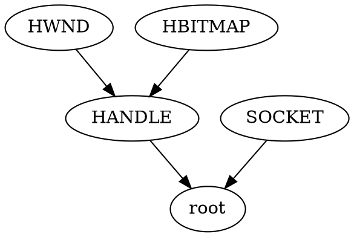

# Primitive 语义子格设计草案

日期：2026-04-14

## 1. 目标

当前系统里的 primitive 类型主要按底层表示区分，例如：

- `sint32`
- `uint32`
- `float32`
- `char`
- `bool`

这对“底层表示相同、但语义不同”的类型不够用。典型例子是：

- Windows 各类 handle
- 某些 ID / index / fd 风格的值

这些类型在机器层面可能都落在同一个底层表示上，但在恢复出的高级类型里，用户希望保留更强的语义区分。

因此，这里希望引入一套新的“primitive 语义子格”系统，用来在同一底层 primitive family 内继续细分语义类型。

## 2. 设计定位

这套设计只考虑 primitive 类型，不考虑 function、record、pointer、array 等非 primitive 类型。

更具体地说，它不是：

- 替换 PNDiff 的 ptr/num 区分
- 替换当前 binarysub 的函数 / record / pointer 结构

它更像是：

- 在“某个底层 primitive family 已经确定之后”
- 继续用一个小格去表达其语义细分

可以把它理解为：

```text
底层 family 决定“它是什么物理表示”
语义子格决定“它在这个 family 里更像哪个语义类型”
```

## 3. 核心想法

### 3.1 不建议把基础类型当成全局 top

这里直接采用多个按底层表示切开的 family-local lattice，不使用全局 top。

例如：

- `prim:sint32:*`
- `prim:uint32:*`
- `prim:char8:*`

每个 family 有自己的根节点和内部子类型关系。

### 3.2 语义类型本质上是“带 family 归属的 primitive”

所以内部名字最好显式包含 family 信息，而不是只有裸名字。

推荐内部 canonical name 形式：

```text
prim.uint32.HANDLE
prim.uint32.HWND
prim.char8.ascii_char
```

这样有几个好处：

1. 防止不同 family 下同名节点冲突
2. 调试输出时一眼能看出它属于哪个底层 family
3. 后续即使用户的 `.dot` 文件里只写简短名，内部也能规范化成唯一名

用户侧是否暴露全名可以再讨论，但内部建议统一成这种 canonical name。

## 4. 和当前仓库现状的关系

### 4.1 binarysub 当前的 primitive 还是“原子名字”

当前 `binarysub` 的 primitive 约束逻辑很简单：

- 文件：`external/binarysub/src/binarysub-core.cpp`
- 函数：`constrain_impl()`
- 行为：
  - 先检查 size 相等
  - 如果两边都是 primitive，则只有 `lp->name == rp->name` 才直接兼容
  - 否则报错

这说明当前 primitive 还没有：

- primitive 间子类型
- primitive 间 join / meet
- family-local lattice

所以新设计的本质，是把 primitive 从“原子标签”升级成“一个 family 内可做 join / meet 的格元素”。

旧 retypd 那边的相关恢复格代码目前不是这里的设计目标，可以视为旧路径背景，不在本设计中继续展开。

## 5. 概念模型

### 5.1 三层结构

推荐把类型相关信息拆成三层：

1. 底层表示层
   - 例如 `uint32`、`sint32`、`char8`
2. family 层
   - 一个底层表示对应一个 semantic family
3. family 内语义格
   - 例如 `HANDLE`、`HWND`、`ascii_char`

可以表示成：

```text
primitive instance = base representation + semantic family + lattice element
```

### 5.2 family-root 与 unknown 的关系

每个 family 最少要有一个 root，表示：

- “我知道它属于这个底层 family”
- “但不知道更细语义”

例如：

```text
prim.uint32.__root__
prim.char8.__root__
```

这个 root 才是该 family 内 join 的默认上界，而不是把底层 `uint32` 本身直接拿来当 lattice node。

如果确实需要“全局未知”，建议另设一层外壳概念，例如：

- `unknown primitive of family uint32`

但不建议把它和 family 内 root 混成一个节点。

## 6. join / meet 语义

### 6.1 同 family 内

同一个 family 内定义标准偏序：

- `A <: B`
- `join(A, B)` = least upper bound
- `meet(A, B)` = greatest lower bound

例如：

```text
prim.uint32.__root__
  |- HANDLE
      |- HWND
      |- HBITMAP
  |- SOCKET
```

则：

- `join(HWND, HBITMAP) = HANDLE`
- `join(HWND, SOCKET) = prim.uint32.__root__`
- `meet(HANDLE, HWND) = HWND`
- `meet(HWND, SOCKET)` 若无交，则为空 / conflict / bottom

### 6.2 不同 family 间

不同 family 之间不做 join / meet。

例如：

- `prim.uint32.HANDLE`
- `prim.float32.__root__`

它们不是同一格上的元素。

这和当前 binarysub 的 size/type family 检查一致，也能避免引入很多不自然的跨域规则。

### 6.3 bottom 是否需要

当前版本暂时不引入 bottom。

如果在同一个 family 内做 `meet(A, B)` 时：

- 无法找到 greatest lower bound
- 也无法继续 merge

那么就直接报类型冲突。

也就是说，当前策略是：

- 不提供显式 bottom
- 不提供隐式 bottom
- `meet` 失败时直接视为“类型冲突，无法 merge 找到 greatest lower bound”

## 7. `.dot` 输入格式建议

### 7.1 为什么 `.dot` 合适

你提出用 `.dot` 文件描述节点和关系，这个方向是合理的，因为：

1. 用户直观看 DAG 很方便
2. 偏序图本来就天然适合 DOT
3. 后续可以直接可视化

### 7.2 建议把 `.dot` 约束成“family DAG”，不要放太多额外语义

建议用户文件一开始只负责描述：

- family 名
- base primitive
- 节点名
- 偏序边

不要第一版就把所有推理规则都塞进 `.dot` 属性里。

推荐概念上类似：



这里边方向可以按“更具体 -> 更一般”。

也可以反过来，但必须全局统一。

### 7.3 推荐补充的最小属性

每个 family 建议至少有：

- `base`
  - 对应当前底层 primitive 名
  - 如 `uint`、`sint`、`char`
- `bits`
  - 如 `32`、`8`
- `namespace`
  - 如 `win`、`cstr`、`posix`

每个节点建议允许：

- `display_name`
- `canonical_name`
- `special_role`

例如：

- `special_role="root"`

## 8. 命名空间与冲突规避

这个问题确实值得提前设计。

建议采用两层名字：

1. 用户可读名
   - 例如 `HANDLE`
   - `ascii_char`
2. 内部 canonical name
   - 例如 `win.uint32.HANDLE`
   - `cchar.char8.ascii_char`

如果想把底层 family 信息也编码得更直接，可以再规范成：

```text
prim.uint32.win.HANDLE
prim.char8.cchar.ascii_char
```

我更偏向这一种，因为它把“这是 primitive family 下的语义节点”表达得最明确。

## 9. 当前明确不纳入的内容

### 9.1 `nullterm_string`

`nullterm_string` 暂时不纳入当前设计。

原因不是它不重要，而是它语义上更像：

- 对有结构类型的细分
- 或对 char buffer / char pointer 的更高层语义标注

它和当前只讨论 primitive family 内语义子格的范围不完全一致。

因此当前版本只考虑 primitive 类型，不讨论：

- `char[]`
- buffer
- string
- pointer / array 上的语义子类

## 10. 这套格在推理中的作用

### 10.1 不是给所有 primitive 都加复杂推理

第一版最好只在“primitive 已经出现冲突或需要归并”时才调用这套格。

例如，当多个 primitive 约束汇合时：

- 以前：只能要求 primitive 名完全相等
- 现在：可以在同 family 内做 join / meet

这样最符合你的原始设想：

- 遇到 primitive 类型处理时，落到格上的 least upper bound / greatest lower bound

### 10.2 更像是 primitive 的 refinement lattice

因此它更像：

- primitive refinement
- semantic refinement

而不是一个全新的总类型系统。

## 11. 一个推荐的心理模型

可以把一个 primitive 看成：

```text
(base_representation, semantic_lattice_element)
```

例如：

- `(uint32, HANDLE)`
- `(uint32, HWND)`

其中：

- base representation 决定低层兼容性
- semantic lattice element 决定语义 join / meet

这样设计有几个优点：

1. 与当前 size / base family 检查兼容
2. 易于序列化
3. 易于可视化
4. 用户也容易理解

## 12. 推荐的第一批支持范围

### 13.2 第一版需要成立的只有三件事

1. 用户能定义 family-local semantic lattice
2. primitive 汇合时能在该格上做 join / meet
3. handle / id / char-subclass 这类 primitive 语义节点能被表达

## 15. 示例

### 15.1 Windows handle family

```text
prim.uint32.__root__
  |- HANDLE
      |- HWND
      |- HBITMAP
      |- HDC
  |- SOCKET
```

语义：

- `HWND` 和 `HBITMAP` 的 join 是 `HANDLE`
- `HANDLE` 和 `SOCKET` 的 join 是 `prim.uint32.__root__`

## 16. 当前建议的最终定位

如果用一句话概括，我会把这个设计表述为：

> 在现有 primitive 类型之上，引入按底层表示分族的语义子格；推理时 primitive 不再只是名字相等才兼容，而是在同 family 内通过 join / meet 合并语义。当前版本只讨论 primitive family 内部的语义细分，不扩展到 pointer、array、string 或其他非 primitive 类型。

# 具体实现

## Step1: 实现初步的解析

- 先实现 primitive semantic lattice 的注册表与输入解析
- 只负责读取和校验用户提供的 family 定义
- 暂时不接入 binarysub 求解

建议目标：

- 能读取一个 `.dot` 文件并构造单个 family 的 registry
- 能读取图级属性：
  - `base`
  - `bits`
  - `namespace`
- 能读取节点和边
- 能识别 root 节点

建议校验：

- root 必须且只能有一个
- 图必须无环
- 每个节点都必须能到达 root
- canonical name 必须唯一

建议产物：

- family descriptor
- node descriptor
- registry 查询接口
- 对应单测

## Step2: 实现 family 内基础查询能力

- 在 registry 上补齐后续 `join` / `meet` 所需的基础查询
- 仍然不接入 binarysub 主求解流程

建议目标：

- 支持按名字查询节点
- 支持查询父节点和祖先集合
- 支持判断两个节点是否属于同一个 family
- 支持判断一个节点是否是另一个节点的子类型

建议实现方式：

- 先基于 DAG 预计算祖先闭包
- 或缓存每个节点到 root 的路径信息

完成标准：

- 可以稳定回答：
  - `A <: B` 是否成立
  - `A` 和 `B` 是否在同一 family

## Step3: 实现 family 内 `join`

- 在 registry 层实现 least upper bound 计算
- 当前只处理同 family 的节点

建议规则：

- 若两个节点不在同一个 family，直接报错
- 若存在多个 upper bound，选择最低的那个
- 若找不到公共 upper bound，视为输入图非法或内部错误

完成标准：

- 能对 handle 类 family 算出：
  - `join(HWND, HBITMAP) = HANDLE`
  - `join(HANDLE, SOCKET) = prim.uint32.__root__`

## Step4: 实现 family 内 `meet`

- 在 registry 层实现 greatest lower bound 计算
- 当前版本不引入 bottom

建议规则：

- 若两个节点不在同一个 family，直接报错
- 若找不到 greatest lower bound，则直接报类型冲突
- 若存在多个候选且无法唯一确定，也直接报类型冲突

完成标准：

- 可以稳定报告：
  - 唯一 GLB
  - 无 GLB
  - 冲突

## Step5: 为 primitive 约束路径准备接入接口

- 这一步仍然尽量少碰求解器本体
- 目标是把 registry 封装成后续可调用的接口

建议目标：

- 提供一个统一入口，例如：
  - 通过 `(base, bits, node_name)` 查 semantic node
  - 对两个 primitive semantic node 做 `join`
  - 对两个 primitive semantic node 做 `meet`
- 明确错误返回格式
- 明确“类型冲突”的错误信息

这样后续接入 binarysub 时，改动面会集中在 primitive merge 那一小段逻辑。

## Step6: 最后再接入 binarysub primitive 处理

- 在完成前面几步后，再考虑接入当前 primitive 约束逻辑
- 只改 primitive 那条路径，不扩展到非 primitive 类型

建议接入点：

- `external/binarysub/src/binarysub-core.cpp`
- 当前 primitive 与 primitive 比较的位置

建议策略：

- 先检查 size 是否一致
- 再检查是否属于同一个 primitive family
- 若是同 family，则通过 semantic lattice 做 `join` / `meet`
- 若无法得到结果，则报类型冲突

注意：

- 这一阶段才开始真正影响求解结果
- 在这之前的步骤都可以作为相对独立的小提交
