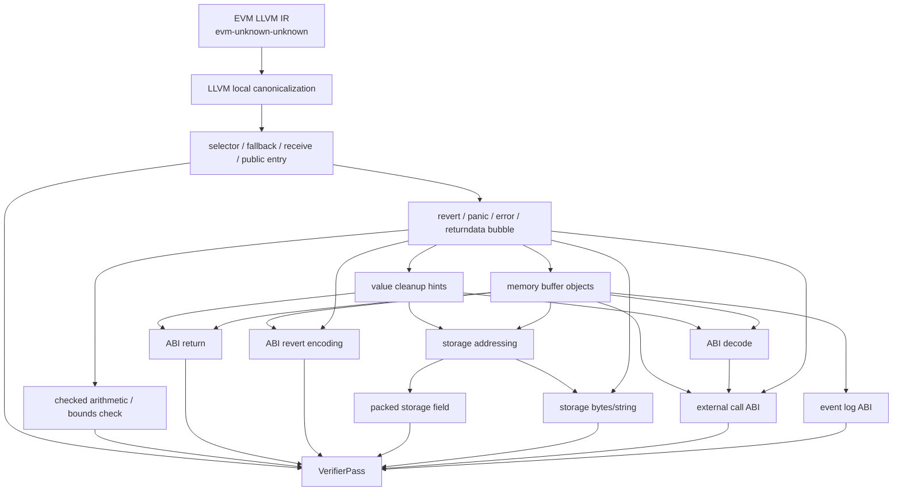

# Evm2llvm Solidity Pass 组织顺序计划

## 原始 prompt

首次 prompt：

阅读logs/20260521-01-Evm2llvmSolidityCompilerPatternPassPlan.md，然后单独写一个新的计划文件，规划一下这些PASS按照什么顺序组织比较合适。用Mermaid写一个架构图，然后再单独列举一下当前的难点，有哪些Pass/底层模式没有写/识别，有哪些问题需要解决。

收集测试用例的过程中，需要同步改进各个pass的标注能力，对于rewrite能力则可以放一放，等后续再做完善。同时在保证主链路能够打印出这种底层模式识别相关的统计信息，在不断加入测试用例的过程中，同时确保所有的底层模式能够被识别出来。但是如果某个前置pass的rewrite有助于后续的识别，则可以先完善前置pass的rewrite能力。
然后后面单独增加一个段落是改进rewrite能力，确保当前的rewrite足够通用，能够处理当前所有收集的测试用例，而不是使用特别针对性的启发式策略。

注意，每次修改产生的 log 都改为按照分类放置到 `logs/20260522-proj-passes/` 下的文件夹内。

日志目录约定：

- `canonicalization/`：EVM IR canonicalization、优化 pass 链路调整。
- `selector-entry/`：selector dispatcher、fallback、receive、public entry 识别。
- `payability/`：payable / nonpayable guard。
- `revert/`：empty revert、Panic、Error、custom error、returndata bubble。
- `checked-bounds/`：checked arithmetic、array bounds、slice、enum / conversion check。
- `value-cleanup/`：address / bool / uintN / intN / enum cleanup 和类型线索。
- `memory-buffer/`：free memory pointer、memory allocation、ABI/event/call/revert buffer 跟踪。
- `abi-decode/`：ABI 参数解码、calldata bounds、动态参数。
- `abi-return/`：ABI 返回值编码、return buffer、returndata forward。
- `abi-revert-encoding/`：Panic/Error/custom error 的 ABI revert buffer。
- `storage-addressing/`：mapping slot、dynamic array slot、sha3 storage 地址链。
- `packed-storage-field/`：packed storage field load/store。
- `storage-bytes-string/`：storage bytes/string 短长编码。
- `event-log/`：event log、topic、event data buffer。
- `external-call/`：call/staticcall/delegatecall/callcode、success check、returndata decode。
- `rewrite/`：各 pass 的 rewrite 通用能力改进。
- `testcase/`：新增、整理、标注测试用例和测试 oracle。

每个 pass 相关修改都要在对应目录下写一份 log。新增测试用例、修改 manifest、补 oracle 这类改动写到 `testcase/`。如果一次工作同时增加测试用例并修改多个 pass，就分别在 `testcase/` 和对应 pass 目录下写多份 log，避免把不同问题混在一个记录里。Pass目录下的log需要单独有段落评估是否当前修改足够通用，不是针对性的启发式策略。

## 背景

上一份 plan 已经列出 Solidity 编译器会主动生成哪些底层代码。这里不再按“层”分类，而是按底层模式和对应高层语义来组织 pass。

`SolidityPatternAnnotationPass`、metadata 名字、公共 helper、统计输出，这些属于实现基础设施。它们应该在代码结构里统一，但不是一个需要参与语义顺序讨论的 pass。真正需要讨论顺序的是：某个模式先识别后，是否能让另一个模式更可靠。

总原则：

- 先跑 EVM IR canonicalization。所有 matcher 面向优化后的 IR。
- 只有明确依赖关系的 pass 才要求顺序；没有依赖的 pass 可以并列跑。
- 每个识别 pass 自己带 rewrite flag，默认开启。metadata 仍然保留，方便调试、统计和测试。
- 不单独做一个总的 rewrite pass。某个模式由哪个 pass 识别，就由哪个 pass 在 rewrite 模式下改写。

## 当前测试组织

现有 EVM Solidity pattern 测试在 `test/evm/solidity-patterns/`：

- `cases/` 下放固定的 evm2llvm `.ll` 输入。
- `manifest.json` 列出每个 case、默认参数和 oracle。
- 现在默认用 `--tr-level=0` 跑主项目 binary，EVM triple 分支仍会执行 EVM 专用 pass。
- oracle 目前主要检查函数级 `notdec.solidity.nonpayable` 数量，以及各类 `notdec.solidity.*` metadata 出现次数。

CTest 入口是 `notdec.evm.solidity_patterns`。它由 `test/CMakeLists.txt` 注册，实际调用 `test/run_evm_solidity_patterns_suite.py`。runner 的流程是：

1. 用 `notdec-decompile` 读 case 的 `.ll`，输出到测试 workdir 里的 `out.ll`。
2. 用项目内 LLVM 22 的 `llvm-as` 汇编 `out.ll`，确认输出 IR 合法。
3. 统计 manifest 里要求的 metadata 数量，写 `compare.txt` 和 `run.log`。

当前固定 case 只有 3 个：

- `0014_proxy_like.ll`
- `0011_multi_public.ll`
- `0002_delegatecall_no_nonpayable.ll`

这批测试适合守住当前 metadata 行为，但还不够覆盖后面列出的所有底层模式。后续新增 pass 时，manifest 也要从“只看数量”逐步扩展到“命中位置、kind、关键参数、误报样例、rewrite 后 IR 形状”。

## 推荐总顺序

严格顺序只需要这样：

1. EVM IR canonicalization。
2. 识别 selector / fallback / receive / public entry。
3. 识别 revert / panic / error / returndata bubble。
4. 识别 value cleanup 和 memory buffer。
5. 识别 ABI decode / ABI return / ABI revert encoding。
6. 识别 storage addressing / packed field / storage bytes-string。
7. 识别 external call 和 event。它们可以早标 helper call，但参数结构要等 memory/ABI。

其中 4 到 7 不是每个 pass 都有严格线性顺序。真正的依赖是：ABI、event、external call、revert encoding 都依赖 memory buffer；checked arithmetic、bounds check 依赖 panic/error 识别；storage field 依赖 storage address 根。

## 架构图



## EVM IR canonicalization

底层模式：evm2llvm 输出的 stack-lifted IR，里面有很多冗余 zext、icmp、helper call 周围的临时值。

高层语义：没有直接高层语义，只是把形状稳定下来。

顺序要求：必须最先跑。后面的 pass 不应该同时兼容优化前和优化后两套形状。

**根据需要，可以专门调整一下优化pass链路的构建**： canonicalization 的强度要控制好。优化太弱，后面的 pass 要兼容很多噪声；优化太强，可能把原本容易看的保护分支、buffer 写入顺序合并到更难匹配的形状里。
- matcher 可以先按常见 CFG 形状匹配，例如“入口块判断、失败块 revert、成功块继续”。但不能只看跳转形状，还要沿着 SSA use-def 确认条件值、helper 调用和失败终点确实连在一起，避免把业务分支误标成编译器模式。

## Selector、fallback、receive 和 public 入口

底层模式：

- `public___function_selector___*` 里有 selector 分发。
- `calldatasize < 4`、`calldataload(0) >> 224`、selector 常量比较。
- fallback / receive / delegatecall 转发逻辑可能内联在 selector 函数里。
- public 函数名通常是 `public_*`。

高层语义：

- 哪些函数是 ABI public entry。
- 哪段代码是 dispatcher。
- 哪段代码是 fallback / receive / selector 内联 body 候选。

顺序要求：

- 这部分应该在 nonpayable、ABI decode、event、external call 之前跑。
- 原因是后续 pass 需要知道自己看到的是 public entry 里的业务逻辑，还是 selector dispatcher 里的内联路径。
- 如果暂时不拆函数，也至少要先标出 selector 比较链边界和内联 body 候选。

当前状态和问题：

- 已有 `SelectorInlinedLogicExtractionPass`，但现在只按函数名和明显 `call/log` 标候选。
- 还没真正识别 selector 比较链边界。
- fallback / receive 的判断还不稳定，尤其是 `calldatasize == 0` 和 payable 状态要结合后面的 callvalue guard。
- 第一阶段不做 selector 到源码函数名恢复。

rewrite flag：

- 默认开启。
- 能确认 selector prologue 和 dispatcher 比较链后，可以把它们从后端业务输出里隐藏。
- 对 fallback / receive / selector 内联 body，rewrite 的目标是先标清边界；是否拆函数可以后续再做，不影响默认开启。

## Payable / nonpayable guard

底层模式：

- public/fallback 入口读 `evm_callvalue`。
- 判断 `callvalue == 0` 或等价条件。
- 失败分支 `revert(0, 0)`。

高层语义：

- 函数是 `nonpayable`。
- 这段 `revert(0,0)` 是编译器保护，不是用户手写 require。

顺序要求：

- 依赖入口识别。没有 public/fallback/receive 上下文时，单独看到 `callvalue == 0` 不够稳。
- 应该在 ABI decode 之前跑，因为 ABI decode 也会产生 `revert(0,0)`。
- 可以在通用 revert 识别前后都跑，但更实用的是：先标 nonpayable guard，再让 revert pass 读取这个标记，避免把它当普通 empty revert。

当前状态和问题：

- 已有 `PayabilityGuardPass`，能识别直接的 `callvalue == 0 -> revert(0,0)`。
- 还没处理 optimizer 变形后的等价条件。
- fallback/receive 的 payable 状态还没完整区分。

rewrite flag：

- 默认开启。
- 命中后删除或隐藏 `callvalue == 0 -> revert(0,0)` 这段 guard，用函数级 `nonpayable` 语义表达。
- fallback/receive 的 payable 状态如果还无法确认，只跳过对应函数，不影响其他已确认 public entry 的 rewrite。

## Revert、Panic、Error、custom error 和 returndata bubble

底层模式：

- `revert(0,0)`。
- `Panic(uint256)` selector `0x4e487b71` 加 panic code。
- `Error(string)` selector `0x08c379a0` 加 ABI string。
- custom error selector 加参数。
- 低级 call 失败后 `returndatacopy` 再 `revert(0, returndatasize)`。

高层语义：

- `require` / `assert` / compiler panic / ABI bounds check / custom error。
- 外部调用失败时原样冒泡 returndata。

顺序要求：

- 应该在 checked arithmetic、array bounds、ABI decode 保护识别之前跑。
- 后面这些 pass 需要通过 panic code 或 error 形状判断某个条件是不是编译器保护。
- 但 `Error(string)` 和 custom error 的参数结构依赖 memory buffer，所以 revert pass 可以先标 selector 和终点，完整 ABI 参数后面再补。

当前状态和问题：

- 已有 `SolidityRevertPass`，能标 empty revert、returndata bubble、部分 Panic selector。
- 还缺 panic code 提取。
- 还缺 `Error(string)`、custom error、revert buffer 的 ABI 结构。
- `revert(0,0)` 误报风险高：nonpayable、ABI bounds、fallback reject、用户 require 都可能用它。

rewrite flag：

- 默认开启。
- 明确的 Panic、Error、custom error、returndata bubble 改写成高层 revert 语义。
- `revert(0,0)` 只有在被 nonpayable、ABI bounds、fallback reject 等上游语义认领后才改写；普通空 revert 保留为用户可见的低层退出。

## Checked arithmetic 和 bounds check

底层模式：

- Solidity 0.8+ checked add/sub/mul/div、取负、类型转换失败。
- array index 和 length 比较，失败进 `Panic(0x32)` 等。
- bytes/string storage 编码错误进 `Panic(0x22)`。

高层语义：

- 普通算术表达式带 checked 语义。
- 数组边界检查。
- enum / 类型转换合法性检查。
- bytes/string storage 编码合法性检查。

顺序要求：

- 严格依赖 revert/panic 识别。没有 panic code 时，很难区分 compiler check 和业务 if。
- 对 ABI decode bounds check，还依赖 calldata 参数模式。
- 对 storage bytes/string，还依赖 storage 地址和编码模式。

当前状态和问题：

- 还没有独立 `CheckedOperationPass`。
- 还没有独立 `BoundsCheckPass`。
- enum 上界检查、bool 归一和 panic 的关系还没处理。

rewrite flag：

- 默认开启。
- 命中后把 `op + condition + panic` 合成 checked arithmetic 或 bounds check 语义，避免后端输出编译器插入的比较和 panic 分支。
- 如果 panic code 不完整，先不改写该处，不能猜成业务逻辑。

## Value cleanup 和类型线索

底层模式：

- `and ((1 << N) - 1)`。
- `signextend`。
- `iszero(iszero(x))` 或等价 bool 归一。
- enum / 小整数的范围检查。

高层语义：

- address、bool、uintN、intN、bytesN、enum 的类型线索。
- 这些不是最终类型，只是低层值被清理到某种宽度。

顺序要求：

- 它和 revert 识别没有强依赖，可以早跑。
- 但它有利于 ABI decode、ABI return、storage field、external call 参数恢复。
- 所以推荐放在 ABI/storage/external call 之前。

当前状态和问题：

- 已有 `ValueCleanupTypeHintPass`，能标常量 mask 和 `signextend`。
- 对 `shl/sub/and` 组合生成的 mask 识别不足。
- 对 bool 双重 `iszero`、enum range check 还没覆盖。
- address mask 和 uint160 mask 本质形状接近，metadata 要保留置信度，不能直接定最终类型。

rewrite flag：

- 默认开启。
- 命中后把 cleanup 当作类型线索，不再把 address mask、bool 归一、`signextend` 这类编译器清理当普通业务位运算输出。
- 如果还不能确定最终类型，保留类型候选，不强行改成 address/bool/enum。

## Memory buffer 和动态对象

底层模式：

- `mload(0x40)` 取 free memory pointer。
- `mstore(0x40, new_ptr)` 更新 free memory pointer。
- 一组 `mstore` 写 ABI buffer、revert buffer、event data、call data、return data。
- 动态数组 / bytes / string 的 length 和 data 区域。

高层语义：

- memory allocation。
- ABI buffer。
- revert/error buffer。
- event data buffer。
- external call input/output buffer。

顺序要求：

- 这是 ABI return、ABI decode 动态参数、revert encoding、event、external call 的共同前置条件。
- 没有 memory buffer 跟踪时，这些 pass 只能做很粗的 helper 标注。
- 它不一定要在 value cleanup 之后，但两者结合后能更好识别 buffer 里写入的类型。

当前状态和问题：

- 已有 `MemoryObjectPass`，只标 `mload(0x40)` 和 `mstore(0x40, ...)`。
- 还缺跨基本块的 buffer 分组、起点、长度、写入顺序。
- Memory 是当前最大的瓶颈，因为 ABI、revert、event、external call 都共享这套 `mstore/mload`。

rewrite flag：

- 默认开启。
- 命中后把明确的 free memory pointer bump 改写成 memory allocation 语义，例如 `evm_malloca(size)`。
- buffer 边界不清楚时，不删除原始 `mstore/mload`，但仍把已确认的分配点改写出来，供 ABI/event/call pass 使用。

## ABI decode

底层模式：

- `calldatasize` bounds check。
- `calldataload(4 + 32 * index)`。
- 动态参数 offset / length 检查。
- `calldatacopy` 复制 bytes/string/array。
- 参数读出后 mask / signextend / bool 归一。

高层语义：

- public/external 函数参数。
- calldata bounds check 是 ABI 解码保护，不是用户业务判断。
- 参数类型线索。

顺序要求：

- 依赖 public entry 识别。
- 依赖 revert/panic 识别来归类失败路径。
- 依赖 value cleanup 获取类型线索。
- 动态参数依赖 memory buffer。

当前状态和问题：

- 还没有 `AbiDecodePass`。
- 静态参数可以先做，动态参数要等 memory buffer 更稳。
- ABI bounds check 容易和业务 require 混在一起，不能只看 `revert(0,0)`。

rewrite flag：

- 默认开启。
- 命中后把 calldata bounds check、`calldataload`、cleanup 合成 public/external 参数语义。
- 静态参数先改写；动态参数等 offset/length 和 memory copy 能绑定后再改写。

## ABI return

底层模式：

- `mload(0x40)` 取返回 buffer。
- 多个 `mstore(retptr + offset, value)`。
- 动态返回值 head/tail。
- `return(retptr, size)`。
- 也可能是 returndata forward。

高层语义：

- 函数返回值。
- 返回值类型线索。
- 外部调用 returndata 原样返回。

顺序要求：

- 简单 `return(ptr, 32)` 可以早标。
- 完整恢复返回值结构依赖 memory buffer 和 value cleanup。
- returndata forward 依赖 external call / returndata bubble 相关模式，但可以先标候选。

当前状态和问题：

- 已有 `AbiReturnPass`，主要标 `evm_return`，区分 `32` 字节和 returndata forward。
- 还没识别 return buffer 的 `mstore` 序列。
- 还没恢复动态返回值、head/tail、返回类型线索。
- 因此建议把完整 `AbiReturnPass` 放在 memory buffer 和 value cleanup 之后。

rewrite flag：

- 默认开启。
- 命中后把 `mstore` return buffer 和 `evm_return` 合成返回值语义。
- 简单静态返回先改写；动态返回在 head/tail 结构明确后改写。

## ABI revert encoding

底层模式：

- 写 `Panic(uint256)` / `Error(string)` / custom error selector。
- 按 ABI 写参数。
- `revert(ptr, size)`。

高层语义：

- `assert` / compiler panic。
- `require(..., "message")`。
- custom error。

顺序要求：

- 依赖 revert 终点识别。
- 依赖 memory buffer。
- custom error 参数还依赖 value cleanup。

当前状态和问题：

- 当前只在 `SolidityRevertPass` 里做了部分 Panic selector 识别。
- 更完整的 ABI revert encoding 可以作为 `SolidityRevertPass` 增强，也可以拆成单独 pass。

rewrite flag：

- 默认开启。
- 命中后把 revert buffer 写入序列改写成 Panic/Error/custom error 语义。
- 这个 rewrite 需要和 `SolidityRevertPass` 共用同一个识别结果，不能再写一套独立 matcher。

## Storage addressing、mapping 和动态数组

底层模式：

- scratch memory 写 key 和 base slot。
- `sha3(mem, 64)` 得到 mapping element slot。
- `sha3(slot)` 得到 dynamic array data 起点。
- 嵌套 mapping/array 形成 sha3 链。

高层语义：

- mapping slot。
- dynamic array data slot。
- 嵌套 storage 地址关系。

顺序要求：

- 对简单 sha3 候选没有严格依赖。
- 可靠识别需要 memory scratch 内容，所以受 memory buffer / mstore 跟踪影响。
- packed field 和 storage bytes/string 应该在 storage address 根之后做。

当前状态和问题：

- 已有 `StorageAddressingPass`，只按 `evm_sha3` 长度标候选。
- 还没确认 hash 前 memory 里写了什么。
- 还没恢复 nested mapping / array 的链。

rewrite flag：

- 默认开启。
- 命中后把 sha3 slot 计算改写成 mapping / dynamic array storage address 语义。
- 只按 `sha3` 长度猜出来的 candidate 不改写，必须确认 scratch memory 里的 key/base slot。

## Packed storage field

底层模式：

- `sload(slot)` 后 shift/mask 取 field。
- `sstore(slot, old_cleared | new_shifted)` 写 field。
- address、bool、小整数、bytesN 可能被打包。

高层语义：

- `storage_field_load(slot, bit_offset, bit_width)`。
- `storage_field_store(slot, bit_offset, bit_width, value)`。

顺序要求：

- 依赖 value cleanup 来判断 bit width。
- 依赖 storage addressing 来知道 slot 根，尤其是 mapping/array 元素里的 packed field。

当前状态和问题：

- 还没有 `StorageFieldPass`。
- 写 field 前的 clear/or/shift 组合容易被 optimizer 改形状。
- 只恢复 slot/offset/width，不猜变量名。

rewrite flag：

- 默认开启。
- 命中后把 shift/mask/or 序列改写成 packed storage field load/store 语义。
- 变量名和源码 storage layout 不在这里猜，只输出 slot、bit offset、bit width。

## Storage bytes/string 短长编码

底层模式：

- storage slot 低 bit 判断短/长编码。
- 短 bytes/string 数据在同一个 slot。
- 长 bytes/string 数据从 `sha3(slot)` 开始。
- 非法编码可能 `Panic(0x22)`。

高层语义：

- storage bytes/string 的 length、data、short/long 分支。
- storage 编码错误。

顺序要求：

- 依赖 storage addressing。
- 依赖 panic 识别，尤其是 `Panic(0x22)`。
- 长 bytes/string 的拷贝还依赖 memory buffer。

当前状态和问题：

- 还没有 `StorageBytesStringPass`。

rewrite flag：

- 默认开启。
- 命中后把短/长分支、长度、data slot 改写成 storage bytes/string 语义。
- 不需要一步到位改成高级字符串操作，但不应继续把短长编码分支当普通业务逻辑输出。

## Event log

底层模式：

- `evm_log0` 到 `evm_log4`。
- topic0 是事件签名 hash，匿名事件没有 topic0。
- 非 indexed 参数写 memory data buffer。
- 动态 indexed 参数先 hash。

高层语义：

- `emit event(topics, data)`。
- topic 和 data 的 ABI 结构。

顺序要求：

- 标 `logN` helper 没有依赖，可以随时做。
- 恢复事件参数依赖 memory buffer 和 ABI encode。
- 动态 indexed 参数 hash 还依赖 storage/memory/value 线索。

当前状态和问题：

- 已有 `EventLogPass`，只标 topic 数。
- 还没恢复 topic 常量、data buffer、匿名事件、动态 indexed 参数。

rewrite flag：

- 默认开启。
- 命中后把 `evm_logN` 和对应 memory data buffer 改写成 `emit event` 语义。
- 事件名不查表，topic 常量和参数结构先保留。

## External call 和 returndata

底层模式：

- `call` / `staticcall` / `delegatecall` / `callcode`。
- call data 写到 memory。
- success check。
- 失败时 returndata bubble。
- 成功时 returndata ABI decode 或直接 return。

高层语义：

- 外部调用的 kind、target、value、gas、input、output。
- 调用失败冒泡。
- 调用返回值解码。

顺序要求：

- 标 call kind 没有严格依赖，可以早做。
- 恢复 input/output buffer 依赖 memory buffer。
- success check 和失败路径依赖 revert / returndata bubble 识别。
- 返回值解码依赖 ABI decode/return 的 buffer 能力。

当前状态和问题：

- 已有 `ExternalCallPass`，只标 call kind。
- 还没恢复 target/value/gas/input/output buffer。
- 还没把 success check、returndata bubble、returndata decode 绑定成一个外部调用结构。
- 不识别 proxy、ERC1967、OpenZeppelin 这类源码/库模式。

rewrite flag：

- 默认开启。
- 命中后把 call helper、input/output buffer、success check、失败冒泡和返回解码合成外部调用语义。
- proxy/library 识别不在这里做；`delegatecall` 只表达低层调用语义。

## 收集测试用例

这一步不是单纯搬样例。收集测试用例的过程中，要同步改进各个 pass 的标注能力，并保证主链路能打印底层模式识别相关的统计信息（可以增加一个命令行参数和对应的链路，专门为该部分服务，比如关闭部分或全部rewrite模式）。目标是不断加入真实样例时，能看到每类底层模式是否已经被识别出来、命中了多少、漏在哪里。

rewrite 能力可以先放一放，后续再集中完善。例外是：如果某个前置 pass 的 rewrite 能明显帮助后续识别，比如先改写 memory allocation 后 ABI/event/call buffer 更容易绑定，就可以先完善这个前置 rewrite。

样例来源是 `/sn640/NotDecChainExp` 的 apehex 数据集和已有 evm2llvm batch 输出，最终补齐 `test/evm/solidity-patterns/`。

用例来源优先级：

1. `/sn640/NotDecChainExp/evm2llvm_apehex_pilot/` 已经跑通并能生成 `.ll` 的样例。
2. `/sn640/NotDecChainExp/apehex_evm_contracts/notdec-runs/` 的历史结果。
3. 有源码或能导出源码 markdown 的样例优先，因为能反查 Solidity 写法和编译器版本。

每个新增 case 要在 manifest 里标注它覆盖了哪些底层模式。一个 case 可以覆盖多个模式，例如同一个合约可以同时覆盖 nonpayable、ABI return、external call、returndata bubble。

建议给 manifest 增加一个只用于说明和筛选的字段，例如：

```json
"patterns": [
  "selector_dispatch",
  "nonpayable_guard",
  "abi_return_static",
  "external_delegatecall",
  "returndata_bubble"
]
```

覆盖目标：

- 每个底层模式至少 5 个 case 覆盖。
- 同一种模式尽量覆盖不同编译器版本、不同 optimizer 情况和不同 CFG 形状。
- 每个 case 保留输入 `.ll`，必要时补一份简短说明，写清楚它为什么算覆盖这些模式。
- 对还没实现的 pass，也可以先把样例收进去，manifest 里先只标 `patterns`。
- 如果某个模式还识别不出来，应该同步改进对应 pass 的标注能力和统计输出，而不是只把样例堆进去。

## 改进 rewrite 能力

rewrite 在测试用例收集阶段不是主目标，但后面需要单独完善。标准不是“当前几个样例能过”，而是当前收集到的所有同类模式都能用同一套规则处理。

要求：

- 每个 pass 的 rewrite 复用自己的识别结果，不再写一套只服务 rewrite 的 matcher。
- rewrite 规则要能覆盖当前收集到的所有相关 case，不能用特别针对某一个样例的启发式策略。
- rewrite 后的 IR 要保留足够语义信息，后续 pass 仍能继续识别 ABI、storage、event、external call 等模式。
- 每次完善 rewrite，都要补对应 oracle：verifier 通过、低层 helper 序列被替换或隐藏、高层语义 metadata / intrinsic 保留。
- 如果 rewrite 让后续识别变差，要优先修 rewrite 表达方式，而不是让后续 pass 重新匹配被改坏的低层残片。

## 不做什么

- 不做 selector 到源码函数名恢复。
- 不识别 ERC1967、Ownable、ERC20/721 这类源码或库模式。
- 不为了让 IR 通过而退回 slot fallback 或掩盖 PHIIncoming 问题。
- 不要求第一阶段覆盖所有 Solidity 版本；先用 apehex 里有源码、大小合适的样例同步验证。

## 验证标准

- `notdec.evm.solidity_patterns` 通过。
- batch001 已有样例能跑完并通过 `llvm-as`。
- 主链路能输出每类底层模式的识别统计。
- 每个 pass 的 oracle 不只看命中数量，还要逐步覆盖命中位置、kind、关键参数和误报样例。
- rewrite 完善阶段要覆盖 rewrite 后 IR 形状，并保证 verifier 通过。

## rewrite 阶段实现记录

2026-05-22：完成第一版通用 rewrite surface。各 pass 仍复用原 metadata matcher，但在命中点同步插入 `notdec_solidity_rewrite_*` marker call、`notdec_solidity_rewrite_hidden` marker call，并给原始低层指令或函数入口点写 `notdec.solidity.rewrite_hidden.*` metadata；测试 runner 已开启 rewrite marker / hidden oracle，要求数量和对应 metadata 数量一致。详细记录见 `logs/20260522-proj-passes/rewrite/20260522-06-solidity-pattern-rewrite-markers.md`。

当前判断：这版覆盖所有现有 pass 类别，并且为后端隐藏低层 EVM helper 提供了直接 metadata。但它仍是保守 rewrite surface，没有真正删除 CFG / helper，也没有合并 memory / ABI / storage 结构。memory / ABI / storage 等需要更强数据流后，才能继续做真正合并和替换。

2026-05-22：补充按类别 rewrite 审计，逐类记录当前通用 rewrite / hide 覆盖情况，以及不继续删除 CFG / 合并 typed intrinsic 的原因。详细记录见 `logs/20260522-proj-passes/rewrite/20260522-07-solidity-pattern-rewrite-category-audit.md`。
