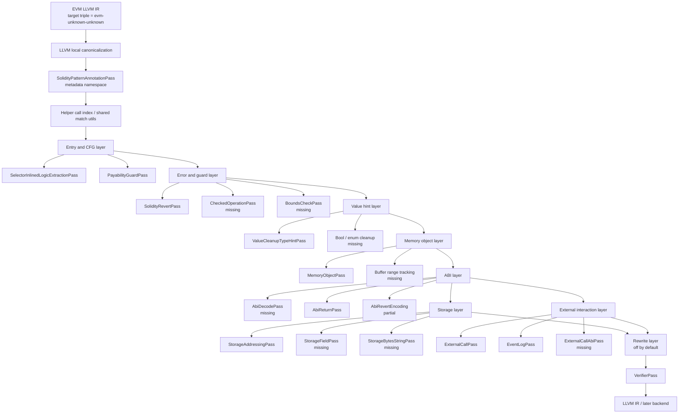

# Evm2llvm Solidity Pass 组织顺序计划

## 原始 prompt

阅读logs/20260521-01-Evm2llvmSolidityCompilerPatternPassPlan.md，然后单独写一个新的计划文件，规划一下这些PASS按照什么顺序组织比较合适。用Mermaid写一个架构图，然后再单独列举一下当前的难点，有哪些Pass/底层模式没有写/识别，有哪些问题需要解决。

## 背景

上一份 plan 已经把 Solidity 编译器主动生成的底层模式列出来了。当前代码也已经有一批 metadata-only pass：

- `SolidityPatternAnnotationPass`
- `SelectorInlinedLogicExtractionPass`
- `PayabilityGuardPass`
- `AbiReturnPass`
- `SolidityRevertPass`
- `ValueCleanupTypeHintPass`
- `StorageAddressingPass`
- `MemoryObjectPass`
- `EventLogPass`
- `ExternalCallPass`

这些 pass 现在主要是“看到 helper 调用或简单形状就挂 metadata”。下一步不能只按“功能类别”排队，还要按依赖排队：先把 IR 形状稳定下来，再识别入口、错误、内存对象、ABI、storage，最后才做跨调用、事件和 rewrite。

## 目标

这份计划只解决 pass 组织问题：

- 给 EVM Solidity pass 一个更合适的运行顺序。
- 明确哪些 pass 是基础信息，哪些 pass 依赖前面结果。
- 列出当前没写、只写了候选、或者底层模式还没识别的部分。
- 先保持 metadata-only 为主，rewrite 只能放到后面低风险模式里。

## 推荐顺序

### 0. EVM IR canonicalization

先跑当前已有的 LLVM 局部优化，让 stack-lifted IR 变成比较稳定的 SSA 形状。

要求：

- 只做局部、通用、低风险优化。
- 不跑 wasm 类型恢复、不跑主 NotDec 的 wasm 恢复 pass。
- 所有 Solidity matcher 只面向 canonical 后的 IR 写，不兼容太多旧形状。

### 1. Metadata 和基础索引层

顺序：

1. `SolidityPatternAnnotationPass`
2. 后续补一个公共的 `EvmSolidityAnalysis` 或轻量索引工具，不一定马上做成 LLVM analysis pass

作用：

- 统一 metadata 名字、字段和版本。
- 建立 helper call 索引：`evm_mload`、`evm_mstore`、`evm_sha3`、`evm_revert`、`evm_return`、`evm_call*`、`evm_log*`。
- 后面不要每个 pass 自己完整扫一遍并重复发明字段。

### 2. 入口和 CFG 边界层

顺序：

1. `SelectorInlinedLogicExtractionPass`
2. `PayabilityGuardPass`

原因：

- 先知道哪些函数是 selector dispatcher、public entry、fallback/receive 候选。
- `nonpayable` guard 是入口语义，应该在 ABI decode 和业务 require 之前识别。
- selector 函数里内联的 fallback/receive/body 候选要先标出来，后面 ABI、call、event pass 才能知道这些代码不一定属于 selector 比较链。

当前建议：

- `SelectorInlinedLogicExtractionPass` 继续只标边界和候选，不拆函数。
- `PayabilityGuardPass` 继续 metadata-only，rewrite 等 fallback/receive 判定更稳定后再开。

### 3. 错误和保护层

顺序：

1. `SolidityRevertPass`
2. 后续新增 `CheckedOperationPass`
3. 后续新增 `BoundsCheckPass`

原因：

- ABI decode、数组访问、checked arithmetic 都会失败到 revert/panic。
- 先识别 `Panic(uint256)`、`Error(string)`、custom error、empty revert、returndata bubble，后面的 pass 才能把某些判断归类为编译器保护，而不是业务逻辑。
- `CheckedOperationPass` 和 `BoundsCheckPass` 需要依赖 panic code。

### 4. 值清理和类型线索层

顺序：

1. `ValueCleanupTypeHintPass`
2. 后续可以补 `BoolEnumCleanupPass`，也可以合进这个 pass

原因：

- address mask、小整数 mask、`signextend`、bool 归一会被 ABI、storage、return、external call 共用。
- 这些只是线索，不应该过早变成最终类型。

### 5. 内存对象层

顺序：

1. `MemoryObjectPass`
2. 后续补 memory write slice / buffer range 跟踪

原因：

- ABI return、ABI decode 动态参数、event data、call data encode、revert encode 都依赖 memory buffer。
- 现在只标 `mload(0x40)` / `mstore(0x40, new_ptr)` 还不够，下一步要能把一组 `mstore` 归到同一个 buffer。

### 6. ABI 层

顺序：

1. 后续新增 `AbiDecodePass`
2. `AbiReturnPass`
3. 后续补 `AbiRevertEncodingPass`，也可以作为 `SolidityRevertPass` 的增强

原因：

- decode 依赖入口函数和 calldata bounds check。
- return 依赖 memory object 和 cleanup type hint。
- revert 的 `Error(string)` / custom error 本质也是 ABI encoding，不能永远只在 `SolidityRevertPass` 里做相邻块匹配。

建议：

- `AbiReturnPass` 从当前位置挪到 `MemoryObjectPass` 和 `ValueCleanupTypeHintPass` 后面。
- 简单 `return(ptr, 32)` 可以继续早标，但完整返回值结构要等 memory buffer 信息。

### 7. Storage 层

顺序：

1. `StorageAddressingPass`
2. 后续新增 `StorageFieldPass`
3. 后续新增 `StorageBytesStringPass`

原因：

- sha3 slot 根、packed field、bytes/string 短长编码是三层问题。
- 先识别 `sha3(key, slot)` / `sha3(slot)` 这种地址根，再识别 `sload/sstore` 上的 bit field。
- bytes/string storage 依赖 storage addressing、panic 0x22、循环拷贝，放在 storage field 后面更稳。

### 8. 外部交互层

顺序：

1. `ExternalCallPass`
2. `EventLogPass`
3. 后续补 `ExternalCallAbiPass`

原因：

- 低级 call 本身容易识别，但 call data encode、returndata decode、失败冒泡要依赖 memory、ABI、revert。
- event log 也依赖 memory buffer 和 topic/data 区分。
- 所以现在可以先标 helper 调用，真正恢复调用参数和事件参数要放到 ABI/memory 后面。

### 9. Rewrite 层

顺序：

1. `NonpayableGuardRewritePass`
2. `SimpleAbiReturnRewritePass`
3. `RevertRewritePass`
4. 后续再考虑 call/event/storage rewrite

原因：

- rewrite 不应该混在识别 pass 里。识别和替换分开，方便 metadata-only 做统计和回归。
- 第一批只能处理低误报模式：nonpayable guard、简单 ABI return、panic/error/custom error、returndata bubble。
- storage、dynamic ABI、memory object 先不要 rewrite。

## 架构图

## 当前已有但还偏弱的 pass

- `SelectorInlinedLogicExtractionPass`
  - 当前只按函数名和明显 `call/log` 标候选。
  - 还没有真正识别 selector 比较链边界、fallback、receive、内联 body 的 CFG 区域。

- `PayabilityGuardPass`
  - 当前只识别比较直接的 `callvalue == 0` 加 `revert(0,0)`。
  - 还没有处理 optimizer 变形后的等价条件，也没有结合 fallback/receive 判断 payable 状态。

- `AbiReturnPass`
  - 当前主要标 `evm_return`，简单区分 `32` 字节和 returndata forward。
  - 还没有识别 return buffer 的 `mstore` 序列、head/tail、动态返回值、返回类型线索。

- `SolidityRevertPass`
  - 当前能标 empty revert、returndata bubble、部分 Panic selector。
  - 还没完整识别 `Error(string)`、custom error、panic code、revert buffer 的 ABI 结构。

- `ValueCleanupTypeHintPass`
  - 当前能标常量 mask 和 `signextend`。
  - 对 `shl/sub/and` 组合生成的 mask、bool 双重 `iszero`、enum range check 还不够。

- `StorageAddressingPass`
  - 当前只按 `evm_sha3` 长度标 mapping / dynamic array 候选。
  - 还没有确认 scratch memory 里写了 key/base slot，也没恢复嵌套关系。

- `MemoryObjectPass`
  - 当前只标 free memory pointer 的 load/store。
  - 还没有分配大小、对象边界、length/data 起点、buffer alias。

- `EventLogPass`
  - 当前只按 `evm_log0..4` 标 topic 数。
  - 还没有恢复 topic、data buffer、匿名事件、动态 indexed 参数 hash。

- `ExternalCallPass`
  - 当前只标 call kind。
  - 还没有恢复 target/value/gas/input/output buffer、success check、returndata decode。

## 还没写的 pass / 底层模式

- `AbiDecodePass`
  - 缺 calldata size 检查、静态参数槽位、动态 offset/length、`calldatacopy`、参数 cleanup 到类型线索。

- `StorageFieldPass`
  - 缺 packed storage load/store：`sload` 后 shift/mask，`sstore` 前 clear/or merge。

- `StorageBytesStringPass`
  - 缺 bytes/string storage 短长分支、长度恢复、`Panic(0x22)` 归类。

- `CheckedOperationPass`
  - 缺 Solidity 0.8 checked add/sub/mul/div、类型转换、取负等 panic 模式。

- `BoundsCheckPass`
  - 缺 array bounds、slice、calldata dynamic object bounds 的统一识别。

- `ExternalCallAbiPass`
  - 缺 call data ABI encode、returndata ABI decode、失败路径和成功路径绑定。

- `BoolEnumCleanupPass`
  - 缺 bool 归一、enum 上界检查和非法值 panic 的稳定识别。

- `MemoryBufferAnalysis`
  - 缺跨基本块的 memory 写入分组、buffer 起点/长度、`mload(0x40)` 生命周期。

- `RewritePass`
  - 还没有 metadata-only 和 rewrite 的统一开关。
  - 还没有把识别结果变成高层 intrinsic 或删低层 CFG 的独立阶段。

## 当前难点

1. Memory 是核心瓶颈。

   ABI return、ABI decode、revert、event、external call 都通过同一套 `evm_mstore` / `evm_mload` 表达。只看相邻指令会误判，必须有轻量 buffer 跟踪。

2. 编译器版本和 optimizer 会改形状。

   Solidity legacy codegen、via-IR、0.4/0.5/0.8 的形状不同。pass 不能只记固定基本块，要围绕 helper 调用、值依赖和 panic/revert 终点写。

3. selector dispatcher 和业务代码混在一起。

   Gigahorse 当前会把一部分 fallback/receive/delegatecall 逻辑留在 selector 函数里。先不拆函数是对的，但必须把 selector 比较链和内联 body 区域分开。

4. revert 既可能是编译器保护，也可能是用户业务逻辑。

   `revert(0,0)` 在 nonpayable、ABI bounds、fallback reject、用户手写 require 里都可能出现。必须结合入口位置、条件来源和 panic/error encoding 判断。

5. storage 地址计算需要确认 scratch memory 内容。

   `sha3(..., 64)` 不一定就是 mapping。要知道 hash 前 memory 里写的是 key 和 base slot，否则只能标 candidate。

6. cleanup 不是最终类型。

   address mask 和 uint160 mask 形状类似。bool、enum、小整数也会共享 mask/range check。metadata 里要保留置信度，避免过早定类型。

7. rewrite 风险比识别高很多。

   删除 CFG 或替换 intrinsic 前，必须证明这段代码完全是编译器生成逻辑。第一阶段 rewrite 只适合 nonpayable、简单 return、明确 panic/error、returndata bubble。

8. 测试 oracle 不能只看命中数量。

   当前 suite 主要统计 nonpayable metadata。后续需要 per-pass oracle：命中位置、kind、关键参数、误报样例都要固化。

## 阶段计划

### 阶段一：整理顺序和公共设施

- 把 pipeline 顺序调整为：canonicalization、metadata、entry、revert、cleanup、memory、ABI、storage、external/event、verifier。
- 抽公共 helper：callee 判定、常量判定、metadata 写入、helper call 分类。
- 先不改语义，只保证现有测试仍过。

判断标准：

- `notdec.evm.solidity_patterns` 通过。
- batch001 中已有样例仍能跑完并通过 `llvm-as`。
- metadata 数量变化能解释，不出现明显重复标注。

### 阶段二：补 memory 和 ABI decode

- 先做最小 `MemoryBufferAnalysis`，能把 `mload(0x40)` 到一组 `mstore` / `return` / `revert` / `log` / `call` 关联起来。
- 写 `AbiDecodePass`，先覆盖静态参数和 calldata bounds check。
- 增强 `AbiReturnPass` 和 `SolidityRevertPass`，让它们使用 memory buffer 信息。

判断标准：

- 能在当前 `test/evm/solidity-patterns/` 三个样例上标出简单 return buffer、panic/custom error 候选、returndata bubble。
- 对业务 require 不误标为 ABI bounds。

### 阶段三：补 storage 和 checked/bounds

- 写 `StorageFieldPass` 和更可靠的 `StorageAddressingPass`。
- 写 `CheckedOperationPass` / `BoundsCheckPass`，依赖 panic code 分类。
- bytes/string storage 先只做候选识别。

判断标准：

- packed address/bool/small int 的 load/store 能给出 slot、bit offset、bit width。
- mapping/dynamic array slot 不再只靠 `sha3` 长度猜。

### 阶段四：补 external/event 细节和低风险 rewrite

- 增强 `ExternalCallPass` 和 `EventLogPass`，接上 memory/ABI 信息。
- 单独加 rewrite 开关，默认关闭。
- 只对低风险模式启用 rewrite。

判断标准：

- metadata-only 和 rewrite 使用同一套 matcher。
- rewrite 后 verifier 通过。
- rewritten IR 不再把 nonpayable、panic/error、returndata bubble 当业务代码输出。

## 风险和不做什么

- 不识别 ERC1967、Ownable、ERC20/721 这类源码或库模式。
- 不做 selector 到源码函数名的查表恢复。
- 不为了让 IR 通过而退回 slot fallback 或掩盖 PHIIncoming 问题。
- 不在 storage、dynamic ABI、external call 上过早 rewrite。
- 不要求第一阶段覆盖所有 Solidity 版本；先用 apehex 里有源码、大小合适的样例做同步验证。

