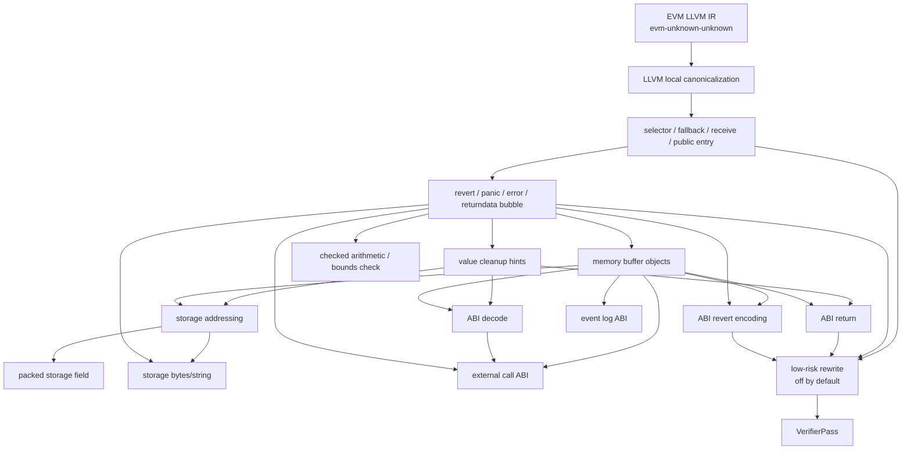

# Evm2llvm Solidity Pass 组织顺序计划

## 原始 prompt

首次 prompt：

阅读logs/20260521-01-Evm2llvmSolidityCompilerPatternPassPlan.md，然后单独写一个新的计划文件，规划一下这些PASS按照什么顺序组织比较合适。用Mermaid写一个架构图，然后再单独列举一下当前的难点，有哪些Pass/底层模式没有写/识别，有哪些问题需要解决。

本次修订 prompt：

抛弃之前的分类思路，重新认真思考，就单纯按照底层模式以及对应的高层语义去分，然后，重点是顺序是怎么样的。如果没有严格顺序要求的话，就说明一下，然后就只聊一下这些pass之间有顺序上的要求的部分，比如某个pass先处理之后，有利于后续的另一个pass。
这里第一点，metadata和基础索引层，这个很奇怪，它只是统一metadata名字，应该只是提供基础的架构，为什么要放到这个推荐顺序里面来。这个第二点入口和CFG边界层，这个名字不太明确，第一眼看上去不知道是干什么的，考虑没必要非要取一个什么什么层这样的名字，标题就简单说这部分是处理什么特性。其次，这里当前已有但还偏弱的pass，还有这个还没写的pass，以及当前难点，这3块最好融入到前面这里面，不要单独列举

## 背景

上一份 plan 已经列出 Solidity 编译器会主动生成哪些底层代码。这里不再按“层”分类，而是按底层模式和对应高层语义来组织 pass。

`SolidityPatternAnnotationPass`、metadata 名字、公共 helper、统计输出，这些属于实现基础设施。它们应该在代码结构里统一，但不是一个需要参与语义顺序讨论的 pass。真正需要讨论顺序的是：某个模式先识别后，是否能让另一个模式更可靠。

总原则：

- 先跑 EVM IR canonicalization。所有 matcher 面向优化后的 IR。
- 识别 pass 默认 metadata-only，不删 CFG。
- 只有明确依赖关系的 pass 才要求顺序；没有依赖的 pass 可以并列跑。
- rewrite 独立放最后，不能和识别混在一起。

## 推荐总顺序

严格顺序只需要这样：

1. EVM IR canonicalization。
2. 识别 selector / fallback / receive / public entry。
3. 识别 revert / panic / error / returndata bubble。
4. 识别 value cleanup 和 memory buffer。
5. 识别 ABI decode / ABI return / ABI revert encoding。
6. 识别 storage addressing / packed field / storage bytes-string。
7. 识别 external call 和 event。它们可以早标 helper call，但参数结构要等 memory/ABI。
8. rewrite。默认关闭，只处理低风险模式。

其中 4 到 7 不是每个 pass 都有严格线性顺序。真正的依赖是：ABI、event、external call、revert encoding 都依赖 memory buffer；checked arithmetic、bounds check 依赖 panic/error 识别；storage field 依赖 storage address 根。

## 架构图

## EVM IR canonicalization

底层模式：evm2llvm 输出的 stack-lifted IR，里面有很多冗余 zext、icmp、helper call 周围的临时值。

高层语义：没有直接高层语义，只是把形状稳定下来。

顺序要求：必须最先跑。后面的 pass 不应该同时兼容优化前和优化后两套形状。

当前问题：

- 只能跑局部、低风险的 LLVM 优化，不能把 wasm 类型恢复和 wasm 专用 pass 带进来。
- optimizer 会改变 Solidity 不同版本的形状，matcher 要围绕 helper call、值依赖和终点写，不能只写固定基本块。

## Selector、fallback、receive 和 public 入口

底层模式：

- `public___function_selector___*` 里有 selector 分发。
- `calldatasize < 4`、`calldataload(0) >> 224`、selector 常量比较。
- fallback / receive / delegatecall 转发逻辑可能内联在 selector 函数里。
- public 函数名通常是 `public_*`。

高层语义：

- 哪些函数是 ABI public entry。
- 哪段代码是 dispatcher。
- 哪段代码是 fallback / receive / selector 内联 body 候选。

顺序要求：

- 这部分应该在 nonpayable、ABI decode、event、external call 之前跑。
- 原因是后续 pass 需要知道自己看到的是 public entry 里的业务逻辑，还是 selector dispatcher 里的内联路径。
- 如果暂时不拆函数，也至少要先标出 selector 比较链边界和内联 body 候选。

当前状态和问题：

- 已有 `SelectorInlinedLogicExtractionPass`，但现在只按函数名和明显 `call/log` 标候选。
- 还没真正识别 selector 比较链边界。
- fallback / receive 的判断还不稳定，尤其是 `calldatasize == 0` 和 payable 状态要结合后面的 callvalue guard。
- 第一阶段不做 selector 到源码函数名恢复。

## Payable / nonpayable guard

底层模式：

- public/fallback 入口读 `evm_callvalue`。
- 判断 `callvalue == 0` 或等价条件。
- 失败分支 `revert(0, 0)`。

高层语义：

- 函数是 `nonpayable`。
- 这段 `revert(0,0)` 是编译器保护，不是用户手写 require。

顺序要求：

- 依赖入口识别。没有 public/fallback/receive 上下文时，单独看到 `callvalue == 0` 不够稳。
- 应该在 ABI decode 之前跑，因为 ABI decode 也会产生 `revert(0,0)`。
- 可以在通用 revert 识别前后都跑，但更实用的是：先标 nonpayable guard，再让 revert pass 读取这个标记，避免把它当普通 empty revert。

当前状态和问题：

- 已有 `PayabilityGuardPass`，能识别直接的 `callvalue == 0 -> revert(0,0)`。
- 还没处理 optimizer 变形后的等价条件。
- fallback/receive 的 payable 状态还没完整区分。
- rewrite 可以先只支持这个模式，但要等 fallback/receive 误报风险降下来。

## Revert、Panic、Error、custom error 和 returndata bubble

底层模式：

- `revert(0,0)`。
- `Panic(uint256)` selector `0x4e487b71` 加 panic code。
- `Error(string)` selector `0x08c379a0` 加 ABI string。
- custom error selector 加参数。
- 低级 call 失败后 `returndatacopy` 再 `revert(0, returndatasize)`。

高层语义：

- `require` / `assert` / compiler panic / ABI bounds check / custom error。
- 外部调用失败时原样冒泡 returndata。

顺序要求：

- 应该在 checked arithmetic、array bounds、ABI decode 保护识别之前跑。
- 后面这些 pass 需要通过 panic code 或 error 形状判断某个条件是不是编译器保护。
- 但 `Error(string)` 和 custom error 的参数结构依赖 memory buffer，所以 revert pass 可以先标 selector 和终点，完整 ABI 参数后面再补。

当前状态和问题：

- 已有 `SolidityRevertPass`，能标 empty revert、returndata bubble、部分 Panic selector。
- 还缺 panic code 提取。
- 还缺 `Error(string)`、custom error、revert buffer 的 ABI 结构。
- `revert(0,0)` 误报风险高：nonpayable、ABI bounds、fallback reject、用户 require 都可能用它。

## Checked arithmetic 和 bounds check

底层模式：

- Solidity 0.8+ checked add/sub/mul/div、取负、类型转换失败。
- array index 和 length 比较，失败进 `Panic(0x32)` 等。
- bytes/string storage 编码错误进 `Panic(0x22)`。

高层语义：

- 普通算术表达式带 checked 语义。
- 数组边界检查。
- enum / 类型转换合法性检查。
- bytes/string storage 编码合法性检查。

顺序要求：

- 严格依赖 revert/panic 识别。没有 panic code 时，很难区分 compiler check 和业务 if。
- 对 ABI decode bounds check，还依赖 calldata 参数模式。
- 对 storage bytes/string，还依赖 storage 地址和编码模式。

当前状态和问题：

- 还没有独立 `CheckedOperationPass`。
- 还没有独立 `BoundsCheckPass`。
- enum 上界检查、bool 归一和 panic 的关系还没处理。

## Value cleanup 和类型线索

底层模式：

- `and ((1 << N) - 1)`。
- `signextend`。
- `iszero(iszero(x))` 或等价 bool 归一。
- enum / 小整数的范围检查。

高层语义：

- address、bool、uintN、intN、bytesN、enum 的类型线索。
- 这些不是最终类型，只是低层值被清理到某种宽度。

顺序要求：

- 它和 revert 识别没有强依赖，可以早跑。
- 但它有利于 ABI decode、ABI return、storage field、external call 参数恢复。
- 所以推荐放在 ABI/storage/external call 之前。

当前状态和问题：

- 已有 `ValueCleanupTypeHintPass`，能标常量 mask 和 `signextend`。
- 对 `shl/sub/and` 组合生成的 mask 识别不足。
- 对 bool 双重 `iszero`、enum range check 还没覆盖。
- address mask 和 uint160 mask 本质形状接近，metadata 要保留置信度，不能直接定最终类型。

## Memory buffer 和动态对象

底层模式：

- `mload(0x40)` 取 free memory pointer。
- `mstore(0x40, new_ptr)` 更新 free memory pointer。
- 一组 `mstore` 写 ABI buffer、revert buffer、event data、call data、return data。
- 动态数组 / bytes / string 的 length 和 data 区域。

高层语义：

- memory allocation。
- ABI buffer。
- revert/error buffer。
- event data buffer。
- external call input/output buffer。

顺序要求：

- 这是 ABI return、ABI decode 动态参数、revert encoding、event、external call 的共同前置条件。
- 没有 memory buffer 跟踪时，这些 pass 只能做很粗的 helper 标注。
- 它不一定要在 value cleanup 之后，但两者结合后能更好识别 buffer 里写入的类型。

当前状态和问题：

- 已有 `MemoryObjectPass`，只标 `mload(0x40)` 和 `mstore(0x40, ...)`。
- 还缺跨基本块的 buffer 分组、起点、长度、写入顺序。
- Memory 是当前最大的瓶颈，因为 ABI、revert、event、external call 都共享这套 `mstore/mload`。

## ABI decode

底层模式：

- `calldatasize` bounds check。
- `calldataload(4 + 32 * index)`。
- 动态参数 offset / length 检查。
- `calldatacopy` 复制 bytes/string/array。
- 参数读出后 mask / signextend / bool 归一。

高层语义：

- public/external 函数参数。
- calldata bounds check 是 ABI 解码保护，不是用户业务判断。
- 参数类型线索。

顺序要求：

- 依赖 public entry 识别。
- 依赖 revert/panic 识别来归类失败路径。
- 依赖 value cleanup 获取类型线索。
- 动态参数依赖 memory buffer。

当前状态和问题：

- 还没有 `AbiDecodePass`。
- 静态参数可以先做，动态参数要等 memory buffer 更稳。
- ABI bounds check 容易和业务 require 混在一起，不能只看 `revert(0,0)`。

## ABI return

底层模式：

- `mload(0x40)` 取返回 buffer。
- 多个 `mstore(retptr + offset, value)`。
- 动态返回值 head/tail。
- `return(retptr, size)`。
- 也可能是 returndata forward。

高层语义：

- 函数返回值。
- 返回值类型线索。
- 外部调用 returndata 原样返回。

顺序要求：

- 简单 `return(ptr, 32)` 可以早标。
- 完整恢复返回值结构依赖 memory buffer 和 value cleanup。
- returndata forward 依赖 external call / returndata bubble 相关模式，但可以先标候选。

当前状态和问题：

- 已有 `AbiReturnPass`，主要标 `evm_return`，区分 `32` 字节和 returndata forward。
- 还没识别 return buffer 的 `mstore` 序列。
- 还没恢复动态返回值、head/tail、返回类型线索。
- 因此建议把完整 `AbiReturnPass` 放在 memory buffer 和 value cleanup 之后。

## ABI revert encoding

底层模式：

- 写 `Panic(uint256)` / `Error(string)` / custom error selector。
- 按 ABI 写参数。
- `revert(ptr, size)`。

高层语义：

- `assert` / compiler panic。
- `require(..., "message")`。
- custom error。

顺序要求：

- 依赖 revert 终点识别。
- 依赖 memory buffer。
- custom error 参数还依赖 value cleanup。

当前状态和问题：

- 当前只在 `SolidityRevertPass` 里做了部分 Panic selector 识别。
- 更完整的 ABI revert encoding 可以作为 `SolidityRevertPass` 增强，也可以拆成单独 pass。

## Storage addressing、mapping 和动态数组

底层模式：

- scratch memory 写 key 和 base slot。
- `sha3(mem, 64)` 得到 mapping element slot。
- `sha3(slot)` 得到 dynamic array data 起点。
- 嵌套 mapping/array 形成 sha3 链。

高层语义：

- mapping slot。
- dynamic array data slot。
- 嵌套 storage 地址关系。

顺序要求：

- 对简单 sha3 候选没有严格依赖。
- 可靠识别需要 memory scratch 内容，所以受 memory buffer / mstore 跟踪影响。
- packed field 和 storage bytes/string 应该在 storage address 根之后做。

当前状态和问题：

- 已有 `StorageAddressingPass`，只按 `evm_sha3` 长度标候选。
- 还没确认 hash 前 memory 里写了什么。
- 还没恢复 nested mapping / array 的链。

## Packed storage field

底层模式：

- `sload(slot)` 后 shift/mask 取 field。
- `sstore(slot, old_cleared | new_shifted)` 写 field。
- address、bool、小整数、bytesN 可能被打包。

高层语义：

- `storage_field_load(slot, bit_offset, bit_width)`。
- `storage_field_store(slot, bit_offset, bit_width, value)`。

顺序要求：

- 依赖 value cleanup 来判断 bit width。
- 依赖 storage addressing 来知道 slot 根，尤其是 mapping/array 元素里的 packed field。

当前状态和问题：

- 还没有 `StorageFieldPass`。
- 写 field 前的 clear/or/shift 组合容易被 optimizer 改形状。
- 只恢复 slot/offset/width，不猜变量名。

## Storage bytes/string 短长编码

底层模式：

- storage slot 低 bit 判断短/长编码。
- 短 bytes/string 数据在同一个 slot。
- 长 bytes/string 数据从 `sha3(slot)` 开始。
- 非法编码可能 `Panic(0x22)`。

高层语义：

- storage bytes/string 的 length、data、short/long 分支。
- storage 编码错误。

顺序要求：

- 依赖 storage addressing。
- 依赖 panic 识别，尤其是 `Panic(0x22)`。
- 长 bytes/string 的拷贝还依赖 memory buffer。

当前状态和问题：

- 还没有 `StorageBytesStringPass`。
- 第一阶段只适合标 candidate，不适合 rewrite 成高级字符串操作。

## Event log

底层模式：

- `evm_log0` 到 `evm_log4`。
- topic0 是事件签名 hash，匿名事件没有 topic0。
- 非 indexed 参数写 memory data buffer。
- 动态 indexed 参数先 hash。

高层语义：

- `emit event(topics, data)`。
- topic 和 data 的 ABI 结构。

顺序要求：

- 标 `logN` helper 没有依赖，可以随时做。
- 恢复事件参数依赖 memory buffer 和 ABI encode。
- 动态 indexed 参数 hash 还依赖 storage/memory/value 线索。

当前状态和问题：

- 已有 `EventLogPass`，只标 topic 数。
- 还没恢复 topic 常量、data buffer、匿名事件、动态 indexed 参数。

## External call 和 returndata

底层模式：

- `call` / `staticcall` / `delegatecall` / `callcode`。
- call data 写到 memory。
- success check。
- 失败时 returndata bubble。
- 成功时 returndata ABI decode 或直接 return。

高层语义：

- 外部调用的 kind、target、value、gas、input、output。
- 调用失败冒泡。
- 调用返回值解码。

顺序要求：

- 标 call kind 没有严格依赖，可以早做。
- 恢复 input/output buffer 依赖 memory buffer。
- success check 和失败路径依赖 revert / returndata bubble 识别。
- 返回值解码依赖 ABI decode/return 的 buffer 能力。

当前状态和问题：

- 已有 `ExternalCallPass`，只标 call kind。
- 还没恢复 target/value/gas/input/output buffer。
- 还没把 success check、returndata bubble、returndata decode 绑定成一个外部调用结构。
- 不识别 proxy、ERC1967、OpenZeppelin 这类源码/库模式。

## Rewrite

底层模式：

- 已经识别并确认是编译器生成的低层片段。

高层语义：

- 用 metadata 或高层 intrinsic 表达，不再让后端输出底层 helper 序列。

顺序要求：

- 必须最后跑。
- 只能依赖前面 metadata 结果，不能再自己写一套 matcher。
- 默认关闭。

当前建议：

- 第一批只 rewrite nonpayable guard、简单 ABI return、明确 Panic/Error/custom error、returndata bubble。
- storage、dynamic ABI、event、external call 暂时不要 rewrite。

## 不做什么

- 不做 selector 到源码函数名恢复。
- 不识别 ERC1967、Ownable、ERC20/721 这类源码或库模式。
- 不为了让 IR 通过而退回 slot fallback 或掩盖 PHIIncoming 问题。
- 不要求第一阶段覆盖所有 Solidity 版本；先用 apehex 里有源码、大小合适的样例同步验证。

## 验证标准

- `notdec.evm.solidity_patterns` 通过。
- batch001 已有样例能跑完并通过 `llvm-as`。
- 每个 pass 的 oracle 不只看命中数量，还要看命中位置、kind、关键参数和误报样例。
- metadata-only 不改变 CFG。
- rewrite 开启后必须 verifier 通过，并且只处理前面列出的低风险模式。

