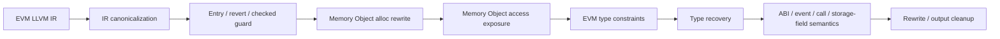

# EVM Memory Object 与类型恢复接入后的 Pass 顺序计划

## 原始 prompt

EVM这一块需要后续接入类型恢复部分。主要就是基于现在内存对象的分配，然后以及暴露出来的对内存对象的访问和操作，推测出内存对象内部的结构和具体的类型。然后后续的可能ABI或者什么field相关的都可以从类型推理的结果上进一步处理得到。基于这一点，尝试重新规划一下logs/20260522-01-Evm2llvmSolidityPassOrderingPlan.md里的各个特性该按什么顺序处理，写一个新的文档

## 背景

旧 plan 里 ABI return、event、external call、revert encoding 都直接依赖 memory buffer。这个方向能先做模式识别，但容易让每个 pass 都自己重新理解一遍 `mstore/mload/copy`。

新的目标是把 Memory Object 作为类型恢复输入：

- `notdec_evm_alloc(size)` / `notdec_evm_alloc_unbounded()` / `notdec_evm_finalize_alloc(base, size)` 先表达内存对象边界。
- 对同一个对象的 `mstore/mload/calldatacopy/returndatacopy` 暴露成对象访问事实。
- 类型恢复基于这些访问推断对象内部结构，例如 ABI head/tail、bytes/string、数组、tuple、call input/output buffer。
- ABI return、event、external call 返回值、部分 field 相关恢复，优先消费类型恢复结果，而不是各自手写一套 memory matcher。

这里不是说 ABI/event/call pass 不能看 IR。它们仍然负责识别边界 helper，例如 `evm_return`、`evm_logN`、`evm_call*`。但 buffer 内部结构尽量从 Memory Object 类型结果上拿。

## 总顺序

推荐顺序：

1. EVM IR canonicalization。
2. 入口和退出 guard：selector、fallback/receive、payability、revert/panic、checked/bounds。
3. Memory Object rewrite：把 free memory pointer 操作改成显式 alloc/finalize。
4. Memory Object access exposure：收集和暴露对象上的 read/write/copy/use。
5. EVM 类型恢复输入准备：把 calldata、returndata、storage、value cleanup、memory object 访问转换成类型约束。
6. 类型恢复主流程：推断 memory object 结构、值宽度、ABI head/tail、数组和 bytes/string 形状。
7. 基于类型结果的 Solidity 语义 pass：ABI 参数、ABI return、revert encoding、event、external call 参数和返回值、storage field。
8. 最后做 rewrite / output cleanup：隐藏 compiler guard、低层 helper 和已被高层语义覆盖的 memory 操作。

简化图：

## 1. IR canonicalization

目标还是先把 evm2llvm 输出的局部噪声稳定下来。

处理内容：

- 简化明显的 zext/trunc/icmp/helper call 周边表达式。
- 保留 CFG guard 和 memory access 的可追踪形状。
- 不做会破坏 `mstore/mload/copy` 顺序关系的激进改写。

顺序原因：

- 后面所有 matcher 都面向 canonical IR。
- Memory Object rewrite 需要稳定识别 `mload(0x40)` 和 `mstore(0x40, new_ptr)`。

## 2. 入口、退出和 compiler guard

这一组 pass 先把“哪些分支是编译器保护”确认下来。它们不依赖 Memory Object 类型恢复，反而应该尽量在 memory rewrite 之前或刚之后做完关键判断。

包含：

- selector / fallback / receive / public entry。
- payability guard。
- revert / panic / returndata bubble。
- checked arithmetic / array bounds / enum conversion / allocation bounds。

顺序原因：

- `revert(0,0)`、`Panic(code)` 是很多后续判断的 guard 证据。
- checked/bounds 是 compiler guard，不应该等类型恢复后再猜。
- public entry 是后续 ABI 参数约束的上下文。

输出：

- guard 类型、panic code、成功/失败边。
- public entry / selector region。
- 可被后续 rewrite 隐藏的 compiler guard。

不做：

- 不在这里恢复 ABI 参数结构。
- 不在这里恢复 return/event/call buffer 内部字段。

## 3. Memory Object alloc rewrite

这是当前 MemoryBufferPass 该承担的核心工作。

输入形状：

- `mload(0x40)` 取 free memory pointer。
- `mstore(0x40, base + size)` 写回 free memory pointer。

输出形态：

- size 在分配点可用：`base = notdec_evm_alloc(size)`。
- size 在后面才可用：`base = notdec_evm_alloc_unbounded()`，写回点改成 `notdec_evm_finalize_alloc(base, size)`。

顺序原因：

- 类型恢复需要先有对象边界，而不是一堆裸 `i256` 地址。
- 后续 pass 通过 alloc base 判断哪些 access 属于同一个对象。

保守策略：

- 能识别边界就 rewrite；边界不完整时保留原始 `mstore/mload`。
- 不在这里判断对象是 ABI return、event data 还是 call input。
- 不插 `memory_consumer` 这类中间 marker。

## 4. Memory Object access exposure

这一步负责把对象上的访问整理成后续类型恢复能消费的事实。它可以是 pass，也可以先是 helper + analysis result，但不应该是只给某个 ABI pass 用的局部 matcher。

需要暴露的事实：

- object base：来自 `notdec_evm_alloc*`。
- object size：来自 `notdec_evm_alloc(size)` 或 `finalize_alloc(base, size)`。
- word write：`mstore(obj + offset, value)`。
- word read：`mload(obj + offset)`。
- byte / range copy：
  - `calldatacopy(obj + offset, src, size)`
  - `returndatacopy(obj + offset, src, size)`
  - `codecopy` / `memory copy` 后续再补。
- object use：
  - `evm_return(mem, obj, size)`
  - `evm_revert(mem, obj, size)`
  - `evm_logN(mem, obj, size, topics...)`
  - `evm_call*(..., in_obj, in_size, out_obj, out_size)`

顺序原因：

- 类型恢复不应该重新扫描所有 EVM helper 的参数细节。
- ABI/event/call pass 也不应该分别维护一套“这个 mstore 属于哪个 buffer”的逻辑。

输出方式：

- 首选 C++ analysis result / facts。
- metadata 只用于调试和 oracle，不作为主要接口。
- 如果必须改 IR，应尽量保留普通 `evm_mstore/evm_mload`，通过地址和 alloc base 表达关系。

## 5. EVM 类型恢复输入准备

这一步把 EVM 特有事实转换成类型恢复能理解的约束。

输入：

- Memory Object access facts。
- value cleanup：mask、signextend、bool 归一、enum bounds。
- calldata load：`calldataload(4 + 32 * index)`。
- storage load/store：`sload/sstore` 及 storage address helper 结果。
- returndata size/copy/read。

约束例子：

- `mstore(obj + 0x00, x)` 给对象 `obj` 的 offset 0 一个字段候选。
- `mload(obj + 0x20)` 读取对象 offset 0x20。
- `calldatacopy(obj + 0x20, src, len)` 表示对象有一段动态 byte range。
- `evm_return(obj, size)` 表示对象作为 ABI return buffer 使用。
- `evm_call(..., in_obj, in_size, out_obj, out_size)` 表示 input/output 两个对象分别有 ABI encode/decode 角色。
- `and x, ((1 << 160) - 1)` 给 `x` 一个 uint160/address 候选，不直接定死。

顺序原因：

- 类型恢复需要把 memory、calldata、returndata、storage、value cleanup 放到同一张约束图里。
- 单独 ABI decode pass 只看 calldata，不足以推断动态对象结构。

## 6. 类型恢复主流程

目标是推断 Memory Object 内部结构和相关值类型。

优先恢复：

- ABI tuple/head/tail：
  - offset 0、32、64 等 head word。
  - head 里指向 tail 的动态 offset。
  - tail 里的 length + data。
- bytes/string/array：
  - length 字段。
  - data range。
  - element width。
- return/revert/event/call buffer：
  - buffer role 来自 object use。
  - 字段结构来自 write/read/copy。
- value width：
  - address/uint160。
  - bool。
  - uintN/intN。
  - bytesN。

输出：

- memory object type：例如 tuple、dynamic bytes、array、ABI encoded buffer。
- object fields：offset、size、value type、source。
- object role：return buffer、revert buffer、event data、call input、call output、calldata dynamic arg copy。
- confidence / reason：哪些是确定事实，哪些只是候选。

不做：

- 不猜源码变量名。
- 不查 ABI JSON 或 event signature database。
- 不把所有 `uint160` 强行叫 address，除非上下文明确是 address。

## 7. 基于类型结果的语义 pass

这部分是旧 plan 里 ABI/event/call/revert/storage field 的重排重点。它们应该优先消费类型恢复结果。

### 7.1 Public entry ABI 参数

输入：

- public entry / selector 上下文。
- calldata load/copy 约束。
- 类型恢复出的静态参数、动态参数 head/tail。
- ABI bounds guard 结果。

输出：

- 函数参数列表候选。
- 参数类型候选。
- ABI bounds check 可隐藏。

顺序变化：

- 不再把 `AbiDecodePass` 当成独立的大 pass 先恢复所有参数。
- 它更像 public entry 参数汇总和 rewrite pass，核心结构来自类型恢复。

### 7.2 ABI return

输入：

- `evm_return` 使用的 memory object。
- 类型恢复出的 return buffer 字段。
- returndata forward 候选。

输出：

- 返回值 tuple / 动态返回值。
- 隐藏 return buffer 的低层 `mstore`。

顺序变化：

- `AbiReturnPass` 不应该自己完整重建 head/tail。
- 它负责把 return helper 和对象类型绑定，做最终语义输出。
- 当前实现方向是把 `AbiReturnPass` 放到类型恢复后，payload 只读 HType record field。

### 7.3 Revert encoding

输入：

- revert/panic/custom error 终点。
- revert buffer object type。
- selector word、参数字段、Error(string) 动态字符串结构。

输出：

- Panic(code)。
- Error(string)。
- custom error selector + 参数结构。
- returndata bubble。

顺序变化：

- `SolidityRevertPass` 当前也放到类型恢复后。
- empty revert 可以只看 `evm_revert` 参数；非空 Panic / Error(string) / custom error payload 从 HType record field 读。
- 如果 HType 缺字段，不回退扫 `mstore` / memory write marker。

### 7.4 Event log

输入：

- `evm_logN` helper。
- topic 值。
- event data object type。
- value cleanup 类型线索。

输出：

- event topic 列表。
- data 参数结构。
- 动态 indexed 参数 hash 候选。

顺序变化：

- `EventLogPass` 当前放到类型恢复后。
- `evm_logN` 边界仍按 helper 名字识别；非空 data buffer 只从 HType record field 读。

### 7.5 External call 和返回值

输入：

- `evm_call/staticcall/delegatecall/callcode` helper。
- input object type。
- output object type。
- success check / returndata bubble。
- output reads 和 returndata copy。

输出：

- call kind、target、value、gas。
- input ABI encoded 参数结构。
- output ABI decoded 返回结构。
- failure bubble。

顺序变化：

- external call pass 仍然可以早标 call kind。
- input/output buffer 内部字段不在这个 pass 里重扫 `mstore/mload`，而是读类型恢复结果。

### 7.6 Storage field / storage bytes-string

输入：

- storage address helper：mapping / dynamic array slot。
- value cleanup。
- sload/sstore 的 shift/mask/or 访问。
- 类型恢复出的值宽度和使用上下文。

输出：

- packed storage field load/store：slot、bit offset、bit width、value type。
- storage bytes/string short/long 编码结构。

顺序变化：

- storage addressing 可以保留为 helper。
- packed field 不需要单独作为 marker pass；如果要 rewrite，应由 storage field 语义 pass 基于 helper + 类型结果完成。

## 8. Rewrite / output cleanup

最后再隐藏或替换低层代码。

可以 rewrite 的内容：

- 已确认的 compiler guard。
- 已被 ABI 参数/返回/事件/调用语义覆盖的 memory buffer writes。
- `mload(0x40)` / `mstore(0x40, ...)` 这种 free pointer 操作。
- 已确认的 packed storage shift/mask。

不能 rewrite 的内容：

- 类型恢复还只是候选的对象字段。
- 无法绑定到具体 object role 的 `mstore/mload`。
- 可能是用户业务分支的 `revert(0,0)`。

原则：

- 类型结果用于指导 rewrite，但不能把低置信度候选强行删掉。
- metadata 继续用于调试和 oracle，不作为 pass 间主要接口。

## 对旧计划的主要调整

1. `ABI decode` 收窄成 public entry 参数汇总，不再承担所有 calldata/memory 动态对象恢复。
2. `ABI return`、`event`、`external call` 不再各自完整分析 buffer 结构，改为消费 Memory Object 类型结果。
3. `memory-buffer` 升级成 Memory Object alloc rewrite + access exposure，是类型恢复前置。
4. `storage-addressing` / `packed-storage-field` 不再作为早期 marker pass。storage address 是 helper，packed field 等类型恢复和 value cleanup 后再做 rewrite。
5. rewrite 尽量后置。前面先产出可给类型恢复使用的显式对象、访问和约束。

## 分阶段做法

第一阶段：

- 稳定 `notdec_evm_alloc*` / `finalize_alloc`。
- 建 Memory Object access facts。
- 把 ABI return、event、external call 现有 matcher 改成优先读 object access facts。

第二阶段：

- 给 EVM 类型恢复加 memory object 约束输入。
- 先覆盖静态 ABI tuple、return buffer、event data、call input/output 这些 32 字节 word 结构。
- manifest oracle 增加 object role、字段 offset、字段数量。

第三阶段：

- 支持动态 bytes/string/array 的 head/tail。
- public entry 参数、ABI return、external call 返回值从类型结果生成。
- 删除旧 memory write/read/copy/consumer marker。

第四阶段：

- storage field 和 storage bytes/string 接入 value cleanup + 类型结果。
- 对已确认结构做 rewrite cleanup，减少后端输出里的低层 helper。

## 风险和判断标准

风险：

- Memory Object 边界错了，会污染后续类型恢复。
- 类型恢复结果如果没有置信度，后续 rewrite 容易删错业务逻辑。
- dynamic ABI head/tail 和普通内存对象可能形状相似，必须结合 object role。
- external call output buffer 有时只是预留，实际返回长度由 returndata 决定，不能只信分配 size。

判断标准：

- Solidity patterns suite 继续通过。
- manifest 能覆盖 object role、object field、ABI/event/call buffer 结构。
- 固定 apehex 100 个样例里，alloc/object facts 不明显爆炸，类型结果能解释更多 return/event/call buffer。
- rewrite 后 IR 仍能通过 LLVM verifier。
- 低置信度候选不会导致原始 `mstore/mload` 被删除。
