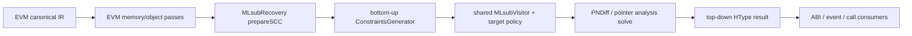

# EVM 类型恢复对接 MLsub 复用计划

## 原始 prompt

重新规划一下如何对接类型推理，写到一个logs/下的日志文件里。基础的思路就是参照那边wasm的类型推理，照抄那个IR Visitor用于生成约束和PNDiff约束。再外面就也是那个先bottom-up再top-down的架构。参考的同时看看能不能把那边改得更适合复用，尽量复用代码

## 背景

当前类型恢复主线已经在 wasm pipeline 里工作：

- `MLsubRecovery::run()` 建 call graph / SCC，再跑 bottom-up 和 top-down。
- `MLsubRecovery::bottomUpPhase()` 按 SCC 从 callee 到 caller 生成约束，处理 summary / signature / extra constraints。
- `ConstraintsGenerator::run()` 给函数、参数、返回值建节点，用 `MLsubVisitor` 遍历 IR，然后求解 PNDiff 和 pointer analysis。
- `MLsubVisitor` 已经覆盖 `call`、`load/store`、`alloca`、`ptrtoint/inttoptr/bitcast`、`phi`、算术和比较等常见 LLVM IR。

EVM 现在已经从 `evm_mload/mstore` 迁到原生 `load/store`，free memory allocation 也已经改成
`calloc/calloc_unbounded + ptrtoint`。这意味着 EVM 不需要单独写一套类型推理算法，应该让它进入同一个 MLsub / PNDiff 流程。

当前主要缺口在 pass 接入和少量 EVM 语义：

- `PassManager` 里 EVM 分支跑完 Solidity/EVM pass 后直接返回，还没有 `prepareTypeRecoveryContext()`。
- `MLsubVisitor` 的 IR 约束大部分可复用，但 call helper 语义、memory object role、calldata/storage/returndata 还没有变成类型约束。
- 现有 visitor 类在 `MLsubGenerator.h/.cpp` 内部，和 wasm 经验绑得比较紧，不太方便给 EVM 增加目标相关规则。

## 目标

第一目标是让 EVM IR 进入现有类型恢复架构：

- 复用 `MLsubRecovery` 的 SCC、bottom-up、top-down、summary 实例化。
- 复用 `ConstraintsGenerator::MLsubVisitor` 的普通 LLVM IR 约束和 PNDiff 约束。
- EVM 只补目标相关语义：allocation helper、EVM runtime helper、memory object facts、ABI role 线索。

第二目标是顺手把 wasm 侧代码改得更适合复用：

- 不复制一整份 visitor。
- 把“目标相关判断”从 visitor 主体里拆小，例如 allocation call 识别、忽略哪些 runtime call、哪些 helper 有固定签名。
- 保持 wasm 行为不变，EVM 只是多一个 policy / hook。

## 总路线

推荐路线：

1. 先把现有 MLsub 架构接到 EVM pipeline，但默认只在 `tr-level >= 2` 或明确开启类型恢复时运行。
2. 先加基于 module triple 的小工具函数，让同一个 `MLsubVisitor` 在少数判断处知道当前是否是 EVM。
3. 先依赖新 EVM 原生 IR：`calloc`、`ptrtoint/inttoptr`、`load/store`。不要为了类型恢复再造新的 marker。
4. 把 Solidity pass 已经收集到的 memory object/access/use 信息转换成 MLsub / PNDiff 约束。
5. 类型结果先只用于 debug/oracle，不急着驱动 rewrite。等结果稳定后，再让 ABI return、event、external call 消费类型结果。

简化图：

## 1. Pass 接入

EVM 分支不能继续在 Solidity pass 后直接 `return`。新的顺序建议是：

1. EVM local canonicalization。
2. selector/payability/checked-bounds/memory-buffer/ABI-return/revert/event/external-call 这些现有 EVM pass。
3. Verifier。
4. `prepareTypeRecoveryContext()`。
5. `MLsubRecoveryMain`。
6. 后续需要 C 输出或类型驱动 rewrite 时，再接 `MLsubRecoveryOpt` 或新的 EVM type consumer pass。

这里先不要把 wasm 的 pre-type-recovery pass 原样塞给 EVM。`LinearAllocationRecovery`、`MemsetMatcher`、`MemcpyMatcher`、`UndoInstCombine` 里面有 wasm 假设，EVM 应该只接 MLsub 主体。

## 2. 复用 visitor 的方式

不要复制一份 `EvmMLsubVisitor`。更合适的是保留一个 visitor，只在少数确实需要目标判断的地方查 module triple。

第一步不需要上很重的 policy/strategy 对象。先加几个工具函数就够：

- `isEVMModule(const Module&)`
- `isEVMFunction(const Function&)`
- `isHeapAllocationCall(CallBase&)`
- `handleEVMRuntimeCall(CallBase&, ConstraintsGenerator&)`
- `shouldIgnoreRuntimeFunction(Function&)`

wasm 路径保持现在行为：

- `malloc` / `calloc` 类分配识别。
- LLVM dbg/lifetime/memcpy/memset/memmove/minmax 的现有处理。
- 普通 call 继续走 SCC 内约束或 summary 实例化。

EVM 特殊逻辑应该很少：

- `calloc` / `calloc_unbounded` 是 heap allocation。
- 旧 `notdec_evm_alloc*` 只作为兼容。
- `notdec_evm_finalize_alloc` 不产生新对象，只给已有 object 补 size 事实。
- `evm_return`、`evm_revert`、`evm_logN`、`evm_call*` 这类 helper 不按普通 C 函数调用推断，而是作为 object role / use 事实。
- `calldataload`、`sload`、`returndatasize` 等 helper 先按普通值保守建节点，只有需要 role/source 信息时再补标签。

这样 visitor 里的 `visitCastInst()`、`visitLoadInst()`、`visitStoreInst()`、`visitAllocaInst()`、`visitPHINode()`、算术和 PNDiff 逻辑都不用复制。

## 3. PNDiff 和指针/整数转换

现有 `visitCastInst()` 已经把 `bitcast`、`ptrtoint`、`inttoptr` 当成类型 remap / alias 处理，这正好匹配 EVM 当前语义：地址值是 `i256`，但可以和 `ptr` 互转。

EVM 侧不要把 `ptrtoint to i256` 当成假语义去规避。计划上直接复用：

- `calloc` 返回 `ptr`。
- `ptrtoint ptr %p to i256` 和 `%p` 类型 remap。
- `inttoptr i256 %addr to ptr` 和 `%addr` 类型 remap。
- 原生 `load/store` 按现有 `recordLoad()` / `recordStore()` 加内存约束。

需要补的是 EVM object 边界：

- `calloc(1, size)` 创建 heap object。
- `calloc_unbounded()` 创建 heap object，但 size 可能来自 `notdec_evm_finalize_alloc(base, size)`。
- object role 来自 `evm_return`、`evm_logN`、`evm_call*` 等 use。

## 4. Memory object facts 转约束

EVM 类型恢复不应该重新扫描所有 Solidity matcher 细节。更合适的是把已有 memory object/access 结果变成统一输入。

第一阶段只做这些事实：

- object allocation：base、size、allocator。
- word store：object + offset 写入 value，通常是 256 bit。
- word load：object + offset 读取 value。
- byte/range copy：calldata/returndata/memory copy 到 object 的 offset 和 size。
- object use：return/revert/event/call input/call output。

转换成约束时，尽量使用 MLsub 已有表达：

- 原生 `load/store` 已经由 visitor 生成 `ptr_load` / `ptr_store`，不要重复造约束。
- 明确能绑定到 object + constant offset 的访问，再补 record field 约束。
- range copy 先作为 facts 保留，等 ABI dynamic bytes/string 阶段再变成数组/bytes 约束。
- object role 先写进类型结果或 debug metadata，不急着影响求解。

## 5. Bottom-up / top-down 保持原架构

EVM 也使用同一套外层架构：

- `prepareSCC()` 建 call graph SCC。
- `bottomUpPhase()` 从 callee 到 caller 生成每个 SCC 的约束。
- SCC 外调用继续通过 summary 实例化。
- `topDownPhase()` 统一生成 HType。

要注意的地方：

- Solidity 合约常见 public entry / dispatcher 形态比较特殊，call graph 可能很浅，但仍然按 SCC 跑，别给 EVM 写特殊求解顺序。
- 外部 EVM helper declaration 不应该进入普通 summary 实例化，应该被 target semantics 消费或忽略。
- `--dump-htypes` 对 EVM 要在 TR 初始化后才允许输出，不能再沿用“EVM 不跑 TR 所以报错”的状态。

## 6. 分阶段实现

### 第一阶段：打通最小闭环

- 在 EVM pipeline 中接 `prepareTypeRecoveryContext()` 和 `MLsubRecoveryMain`。
- 复用现有 visitor，不做大拆分。
- 确认 `calloc/calloc_unbounded + ptrtoint + inttoptr + load/store` 能生成类型变量和 PNDiff 关系。
- EVM helper 先最小处理：明显 runtime helper 不走普通函数 summary，避免污染约束。
- 输出 htypes/debug 文件，先不驱动 rewrite。

判断标准：

- EVM suite 继续通过。
- 选 50-100 个 apehex 样例跑 `--tr-level=2` 不崩。
- `--dump-htypes` 对 EVM 能输出，不再因为 TR 未初始化失败。

### 第二阶段：收窄目标判断

- 从 `MLsubVisitor` 中抽出 allocation call、runtime call ignore、EVM helper use 这些少量判断。
- 用 module triple 工具函数区分 EVM，不引入大接口。
- wasm 默认行为不变。
- EVM 只加少量 helper 处理，仍用同一个 visitor。
- 加小测试覆盖 `calloc`、`calloc_unbounded`、旧 `notdec_evm_alloc*`、`evm_return/log/call` 不被当普通 call。

判断标准：

- wasm type recovery suite 不退化。
- EVM `calloc` 样例能看到 heap object。
- 代码没有复制 visitor 主体。

### 第三阶段：memory object facts 接入

- 把 MemoryBuffer/solidity-pattern helper 收集到的 allocation/access/use 信息整理成 analysis result。
- 在 `ConstraintsGenerator` 或 EVM semantics hook 中把 object + offset 访问补成字段约束。
- 先覆盖 constant offset 的 32 字节 word。
- range copy、dynamic ABI 只记录 facts，不急着求复杂结构。

判断标准：

- return/event/call buffer 的字段 offset 能在 htypes/debug 输出里看到。
- 误绑定 object 的样例能被定位，有 trace。
- 类型结果不导致现有 rewrite 删除更多 IR。

### 第四阶段：ABI role 和动态结构

- 根据 object role 恢复 ABI return、event data、external call input/output。
- 支持 head/tail：offset word、length word、data range。
- bytes/string/array 先覆盖常见 Solidity codegen 形态。
- ABI/event/call pass 改成优先读类型结果，旧 matcher 保留 fallback。

判断标准：

- manifest 增加 object role、field count、dynamic object 统计。
- ABI return/event/external call oracle 不低于当前 matcher。
- 低置信度结果不会触发 cleanup。

## 风险

- 直接让 EVM 进入 MLsub 可能暴露很多 helper call 噪声，所以第一阶段必须先屏蔽明显 runtime helper。
- 抽接口如果太大，会把现有 MLsub 代码改散。第一轮只加 module triple 工具函数和少数 call/helper 判断。
- Memory object 绑定错会污染类型结果。字段约束只从 base + constant offset 这种高置信度访问开始。
- 动态 ABI 和普通 memory object 很像，必须结合 object role，不能只看 `length + data` 形状。
- 类型恢复会增加运行时间。涉及 pass pipeline，后续实现必须对比 fortune wasm 当前关注用例，并记录 apehex smoke 时间。

## 判断标准

- wasm 类型恢复输出和现有 suite 保持一致，说明复用改造没有破坏原路线。
- EVM `tr-level=2` 能正常完成 MLsubRecovery，不再停在 Solidity pass 后。
- EVM `calloc/calloc_unbounded` allocation 在类型恢复里是 heap object。
- `ptrtoint/inttoptr i256` 能和 pointer 结果合并，不额外制造假类型。
- EVM helper 不作为普通未知函数污染 summary。
- apehex 抽样能稳定跑完，并且 htypes/debug 能看到 memory object 字段或 role 的增量信息。

## 2026-06-03 实现记录：第一阶段最小闭环

本次完成第一阶段的 EVM MLsub 接入，范围只限打通类型恢复，不消费类型结果做 rewrite。

改动位置：

- `src/Passes/PassManager.cpp:275`，函数 `PassEnv::build_passes()`：
  EVM 分支在 Solidity/EVM pass 和 verifier 后，`tr-level >= 2` 时调用
  `prepareTypeRecoveryContext()` 和 `add_type_recovery_passes()`。`--emit-tr-input-ir`
  会停在 EVM 规范化后，`--frozen-tr-input-ir` 会跳过 EVM matcher，直接进入 MLsub。
- `include/notdec/TypeRecovery/mlsub/MLsubGenerator.h:335`：
  给 `MLsubVisitor` 声明 `shouldIgnoreRuntimeCall()`。
- `src/TypeRecovery/mlsub/MLsubGenerator.cpp:3562`：
  新增 EVM module 判断和 APInt 版 pointer tag mask 判断，避免 i256 常量调用
  `getZExtValue()`。
- `src/TypeRecovery/mlsub/MLsubGenerator.cpp:3663` 和 `:3675`：
  `isHeapAllocationCall()` 继续识别 `calloc/calloc_unbounded/notdec_evm_alloc*`；
  `shouldIgnoreRuntimeCall()` 在 EVM module 里忽略 `evm_*` 和
  `notdec_evm_finalize_alloc` call site，避免当普通 C 函数 summary 实例化。
- `src/TypeRecovery/mlsub/MLsubGenerator.cpp:3729`，函数
  `MLsubVisitor::visitCallBase()`：
  allocation 仍按 heap object 处理，EVM runtime helper 直接保守跳过。
- `src/TypeRecovery/LowTy.cpp:60`，函数 `fromLLVMTy()`：
  允许 256-bit pointer size，使 EVM `i256` 成为 pointer-sized integer。
- `src/TypeRecovery/mlsub/PNDiff.cpp:103` 和 `:181`：
  PNDiff 只在 APInt 能安全放进 signed 64-bit 时提取 offset；超出时返回 unknown，
  不截断 EVM i256 常量。
- `test/type-recovery/evm/`：
  新增 frozen EVM TR 小 suite，覆盖 `calloc`、`calloc_unbounded`、
  `ptrtoint/inttoptr i256`、原生 `load/store`、`evm_return` 和
  `notdec_evm_finalize_alloc`。
- `test/CMakeLists.txt:91`：
  注册 `notdec.type_recovery.evm.tr_level_2`。

验证：

- `cmake --build ./build --target all -j4` 通过。
- `ctest --test-dir build -R notdec.type_recovery.evm.tr_level_2 --output-on-failure`
  通过，0.15s。
- `ctest --test-dir build -R notdec.evm.solidity_patterns --output-on-failure`
  通过，112.00s。
- `ctest --test-dir build -R notdec.evm.solidity_rewrite --output-on-failure`
  通过，84.19s。
- `./build/bin/notdec test/evm/solidity-patterns/cases/checked_bounds_array_01.ll
  -o /tmp/notdec-evm-tr.ll --tr-level=2 --dump-htypes=/tmp/notdec-evm-tr.htypes`
  通过，生成 478 行 htypes。
- `./build/bin/notdec /tmp/notdec-evm-tr-input.ll -o /tmp/notdec-evm-tr-frozen.ll
  --tr-level=2 --frozen-tr-input-ir --dump-htypes=/tmp/notdec-evm-tr-frozen.htypes`
  通过，生成 478 行 htypes。
- fortune 当前关注用例：
  `/usr/bin/time -f 'elapsed=%e user=%U sys=%S maxrss=%M'
  ./build/bin/notdec test/type-recovery/realworld/cases/fortune.o3.wasm.ll
  -o /tmp/notdec-fortune-tr2.ll --tr-level=2 --frozen-tr-input-ir
  --dump-htypes=/tmp/notdec-fortune-tr2.htypes`
  通过，`elapsed=12.39 user=12.04 sys=0.35 maxrss=852792`。

已知验证结果：

- `ctest --test-dir build -R notdec.type_recovery.llvm_ir.tr_level_2 --output-on-failure`
  仍有 4 个 snapshot 差异：`17_StackArray`、`18_offset1`、
  `20_PointerAnalysisFieldCycle`、`21_PointerAnalysisBranchingFieldCycle`。
  差异表现为少了未引用/已归一化的 decl；PNDiff trace 仍能看到
  `ptradd-reify offset=@0+4i`，不像本次 EVM 接入引入的崩溃或 offset 丢失。
- `ctest --test-dir build -R notdec.type_recovery.sysy.tr_level_2 --output-on-failure`
  当前失败原因是 x86_64/Other target 没初始化 TR：
  `--dump-htypes requires type recovery to be initialized`，和本次 EVM 分支无关。
- `ctest --test-dir build -R notdec.type_recovery.realworld.tr_level_2 --output-on-failure`
  当前可跑完 MLsub，但 DWARF oracle 仍有 `fortune.o3.wasm` 结构字段缺失差异。

评分：

- 实现效果：7/10。EVM `tr-level=2` 和 frozen TR 最小闭环已通，能 dump htypes；
  helper call site 不再走普通 summary。memory object role/facts 还没接入。
- 复杂度：6/10。只改 pipeline、visitor 少量判断和 i256 常量边界，没有复制 visitor。
  PNDiff 的 64-bit offset 边界仍是后续需要明确建模的地方。
- 维护成本：6/10。当前用 module triple 做少量分支，成本低；如果第二阶段继续增加
  helper 语义，应把 EVM helper 规则收窄到更集中的小函数里。

下一步：

- 第二阶段先把 EVM helper 语义分类做细，只保守记录 role/use，不影响普通 MLsub 求解。
- 第三阶段再接 MemoryBuffer/ABI marker 事实，只从 base + constant offset 的 32 字节 word 开始。

## 2026-06-03 实现记录：第二阶段 helper 判断收窄

本次继续推进第二阶段，但仍不接 memory object facts。重点是把 EVM-only helper 的识别范围收紧，
并补测试覆盖旧 helper 和 runtime helper call。

改动位置：

- `src/TypeRecovery/mlsub/MLsubGenerator.cpp:3663`，函数
  `MLsubVisitor::isHeapAllocationCall()`：
  `malloc/calloc` 保持通用 allocation 识别；`calloc_unbounded`、
  `notdec_evm_alloc`、`notdec_evm_alloc_unbounded` 只在 EVM module triple 下识别为
  heap allocation，避免非 EVM module 误吃 EVM 兼容 helper。
- `test/type-recovery/evm/cases/02_evm_runtime_helpers.ll:1`：
  新增 frozen EVM IR，用旧 `notdec_evm_alloc*` 返回 i256 地址，并调用
  `notdec_evm_finalize_alloc`、`evm_log1`、`evm_call`。
- `test/type-recovery/evm/manifest.json:14`：
  注册 `02_evm_runtime_helpers`。
- `test/type-recovery/evm/expected/tr-level-2/02_evm_runtime_helpers.htypes`：
  新增 expected snapshot，锁住旧 allocation helper 仍能产生 pointer 结果，runtime helper
  不导致 MLsub 崩溃。

验证：

- `cmake --build ./build --target all -j4` 通过。
- `ctest --test-dir build -R notdec.type_recovery.evm.tr_level_2 --output-on-failure`
  通过，0.27s。
- `./build/bin/notdec test/type-recovery/llvm-ir/cases/10_BottomUp1.ll
  -o /tmp/notdec-10-bottomup.ll --tr-level=2 --frozen-tr-input-ir
  --dump-htypes=/tmp/notdec-10-bottomup.htypes` 通过。
- fortune 当前关注用例同口径：
  `/usr/bin/time -f 'elapsed=%e user=%U sys=%S maxrss=%M'
  ./build/bin/notdec test/type-recovery/realworld/cases/fortune.o3.wasm.ll
  -o /tmp/notdec-fortune-stage2.ll --tr-level=2 --frozen-tr-input-ir
  --dump-htypes=/tmp/notdec-fortune-stage2.htypes`
  通过，`elapsed=12.45 user=12.06 sys=0.38 maxrss=848612`。

判断：

- 这一步没有复制 visitor，也没有引入 policy 对象；只是把 EVM-only helper 的判断收窄到
  EVM module。
- `evm_log/call` 目前仍只是保守忽略 call site；真正 role/use fact 需要下一步决定落在哪里。

## 2026-06-03 实现记录：第二阶段 marker call 保守忽略

继续推进第二阶段。现有 EVM pass 已经会插入 `notdec_solidity_*` marker call，
这些 marker 是后续可消费的 facts，不是普通程序函数。MLsub 在第三阶段真正读取这些 facts
之前，先不要让它们作为普通 call 进入 summary/call-site 约束。

改动位置：

- `src/TypeRecovery/mlsub/MLsubGenerator.cpp:3681`，函数
  `MLsubVisitor::shouldIgnoreRuntimeCall()`：
  在 EVM module 下新增 `notdec_solidity_*` call site 的保守忽略。注意这只跳过 call
  约束；marker declaration 自身仍会在 htypes 里出现，这是当前 MLsub 初始化函数节点的行为。
- `test/type-recovery/evm/cases/03_evm_solidity_markers.ll:1`：
  新增 frozen EVM IR，覆盖 memory allocation/write/consumer marker、ABI return word write
  marker、event word write marker、external call input word write marker。
- `test/type-recovery/evm/manifest.json:20`：
  注册 `03_evm_solidity_markers`。
- `test/type-recovery/evm/expected/tr-level-2/03_evm_solidity_markers.htypes`：
  新增 snapshot，锁住 marker call 不导致 MLsub 崩溃或普通 call-site 约束扩散。

验证：

- `cmake --build ./build --target all -j4` 通过。
- `ctest --test-dir build -R notdec.type_recovery.evm.tr_level_2 --output-on-failure`
  通过，0.38s。
- `ctest --test-dir build -R notdec.evm.solidity_patterns --output-on-failure`
  通过，112.10s。
- `./build/bin/notdec test/evm/solidity-patterns/cases/checked_bounds_array_01.ll
  -o /tmp/notdec-evm-marker-real.ll --tr-level=2
  --dump-htypes=/tmp/notdec-evm-marker-real.htypes` 通过。
- fortune 当前关注用例同口径：
  `/usr/bin/time -f 'elapsed=%e user=%U sys=%S maxrss=%M'
  ./build/bin/notdec test/type-recovery/realworld/cases/fortune.o3.wasm.ll
  -o /tmp/notdec-fortune-marker-ignore.ll --tr-level=2 --frozen-tr-input-ir
  --dump-htypes=/tmp/notdec-fortune-marker-ignore.htypes`
  通过，`elapsed=12.54 user=12.16 sys=0.38 maxrss=852128`。

判断：

- 这一步仍没有决定 role/use facts 的最终承载位置，只是避免 marker call 污染普通 MLsub
  call 约束。
- 下一步进入第三阶段前，需要做设计判断：读取 `notdec_solidity_*` marker 后，facts 是先写入
  独立 debug/facts 输出，还是直接补 MLsub record field 约束。
