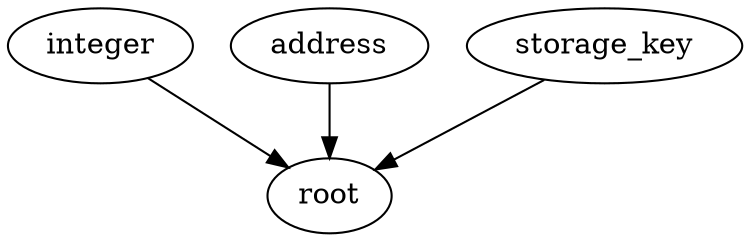

# EVM 类型恢复下一步计划

## 原始 prompt

接下来该做什么，规划一下

把当前的这个规划写到一个新的logs/下的文件

是的，改一下规划，就按这个80个吧。另外里面的第五步先去掉。第三步和第四步合并一下，确认HType质量里面就先确认extractvalue是否正常工作，然后再确认是否类型推理能够正常分析出内存的类型。

## 背景

当前 EVM 类型恢复已经接入 MLsub 主流程，普通 LLVM 操作、native load/store、allocation helper
和 private helper 多返回都已经能进入同一套约束生成和 HType 输出。

最近完成的关键点：

- EVM private 多返回不再跳过 aggregate 本体，而是在 binarysub function result 位置用
  `record{"0": ..., "1": ...}` 表示 tuple，HType 转换时拆成多个返回值。
- LLVM IR 仍保留 `{ i256, i256 }` 这类 aggregate Value，不改底层 IR 形状。
- `SubNodeCons::Rules` 补上 `{'P', 'I', 'p'}`，让
  `Unknown - Unknown = Pointer` 正常推成 `Pointer - Number = Pointer`。
- apehex native 30 样本和 EVM type recovery ctest 已通过。

现在需要从“能跑通”推进到“结果稳定、可回归、能继续接字段”。

## 目标

1. 固定刚完成的多返回和 PNDiff 规则，避免后续回退。
2. 样本范围固定为已经筛好的 selected-apehex-80。已有 IR 先直接跑 type recovery；
   缺 IR 的样本再补跑 Gigahorse + evm2llvm，不扩大到完整 apehex。
3. 合并检查 HType 质量：先确认 `extractvalue` 是否正常工作，再确认类型推理是否能分析出内存类型。

## 路线

### 1. 补最小回归测试

先补一个 frozen LLVM IR case，覆盖两个点：

- callee 返回 `{ i256, i256 }`，caller 用 `extractvalue` 取两个字段。
- 构造一个 `sub` 场景，让 PNDiff 需要使用 `Unknown - Unknown = Pointer` 到
  `Pointer - Number = Pointer` 的规则。

判断标准：

- `ctest --test-dir build -R notdec.type_recovery.evm.tr_level_2 --output-on-failure`
  继续通过。
- oracle 或 dump 检查能看到函数 HType 是多返回。
- 这个 case 不依赖 apehex 数据集。

### 2. 跑 selected-apehex-80 样本

使用已经筛好的 80 个 pilot 样本：

```text
/sn640/NotDecChainExp/evm2llvm_apehex_pilot/selected-apehex-80/manifest.csv
```

先复用已有 `outputs/*.ll`，只跑：

```bash
./build/bin/notdec sample.ll -o out.ll --tr-level=2 --dump-htypes sample.htypes
```

缺 IR 的样本单独补跑 Gigahorse + evm2llvm，仍然只围绕这 80 个 pilot，不扩大到完整
apehex。

观察点：

- 是否还有 assert / abort。
- HType 里 private helper 多返回是否稳定。
- 普通 memory record 是否没有被误拆成多返回。

判断标准：

- 80 个 pilot 样本全部 `notdec_tr` ok。
- 多返回样本里能看到类似 `((ret0, ret1) (*)(...))*` 的函数类型。

### 3. 确认 HType 质量和内存类型

这一步把原来的 HType 检查和内存类型检查合并，不再单独拆成后续步骤。

先从验证样本里挑 3-5 个有 private 多返回的样本，确认 `extractvalue` 相关结果：

- 函数类型是否输出多返回。
- `extractvalue` 后的字段是否拿到对应类型。
- `ReturnValue::<ret>` 和 `::<ret:N>` 是否分开。
- 普通 struct/memory record 没有被当 tuple return 拆掉。

确认 `extractvalue` 正常后，再看类型推理是否已经能分析出内存类型。第一轮只看 HType
里已经能稳定看到的结果，不在这一步新增字段建模：

- `[memory] type => struct_*` 是否存在。
- `evm.mem.ptr` / `evm.alloc.addr` 是否带上具体 struct 类型。
- struct 字段里是否能看到常量 offset。

判断标准：

- `extractvalue` 多返回字段在 HType 中能稳定对应到字段返回值。
- 80 个 pilot 样本中能定位出已有内存类型恢复效果较好的样本。
- 常量 offset 字段在 HType/debug 输出中可见。

## 风险

- 最小回归测试如果只看不崩，无法保证 HType 真的是多返回，所以需要 oracle 或明确检查 dump。
- `record{"0","1"}` 目前是 function result 位置的 tuple 约定，不能扩散到普通 memory record。
- memory object offset 字段如果绑定错 base，会污染类型结果。第一版必须只做高置信度 constant offset。

## 暂不做

- 暂不改 binarysub 核心 `UFunctionType` 为原生多返回。
- 暂不重跑完整 apehex。
- 暂不做动态 ABI bytes/string/array。
- 暂不让类型结果驱动 ABI rewrite 或 cleanup。

## 2026-06-04 实现记录：完成最小回归测试

完成路线第 1 步，新增一个 frozen EVM LLVM IR case，固定 aggregate 多返回和
PNDiff sub pointer result 规则。

改动位置：

- [test/type-recovery/evm/cases/05_evm_aggregate_return_pndiff_sub.ll:6](/sn640/NotDec/test/type-recovery/evm/cases/05_evm_aggregate_return_pndiff_sub.ll:6)
  新增 `@private_pair`，返回 `{ i256, i256 }`。函数里用
  `%addr = sub i256 %base, %delta` 和 `inttoptr %addr` 触发
  `Unknown - Unknown = Pointer` 到 `Pointer - Number = Pointer` 的 PNDiff 规则。
- [test/type-recovery/evm/cases/05_evm_aggregate_return_pndiff_sub.ll:16](/sn640/NotDec/test/type-recovery/evm/cases/05_evm_aggregate_return_pndiff_sub.ll:16)
  新增 `@main`，调用 `@private_pair` 后用两个 `extractvalue` 读取返回字段。
- [test/type-recovery/evm/expected/tr-level-2/05_evm_aggregate_return_pndiff_sub.htypes:10](/sn640/NotDec/test/type-recovery/evm/expected/tr-level-2/05_evm_aggregate_return_pndiff_sub.htypes:10)
  新增 HType snapshot。`@private_pair` 输出为多返回函数类型，
  `private_pair::<ret>` 和 `::<ret:1>` 分开。
- [test/type-recovery/evm/manifest.json:32](/sn640/NotDec/test/type-recovery/evm/manifest.json:32)
  把新 case 加入 EVM type recovery suite。

验证：

- `ctest --test-dir build -R notdec.type_recovery.evm.tr_level_2 --output-on-failure`
  通过。

## 2026-06-04 实现记录：复用已有 IR 检查 selected-apehex-80 的 30 个样本

路线第 2/3 步先用已有 IR 做了 type-recovery-only 检查。当前
`selected-apehex-80` 里只有 30 个样本在
`/sn640/NotDecChainExp/evm_type_recovery_apehex_pilot/*/outputs/*.ll`
下有可复用 IR；其余 50 个缺 `.ll`。旧 evm2llvm pilot batch 的 `outputs/*.ll`
也没有对应文件，符合之前清理旧 IR 的状态。

验证目录：

```text
/tmp/notdec-selected80-existing30-tr
```

结果：

- 30 个已有 IR 全部 `notdec --tr-level=2 --dump-htypes` 通过。
- `summary.csv`：30/30 ok。
- `missing.csv`：记录剩余 50 个缺 IR 的 selected-apehex-80 样本。

HType 质量检查：

- 30 个里 7 个样本出现 private helper 多返回函数类型。
- 这 7 个样本里能看到 `::<ret:N>` 字段返回槽位，并且函数类型输出为多返回形式。
- 抽查 `3938`、`26592`、`1111`、`29023`、`8312`：
  - 已使用的 `extractvalue` 字段能在 HType 里看到对应 SSA 值类型。
  - `1111` 和 `8312` 的 `%private.ret1` 在 IR 中取出后没有实际参与后续内存/算术使用，
    所以 HType dump 没有独立 SSA 行；但对应 callee 的 `::<ret:1>` 槽位存在。
- 30 个里 18 个样本输出了 memory struct 字段。
- 内存类型表现较明显的样本包括 `8312`、`3938`、`29023`、`1111`：
  - HType 中有 `[memory] type => struct_*`。
  - 多个 `evm.mem.ptr` / `evm.alloc.addr` 已带 `ptr<...> & struct_*`。
  - struct 字段里已经出现常量 offset，例如 `32`、`64`、`100` 等。

当前决策点：

- 如果要完成完整 selected-apehex-80 验证，需要重新对缺失 50 个样本跑
  Gigahorse + evm2llvm 生成 IR。
- 在补齐 50 个 IR 前，type-recovery-only 验证只能证明已有 30 个 selected pilot 样本。

## 2026-06-04 实现记录：补齐 missing50 并修复 aggregate/负 offset 崩溃

完成路线第 2/3 步的一轮推进：对 `selected-apehex-80` 中缺 IR 的 50 个样本补跑
Gigahorse + evm2llvm + type recovery，并修掉其中能直接定位的 type recovery 崩溃。

补跑目录：

```text
/sn640/NotDecChainExp/evm_type_recovery_apehex_pilot/20260604-selected80-missing50
```

原始 missing50 结果：

- 36/50 直接 ok。
- 14/50 fail：
  - 9 个 `notdec_tr` crash，后续本次已修复并局部重跑通过。
  - 2 个 `notdec_tr` timeout：`18404_19693601_dc6a4df89e_e8062015dadc`、
    `7435_19576293_0de5f3a958_6780a1c34693`。
  - 2 个 evm2llvm 失败：`22492_19734645_9489004623_d90f6b6ef58d`、
    `26708_19785111_ed5443326c_5864b22a5ad0`，其中 `26708` 是 `phiincoming`。
  - 1 个 Gigahorse timeout：`13930_19647126_c6ee358d43_4890d547bb1c`。

代码修复：

- [external/NotDec-llvm2c/lib/notdec-llvm2c/Interface/ExtValuePtr.cpp:240](/sn640/NotDec/external/NotDec-llvm2c/lib/notdec-llvm2c/Interface/ExtValuePtr.cpp:240)
  修改 `notdec::getSize(llvm::Type *, unsigned int)`，支持 struct/array aggregate size。
  EVM private return aggregate 本体现在能查询 `{ i256, i256 }`、`{ i256, i256, i256 }`
  这类 LLVM Value 的 bit size。
- [src/TypeRecovery/LowTy.cpp:12](/sn640/NotDec/src/TypeRecovery/LowTy.cpp:12)
  修改 `notdec::retypd::getSize(llvm::Type *, unsigned)`，同步支持 struct/array aggregate size。
- [src/TypeRecovery/LowTy.cpp:248](/sn640/NotDec/src/TypeRecovery/LowTy.cpp:248)
  修改 `llvmType2Elem`，把 aggregate 低层类型标成 `aggregate`，避免旧 P/N 低层类型转换遇到
  aggregate Value 本体时 assert。
- [src/TypeRecovery/mlsub/MLsubGenerator.cpp:3643](/sn640/NotDec/src/TypeRecovery/mlsub/MLsubGenerator.cpp:3643)
  修改 `ConstraintsGenerator::convertSimpleTypeVal`，aggregate constant 先按变量处理。
  这覆盖 `zeroinitializer` 和 `{ i256 0, i256 0, i256 poison }` 这类 evm2llvm
  为 private 多返回生成的初始 aggregate 常量。
- [external/NotDec-llvm2c/include/notdec-llvm2c/Interface/Range.h:77](/sn640/NotDec/external/NotDec-llvm2c/include/notdec-llvm2c/Interface/Range.h:77)
  给 `OffsetRange` 增加 `hasNegativeBaseOffset()`。
- [include/notdec/TypeRecovery/mlsub/MLsubGenerator.h:303](/sn640/NotDec/include/notdec/TypeRecovery/mlsub/MLsubGenerator.h:303)
  修改 `ConstraintsGenerator::setAsPtrAdd`。在 `PointerSize == 256` 且 base offset 为负时，
  只保留 P/N 变量统一，跳过 record field 和 pointer-analysis field。这样 EVM 负偏移指针
  不再把 TypeBuilder 带到 `OffsetRange::maxAccess()` 的负 offset assert；普通 32/64 位
  LLVM 栈用例仍保留原来的负 offset 字段建模。

局部验证：

- `/tmp/notdec-selected80-rerun-crashes-final`：
  - 9/9 个原 `notdec_tr` crash 样本重跑通过。
  - `14575_19657109_cadd3b2a47_50062a119b46` 覆盖负 offset 跳过。
  - `13110`、`13153`、`19407`、`22332`、`22877`、`24934`、`29524`、`9314`
    覆盖 aggregate size / aggregate elem / aggregate constant。
- 单独复测 `14575`：`./build/bin/notdec ... --tr-level=2 --dump-htypes` 通过。
- `ctest --test-dir build -R notdec.type_recovery.evm.tr_level_2 --output-on-failure` 通过。

合并口径：

- selected-apehex-80 目前有效 HType 覆盖 75/80。
- 75 = 已有 IR 的 30 个 ok + missing50 原始 36 个 ok + 本次修复后 9 个 ok。
- 剩余 5 个不是这次 crash 修复能直接解决：
  - 2 个 evm2llvm 失败。
  - 1 个 Gigahorse timeout。
  - 2 个 `notdec_tr` timeout，需要后续单独看性能。

HType 质量检查：

- 75 个有效 HType 中：
  - 49 个样本有 `::<ret:N>` 多返回槽位。
  - 49 个样本有 private helper 多返回函数类型。
  - 62 个样本有 `[memory] type => struct_*` 和常量 offset 字段。
- `extractvalue` 检查：
  - 42 个样本含 `extractvalue`。
  - 29 个样本的 `extractvalue` SSA 名全部出现在 HType 中。
  - 其余样本缺失的名字主要是两类：只用于 `insertvalue` 重新组装 aggregate return，或在
    PHI 链中继续传递但没有进入内存/算术约束。对应 callee 的 `::<ret:N>` 槽位仍存在。
- 抽查 `13110`、`14575`、`26262`、`20900`：
  - private helper 函数输出多返回形式，例如 `((u256, u256) (*)(...))*`
    或 `((u256, u256, u256) (*)(...))*`。
  - `::<ret:N>` 返回槽位存在。
  - `[memory] type => struct_*` 存在。
  - struct 字段里能看到常量 offset，例如 `0`、`32`、`64`、`96`、`160`、`192` 等。

额外验证和风险：

- `ctest --test-dir build -R 'notdec.type_recovery.(evm|llvm_ir|sysy).tr_level_2' --output-on-failure`
  中 EVM suite 通过。
- 同一命令下 llvm-ir suite 还有 4 个 HType snapshot diff，表现为少了若干未引用 decl；
  不再是负 offset 指针类型大面积丢失。
- sysy suite 当前全部在 `--dump-htypes requires type recovery to be initialized` 处失败，
  看起来是当前测试入口/配置问题，和这次 EVM aggregate/负 offset 修复不是同一类问题。
- 性能风险需要后续单独看：`7435`、`18404` 在 `notdec_tr` 600 秒 timeout；
  `20900` 原始 `notdec_tr` 用时约 249 秒，`24713` 约 118 秒，`20695` 约 93 秒。

## 2026-06-04 定位记录：两个 notdec_tr timeout 都指向大 SCC，但卡点不同

对剩余两个 `notdec_tr` timeout 样本加了临时 `NOTDEC_MLSUB_TIMING=1` 探针后，
确认 timeout 都和一个 200+ 函数的大 SCC 有关，但不是同一个阶段：

- `7435_19576293_0de5f3a958_6780a1c34693`
  - 120 秒采样仍停在 `bottomUpPhase()` 的 SCC0。
  - SCC0 是 level 0，包含 217 个函数。
  - 卡点在 `ConstraintsGenerator::run()` 里的逐函数 `MLsubVisitor::visit()`，
    还没有进入 `PG.solve()`、`topDownPhase()` 或 HType 输出。
  - 后段 public 函数越来越慢，例如：
    `public_nextImplementationDelay___0x8fe` 约 11 秒，
    `public_availableToInvestOut___0x96e` 约 13 秒，
    `public_redeem_uint256_address_address__0x993` 约 22 秒，
    `public_underlyingBalanceInVault___0x9cf` 约 25 秒。

- `18404_19693601_dc6a4df89e_e8062015dadc`
  - 120 秒采样中 `bottomUpPhase()` 约 6 秒完成。
  - SCC0 是 level 0，包含 240 个函数。
  - log 没有出现任何 `top-down-scc` 行，说明卡在第一个
    `ConstraintsGenerator::genTypes()` 里，具体是 `bulkSimplifyDetailed()` 阶段。

还试了一次很小的现有配置试验：

```json
{
  "poly_funcs": [
    "calloc",
    "calloc_unbounded",
    "notdec_solidity_memory_allocation",
    "notdec_evm_finalize_alloc"
  ],
  "level_override": {}
}
```

这个配置只把 `18404` 的大 SCC 从 240 个函数降到 236 个函数，120 秒内仍 timeout。
所以简单把 allocation helper 标成 poly summary boundary 不够。

当前判断：

- 这不像一个普通崩溃修复，更像 SCC/summary 边界策略问题。
- 直接改 `prepareSCC()` 的 same-level region collapse 可能影响所有类型恢复用例。
- 更稳的下一步应该先决定路线：是做 EVM 专用的大 SCC 切分/summary boundary，
  还是继续用 `NOTDEC_POLY_FUNCS`/`level_override` 找一组可解释的 public/private
  边界，再考虑固化。

## 2026-06-04 profile 记录：7435 不是固定 IR 死循环，热点在 binarysub constraint cache

按“先排除是否代码里有死循环路径”的方向，对
`7435_19576293_0de5f3a958_6780a1c34693` 做了 gdb 采样和 perf profile。

gdb 采样：

- 90 秒后中断，栈稳定落在
  `MLsubRecovery::bottomUpPhase -> ConstraintsGenerator::run ->
  MLsubVisitor::visitStoreInst -> ConstraintsGenerator::addSubtype ->
  binarysub::constrain`。
- 多次采样没有看到固定某个 LLVM IR 指令自旋的显式死循环。
- 一次采样停在 `binarysub::trace_related() -> collect_ids()`，发现 trace 没开时仍会先递归
  `collect_ids(lhs/rhs)`。

perf profile：

- 原始 90 秒 profile：
  - 约 80% CPU 在 `MLsubRecovery::bottomUpPhase`。
  - 约 73% 走到 `MLsubVisitor::visitStoreInst -> addSubtype -> binarysub::constrain`。
  - `std::set<pair<TypeNode*, TypeNode*>>::find` 是主要热点。
  - `trace_related/collect_ids` 约 10%，属于 trace 关闭时的无用开销。
- 加 trace 早退后重跑 90 秒 profile：
  - `trace_related/collect_ids` 热点基本消失。
  - 主要热点仍然是 `visitStoreInst -> addSubtype -> binarysub::constrain`。
  - `std::set<pair<TypeNode*, TypeNode*>>::find` 约 50% children，占比更集中。

代码修复：

- [external/binarysub/src/binarysub-core.cpp:176](/sn640/NotDec/external/binarysub/src/binarysub-core.cpp:176)
  在 `trace_related()` 开头增加 `binarysub_trace_enabled()` 早退。trace 没开时不再递归
  `collect_ids()`。

验证：

- `cmake --build ./build --target notdec-decompile -j4` 通过。
- `ctest --test-dir build -R notdec.type_recovery.evm.tr_level_2 --output-on-failure` 通过。
- `7435` 在 trace 早退后 180 秒仍 timeout，RSS 约 588MB，仍没有打印
  `Constraint generation done!`。

当前判断：

- `7435` 更像是大 SCC 下 store 约束传播量过大，`binarysub::constrain` cache/worklist
  查询成本被放大，不是固定一条 IR 或某个 visitor 分支的死循环。
- trace 早退值得保留，但它只是清掉无用调试开销，不解决主 timeout。
- 下一步如果继续优化，需要看两个方向：
  1. 约束规模：继续切 SCC/summary boundary，减少同一个 `ConstraintsGenerator` 内的 store
     约束传播量。
  2. constraint cache 数据结构：把 `std::set<pair<TypeNode*, TypeNode*>>` 换成 hash set
     或至少统计 cache size / worklist 增长，确认是否是数据结构问题。

## 2026-06-04 实现记录：跳过两个 notdec_tr timeout，并检查现有 HType

按“先标记、后续跳过 timeout case，然后看已有 HType”的方向继续推进。

跳过策略：

- `/sn640/NotDecChainExp/evm_type_recovery_apehex_pilot/scripts/notdec-evm-type-recovery-apehex.py`
  的 `load_samples()` 增加 `skip_reason` 过滤。manifest 行里这个字段非空时，不加入待跑样本。
- `/sn640/NotDecChainExp/evm2llvm_apehex_pilot/selected-apehex-80/manifest.csv`
  给 `7435_19576293_0de5f3a958_6780a1c34693` 和
  `18404_19693601_dc6a4df89e_e8062015dadc` 标记
  `skip_reason=notdec_tr_timeout`。
- `/sn640/NotDecChainExp/evm_type_recovery_apehex_pilot/selected-apehex-80-missing50/manifest.csv`
  同样标记这两个样本。

验证：

- 对完整 `selected-apehex-80` dry-run，runner 现在加载 78 个样本。
- 对 `selected-apehex-80-missing50` dry-run，runner 现在加载 48 个样本。
- 上面两个 dry-run 输出里都不再包含 `7435` 和 `18404`。

已有 HType 检查：

- 合并现有结果：
  - `/tmp/notdec-selected80-existing30-tr/htypes`
  - `/sn640/NotDecChainExp/evm_type_recovery_apehex_pilot/20260604-selected80-missing50/htypes`
  - `/tmp/notdec-selected80-rerun-crashes-final/htypes`
- 去重后共有 75 个有效 HType。
- 49 个有 `extractvalue` 的 IR，都能在对应 HType 中看到 `::<ret:1>` 或更高序号的多返回槽位。
  HType 文本本身不会保留 `extractvalue` 字符串，这是正常的。
- 75 个 HType 都有 `[memory]` 段。
- 52 个样本的 `evm.alloc.addr` 上能看到 `struct_*`。
- 60 个样本能看到 `evm.mem.ptr`。

当前判断：

- 多返回建模在现有样本里看起来已经接住：`extractvalue` 对应的返回槽位没有丢。
- 内存类型已经能在 allocation pointer 和部分 memory pointer 上出现 `struct_*`，但质量还不稳定：
  不是所有 `evm.mem.ptr` 都带 struct，部分仍只是 `ptr<load=void, store=void, psize=256>`。
- 下一步应该挑 3-5 个代表样本人工看 HType 质量，重点看 `evm.alloc.addr` 到后续
  `evm.mem.ptr` 的 struct 是否能传下去，以及字段 offset 是否符合 IR 里的 store/load 形状。

## 2026-06-04 调研记录：EVM i256 semantic primitive lattice

binarysub 已经有同底层 primitive bits 的语义 lattice 支持：

- `PrimitiveSemanticRegistry` 可以从 DOT 注册一个 family，包含 `base`、`bits`、
  `namespace` 和节点。
- `constrain()` 在 primitive 名字不相等时，会查全局 registry；如果两边属于同一个
  family，则按 lattice subtype 判断。
- simplify 阶段会把同 family 的多个 semantic primitive 用 join/meet 合并。
- HType 转换会把 semantic primitive 输出成 typedef，底层仍是对应的 base primitive。

当前 EVM 缺口：

- NotDec/EVM 侧还没有注册内置 EVM i256 lattice。
- EVM builtin 签名和约束生成还没有系统地产生 `prim.uint256.evm.*` 这种 primitive。

第一版做 `address`、`storage_key` 和 `integer`，不放 `selector`：

- `selector` 在当前 IR 里也是 `i256`，因为 EVM 栈字统一 256-bit。
- 但语义上 selector 是 4 bytes。后面如果要恢复 selector，应该先考虑一个 pass 把
  selector 单独转成 `i32`，再讨论 selector 类型。
- 所以第一版 semantic lattice 不引入 `selector`，避免把 32-bit 语义硬塞进 `bits=256`
  的 primitive family。
- `address` 特指 EVM 账户地址，不是内存地址；内存地址继续由现有 pointer / memory
  object 类型表达。
- `storage_key` 是 `i256`，对应 `sload/sstore` 的 slot key。
- `integer` 表示纯数字用法的 `i256` 值；第一版不再额外区分内存指针语义。
- 不引入 `memory_word`。这个名字会把“从 memory 取出的 32-byte word”和内存对象类型混在一起，
  对当前类型恢复没有帮助。

建议第一版 lattice：



第一批类型来源只用强信号。

`address`：

- `evm_address` / `evm_caller` / `evm_origin` / `evm_coinbase` 返回 `address`。
- `evm_balance` 的 address 参数。
- `evm_extcodesize` / `evm_extcodehash` / `evm_extcodecopy` 的 address 参数。
- `evm_call` / `evm_callcode` / `evm_delegatecall` / `evm_staticcall` 的 target address 参数。
- `evm_create` / `evm_create2` 返回 `address`。

`storage_key`：

- `evm_sload` 的 key 参数。
- `evm_sstore` 的 key 参数。
- 暂时不从 keccak 结果反推 storage key，先只用 `sload/sstore` 调用点。

`integer`：

- 算术 intrinsic 和普通整数算术结果可以先落到 `integer`。
- 但如果某个值同时流入 `address` 和 `integer`，第一版应该暴露冲突或 join 到 root，
  不要静默把账户地址当普通数字。

暂时不把 `and x, 2^160-1` 这种 mask 当成强 address 约束，先避免误报。

补充：`external/binarysub/doc/simplesub/TypeSimplifier.scala` 是 SimpleSub 论文/原型的参考代码，
在 `doc/` 目录下，不参与当前 C++ binarysub / NotDec 构建。
